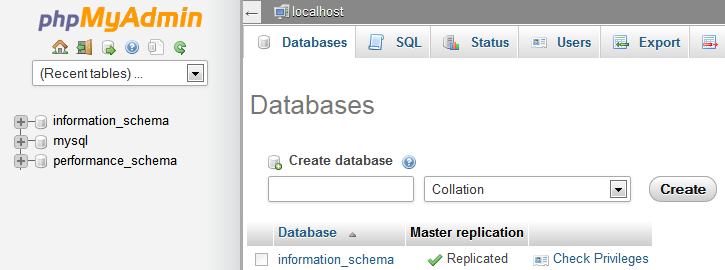
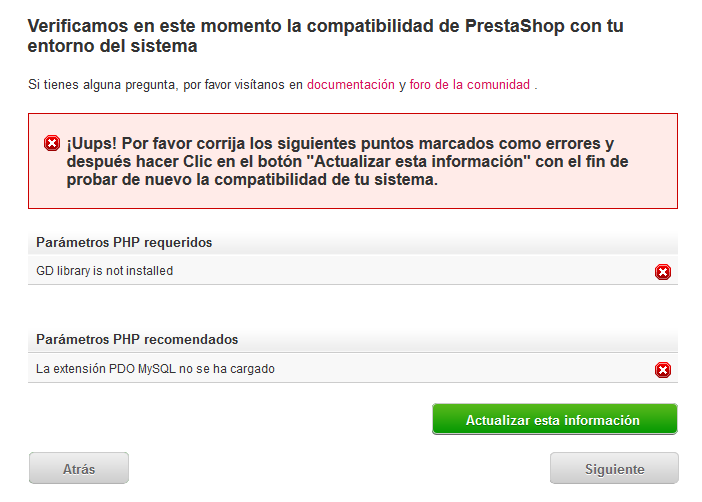

# Instalar PrestaShop

Este capítulo se ha redactado para aquellos que pretenden instalar PrestaShop en su servidor web online.

Si quieres instalar PrestaShop en tu propio ordenador, sigue primero las instrucciones de la página [Instalar de PrestaShop en tu ordenador](instalar-prestashop-ordenador.md).

Si ya has leído las instrucciones de esa página, omite la sección “Creación de una base de datos para tu tienda” que recogemos a continuación.

Instalar PrestaShop es muy fácil. Cuando tengas todos los archivos en tu servidor web, deberías poder empezar a configurar tu tienda en no menos de 5 minutos en la mayoría de los casos. El instalador hace todo el trabajo por ti, lo que hace que el proceso de instalación sea muy sencillo. Los usuarios menos experimentados podrían necesitar entre 10 y 20 minutos para completar todo el proceso.

Antes de empezar, asegúrate de que dispones de todos los requisitos: espacio de servidor en un proveedor de alojamiento, nombre de dominio, cliente FTP y editor de texto. Antes de nada, sigue las instrucciones de la página “[¿Qué necesitas para empezar?](que-necesitas-para-empezar.md)”.

Nuestro socio de alojamiento web 1&1 IONOS ofrece instalación en 1 clic para ahorrarte tiempo y que puedas empezar aún más rápido. Usar esta función puede reducir enormemente el tiempo de instalación para los usuarios inexpertos. 

* [Alojamiento de 1&1 IONOS](https://www.ionos.es/soluciones-ecommerce/prestashop-hosting?ac=OM.WE.WEs96K414095T7073a) 

Esos proveedores web utilizan principalmente las siguientes bibliotecas de scripts:

* [SimpleScripts](https://www.simplescripts.com/script_details/install:PrestaShop)
* [Installatron](http://installatron.com/apps?locale=en#cmd=browser&display=prestashop)
* [Softaculous](http://www.softaculous.com/apps/ecommerce/PrestaShop)

Algunos de estos scripts admiten incluso la actualización en 1 clic. ¡Oro puro!

Otros proveedores tienen sus propios scripts de instalación. Consulta con tu proveedor para obtener más información.

## Instrucciones rápidas de instalación

Para quienes ya os sintáis cómodos instalando aplicaciones PHP/MySQL en un servidor web, aquí tenéis las instrucciones rápidas. Si te resulta incómodo que nos saltemos algunos detalles, encontrarás instrucciones detalladas en la sección siguiente de este capítulo.

1. Descarga y descomprime el paquete PrestaShop, si aún no lo has hecho.
2. Crea una base de datos para la tienda PrestaShop en tu servidor web, si es posible. Si no hubiera un usuario MySQL con privilegios para acceder y modificar esta base de datos, créala igualmente.
3. Carga los tres archivos de PrestaShop en la ubicación elegida de tu servidor web, incluido el archivo .zip \(se descomprimirá él solo posteriormente\).
4. Ejecuta el script de instalación de PrestaShop. Para ello, accede a la URL pública para la ubicación elegida en un navegador web. La URL debe ser la misma donde hayas subido los archivos PrestaShop.
5. Sigue las instrucciones que aparecen en cada pantalla del instalador.
6. Cuando la instalación haya terminado, elimina la carpeta `/install` y anota los nuevos datos de la carpeta `/admin`, que se ha generado por seguridad para que sea exclusiva para ti.

¡PrestaShop ya debería estar instalado y listo para empezar a configurarlo! Dirígete al capítulo de la Guía de usuario [Primeros pasos con PrestaShop 1.7](http://doc.prestashop.com/display/PS17/Primeros+pasos+con+PrestaShop+1.7).

## Instrucciones detalladas

### Descarga y descompresión del archivo PrestaShop

Puedes descargar la última versión de PrestaShop en [http://www.prestashop.com/es/download](http://www.prestashop.com/es/download).

Solo tienes una opción de descarga: la última versión estable, preparada para todo tipo de tiendas online.

Si necesitas descargar alguna de las versiones anteriores, visita esta dirección: [https://www.prestashop.com/es/versiones-para-programadores\#previous-version](https://www.prestashop.com/es/versiones-para-programadores#previous-version).

Ten en cuenta que nunca se recomienda usar otra versión que no sea la última más estable.

  
Haz clic en el botón “Descargar” y guarda el archivo en tu equipo \(por ejemplo, en el Escritorio\). Deberías tener un archivo llamado “prestashop\_1.7.0.0.zip” \(o equivalente, depende de los números de versión\).

El archivo descargable está en formato Zip. Para continuar con el proceso, **tienes que descomprimir el archivo**.

Si tu sistema operativo no es compatible de forma nativa con archivos Zip, puedes descargar e instalar una herramienta específica, como:

* Windows:
  * 7-zip: [http://www.7-zip.org/](http://www.7-zip.org/)
  * WinZip: [http://www.winzip.com/win/en/index.htm](http://www.winzip.com/win/en/index.htm)
  * WinRAR: [http://www.rarlab.com/](http://www.rarlab.com/)
* Mac OS X:
  * iZip: [http://www.izip.com/](http://www.izip.com/)
  * WinZip Mac: [http://www.winzip.com/mac/](http://www.winzip.com/mac/)
  * Zipeg: [http://www.zipeg.com/](http://www.zipeg.com/)

Extrae el contenido del archivo en tu disco duro \(por ejemplo, en el Escritorio otra vez\) usando una herramienta de descompresión. **No cargues el archivo Zip directamente en tu servidor web**.

Este contiene tres elementos en su raíz:

* El archivo “prestashop.zip”, que contiene todos los archivos PrestaShop que cargarás pronto en tu servidor web.
* El archivo “Install\_PrestaShop.html”, que abre esta misma página en tu navegador predeterminado.
* El archivo index.php que ejecuta la instalación.

No cargues el archivo “Install\_PrestaShop.html” a tu servidor web.

###  Carga de PrestaShop

A estas alturas, ya deberías tener un espacio de alojamiento a tu disposición \(de lo contrario, lee el capítulo “¿Qué necesitas para empezar?” de esta guía\) y una carpeta en tu disco duro con el archivo PrestaShop descomprimido.

En este paso, vamos a cargar los archivos de PrestaShop en tu espacio de alojamiento. Para ello, tienes que conectar tu ordenador a tu servidor con una herramienta denominada “cliente FTP”, que deberías haber instalado durante la lectura del capítulo “¿Qué necesitas para empezar?”. Nosotros usaremos la herramienta gratuita FileZilla \([http://filezilla-project.org/](http://filezilla-project.org/)\).

Conéctate a tu espacio de alojamiento con tu cliente FTP con los datos de conexión que te haya proporcionado tu proveedor web \(si no los tienes, ponte en contacto con él\). Una vez conectado, hay que transferir los archivos de PrestaShop de tu ordenador a tu servidor.

En FileZilla \(o cualquier otro cliente FTP\), explora tus carpetas locales hasta que encuentres la que contiene los archivos PrestaShop. Mantenla abierta en la sección “Local site” \(Sitio local\) \(a la izquierda\).

En la sección “Remote site” \(Sitio remoto\) \(a la derecha\), explora la ubicación donde quieres que PrestaShop esté disponible públicamente \(raíz del dominio, subcarpeta, subdominio...\). Esta configuración puede cambiar bastante en función de tu alojamiento y tus necesidades:

* Tu alojamiento:
  * Algunos alojamientos podrían requerir que coloques tus archivos en una carpeta concreta, como `/htdocs`, `/public_html`, `/web`, `/www`, `/`[nombredetudominio.com](http://yourdomainname.com/), etc.
  * Los servidores FTP de otros alojamientos te llevarán directamente al espacio de carga adecuado.
* Lo que necesitas:
  * Si quieres que tu tienda sea el sitio web principal para tu nombre de dominio \(es decir, [http://www.ejemplo.com](http://www.example.com/)\), carga PrestaShop en la carpeta raíz del espacio de carga \(podría depender del proveedor\).
  * Si quieres que la tienda esté en una subcarpeta de tu nombre de dominio \([http://www.ejemplo.com/tienda](http://www.example.com/shop)\), primero tienes que crear una carpeta mediante FileZilla \(haz clic con el botón derecho y elige “Create directory” \[Crear directorio\]\) y carga PrestaShop en esa carpeta.
  * Si quieres que tu tienda esté en un subdominio de tu nombre de dominio \([http://tienda.ejemplo.com](http://shop.example.com/)\), primero tienes que crear un subdominio. Esto depende de tu proveedor: deberías poder hacerlo añadiendo una nueva carpeta en tu cliente FTP, o puede que tengas que usar el panel de administración de tu proveedor para crear el subdominio. Lee primero la documentación de soporte de tu proveedor. Cuando esté todo listo, navega hasta la carpeta del subdominio y carga PrestaShop ahí.

En el lado izquierdo de FileZilla deberías tener la carpeta local donde tienes los archivos PrestaShop extraídos del Zip, y en el lado derecho, la ubicación de destino. Si aún no lo has hecho, el proceso de carga es sencillo: selecciona los tres archivos desde la carpeta local \(usa Ctrl-A\) y puedes optar entre arrastrar y soltarlos en la carpeta remota, o hacer clic con el botón derecho en la selección y elegir “Cargar” en el menú contextual.

### Creación de una base de datos para tu tienda

Antes de que puedas instalar PrestaShop, tienes que comprobar que tu servidor MySQL cuenta con una base de datos preparada para alojar los datos de PrestaShop. De lo contrario, tendrás que crear una.

Puedes crear una base de datos con cualquier herramienta de administración de bases de datos. Nosotros usaremos la herramienta gratuita phpMyAdmin \([http://www.phpmyadmin.net/](http://www.phpmyadmin.net/)\), que debería venir preinstalada en la mayoría de los alojamientos web.

Algunos proveedores prefieren que los clientes usen un panel de control gráfico, como cPanel, Plesk o uno personalizado. Lee la documentación de tu proveedor sobre la gestión de bases de datos MySQL y crea una base de datos para tu tienda siguiendo sus explicaciones específicas.

Conéctate a phpMyAdmin con las credenciales que te haya proporcionado tu proveedor. Deberías poder acceder con una URL estándar, vinculada a tu nombre de dominio o al nombre de dominio del proveedor.

En la columna de la izquierda puedes ver las bases de datos que tienes a tu disposición en ese momento en tu servidor MySQL. Algunas no nos sirven porque las utilizan phpMyAdmin o el proveedor: `phpmyadmin`, `mysql`, `information_schema`, `performance_schema` y otras. Lee la documentación de tu proveedor para saber si puedes usar una de estas como base de datos predeterminada.

En cualquier caso, puedes crear una base de datos nueva desde la pestaña “Database” \(Base de datos\), en el formulario central denominado “Create new database” \(Crear nueva base de datos\). Solo tienes que introducir un nombre exclusivo y hacer clic en “Create” \(Crear\). El nombre de la base de datos se añadirá a la lista que aparece a la izquierda. Ya puedes usarla para almacenar los datos de PrestaShop.

### Cómo ejecutar el instalador automático

Ahora viene la parte donde converge todo: instalar PrestaShop.

El proceso de instalación es muy fácil, y el instalador automático de PrestaShop hace que sea pan comido. Deberías poder estar navegando por PrestaShop en cuestión de minutos. Lee detenidamente cada página para no perderte nada.

Para ejecutar el instalador, solo tienes que navegar hasta la ubicación de PrestaShop en tu servidor web: el script detectará automáticamente que PrestaShop aún no está instalado, y te llevará al instalador automático. Al mismo tiempo, esta acción descomprimirá el archivo prestashop.zip que habías cargado antes. Ahora tienes disponibles todos los archivos de PrestaShop en tu servidor web.

Si vas a hacer una instalación en tu propio ordenador, debes hacerla en la carpeta de PrestaShop que se encuentra en tu servidor web local, que debería estar disponible en [http://127.0.0.1/prestashop](http://127.0.0.1/prestashop).

A partir de aquí, solo tienes que leer, hacer clic y rellenar unos cuantos formularios.

Tienes que completar 6 pasos. En la parte superior de la página, el asistente de instalación te indica en qué parte del proceso te encuentras: los círculos grises cambian a marcas de verificación verdes cuando se completa cada paso.

**Paso 1: Página de bienvenida**

Esta página es una introducción rápida al proceso de instalación. Puedes elegir el idioma de las instrucciones del instalador.

También presenta un enlace al sitio de documentación \([http://doc.prestashop.com/](http://doc.prestashop.com/)\) y un enlace a nuestra oferta de Soporte. Para obtener más información sobre nuestro servicio de soporte, visita [http://support.prestashop.com/es/](http://support.prestashop.com/en/).

Selecciona el idioma del instalador y haz clic en el botón “Siguiente”. Esta acción también define el idioma predeterminado de la instalación de PrestaShop, pero tendrás a tu disposición otros idiomas para poder activarlos.

**Paso 2: Licencias de PrestaShop**

Esta segunda página es un simple requisito: PrestaShop es gratuito y se distribuye sujeto a un conjunto determinado de licencias de código abierto. No puedes utilizar este software si no estás conforme con los términos de las licencias. Este paso requiere que las aceptes de forma explícita.

Lee las licencias de PrestaShop:

* _Open Software License 3.0_ para PrestaShop en sí, que también puedes leer en [http://www.opensource.org/licenses/OSL-3.0](http://www.opensource.org/licenses/OSL-3.0) \(en inglés\). 
* _Academic Free License 3.0_ para los módulos y los temas, que también puedes leer en [http://opensource.org/licenses/AFL-3.0](http://opensource.org/licenses/AFL-3.0) \(en inglés\).

Tienes que aceptar ambas licencias para poder instalar PrestaShop.

Para acceder al siguiente paso, marca la casilla “Acepto los términos y condiciones anteriores” y haz clic en “Siguiente”. Si no aceptas explícitamente las licencias, no puedes instalar PrestaShop. De hecho, ni siquiera podrás hacer clic en el botón “Siguiente”.

**Pasos 3 y 4: Compatibilidad del sistema e información de la tienda**

En la tercera página se hace una comprobación rápida de todos los parámetros del servidor en tu proveedor. En la mayoría de los casos no verás esta página, porque si todo ha ido bien, se te dirigirá directamente a la cuarta página, “Información de la tienda”. En cualquier caso, puedes consultar la tercera página si vas a la barra lateral izquierda y haces clic en el enlace “Compatibilidad del sistema”.

Si hay algún error durante la comprobación del servidor del tercer paso, el instalador muestra la página “Compatibilidad del sistema”, donde puedes ver todas las comprobaciones que han dado error.

**Compatibilidad del sistema**

En esta página se comprueba que la configuración de tu servidor es correcta: los ajustes PHP, los permisos de los archivos y las carpetas, las herramientas de terceros, etc.

Si algo falla, el instalador se detiene en este punto para que puedas ver los detalles técnicos que hay que corregir, ya sea cambiar la configuración PHP o actualizar los permisos de los archivos.

Aquí tienes una lista de las comprobaciones que se realizan durante este tercer paso:

| **Comprobación** | **¿Cómo/dónde corregirlo?** |
| :--- | :--- |
| ¿Está instalado PHP 5.4 o posterior? | Servidor web |
| ¿Puede PrestaShop cargar archivos? | Archivo php.ini \(`file_uploads`\) |
| ¿Puede PrestaShop crear archivos y carpetas nuevos? | Navegador web / cliente FTP / línea de comandos |
| ¿Está la biblioteca GD instalada? | Archivo php.ini \(`extension=`[php\_gd2.so](http://php_gd2.so/)\) |
| ¿Está activada la compatibilidad con MySQL? | Archivo php.ini \(`extension=`[php\_pdo\_mysql.so](http://php_pdo_mysql.so/)\) |
| Permiso de escritura recursiva en ~/config/ | Navegador web / cliente FTP / línea de comandos |
| Permiso de escritura recursiva en ~/cache/ | Navegador web / cliente FTP / línea de comandos |
| Permiso de escritura recursiva en ~/log/ | Navegador web / cliente FTP / línea de comandos |
| Permiso de escritura recursiva en ~/img/ | Navegador web / cliente FTP / línea de comandos |
| Permiso de escritura recursiva en ~/mails/ | Navegador web / cliente FTP / línea de comandos |
| Permiso de escritura recursiva en ~/modules/ | Navegador web / cliente FTP / línea de comandos |
| Permiso de escritura recursiva en ~/override/ | Navegador web / cliente FTP / línea de comandos |
| Permiso de escritura recursiva en ~/themes/default/lang/ | Navegador web / cliente FTP / línea de comandos |
| Permiso de escritura recursiva en ~/themes/default/pdf/lang/ | Navegador web / cliente FTP / línea de comandos |
| Permiso de escritura recursiva en ~/themes/default/cache/ | Navegador web / cliente FTP / línea de comandos |
| Permiso de escritura recursiva en ~/translations/ | Navegador web / cliente FTP / línea de comandos |
| Permiso de escritura recursiva en ~/upload/ | Navegador web / cliente FTP / línea de comandos |
| Permiso de escritura recursiva en ~/download/ | Navegador web / cliente FTP / línea de comandos |
| Permiso de escritura recursiva en ~/sitemap.xml | Navegador web / cliente FTP / línea de comandos |
| ¿Puede PrestaShop abrir URL externas?  | Archivo [php.in](http://php.in/) \(`allow_url_fopen`\) |
| ¿Está desactivada la opción “register globals” de PHP? | Archivo php.ini \(`register_globals`\) |
| ¿Está activada la compresión GZIP? | Archivo .htaccess |
| ¿Está disponible la extensión Mcrypt? | Archivo php.ini \(consulta [http://php.net/manual/es/mcrypt.setup.php](http://php.net/manual/en/mcrypt.setup.php)\) |
| ¿Está la opción “magic quotes” de PHP desactivada? | Archivo php.ini \(`magic_quotes_gpc`\) |
| ¿Está cargada la extensión Dom? | Opción de tiempo de compilación `--enable-dom` |
| ¿Está cargada la extensión PDO MySQL? | Archivo php.ini \(`extension=`[php\_pdo\_mysql.so](http://php_pdo_mysql.so/)\) |

Si bien solo se puede cambiar la configuración PHP caso por caso en función del nivel de acceso que tengas a tu servidor \(lo que requeriría de una explicación en profundidad\), actualizar los permisos de los archivos es más fácil de explicar.

Los permisos son la manera que tiene un sistema de archivos de otorgar derechos de acceso a usuarios o grupos de usuarios concretos, controlando su capacidad de ver o hacer cambios en los archivos y carpetas. El instalador tiene que hacer varios cambios en los archivos que has cargado, y si el sistema de archivos no permite hacer dichos cambios mediante los permisos correspondientes, el instalador no puede completar el proceso.

Por tanto, si el instalador muestra que hay archivos o carpetas que no cuentan con los permisos adecuados, tendrás que cambiarlos manualmente accediendo a tus archivos en tu servidor web y usando tu cliente FTP \(como FileZilla\) en la línea de comandos.

Inicia sesión en la cuenta de tu servidor con tu cliente FTP, navega hasta la carpeta de PrestaShop y localiza las carpetas cuyos permisos tienes que modificar, tal como ha marcado el instalador.

CHMOD

La modificación del permiso de un archivo o una carpeta en un sistema Unix/Linux se denomina “CHMOD”, tras el comando del mismo nombre \(consulta: [https://es.wikipedia.org/wiki/Chmod](http://en.wikipedia.org/wiki/Chmod); puedes leer una explicación sobre los permisos de los archivos aquí: [http://www.elated.com/articles/understanding-permissions/](http://www.elated.com/articles/understanding-permissions/), en inglés\).   
Otorgar a los archivos o las carpetas un “permiso de escritura” se denomina “hacer un CHMOD 755” o “un CHMOD 775”, según el servidor.

Algunos proveedores podrían requerir que uses CHMOD 777, aunque no se recomienda para nada que no sea esporádico.  
Si tienes que usar el CHMOD 777 para instalar PrestaShop, no olvides cambiar a una configuración más segura \(por ejemplo, 775 para carpetas y 664 para archivos\) cuando hayas terminado la instalación.  
Lee la documentación de tu proveedor detenidamente.

Gracias a FileZilla \(y la mayoría de clientes FTP\), no es necesario que uses ningún comando Unix. La mayoría de clientes FTP posibilitan cambiar los permisos de forma fácil y gráfica: una vez que hayas encontrado un archivo o una carpeta que necesite dicho cambio, haz clic con el botón derecho sobre ella y, en el menú contextual, elige “File permissions...” \(Permisos de archivo...\). Se abrirá una pequeña ventana.

En función de la configuración de tu servidor \(que no siempre tienes a mano\), tendrás que comprobar las columnas de casillas “Read” \(Lectura\) y “Execute” \(Ejecutar\), y al menos las filas “Owner” \(Propietario\) y “Group” \(Grupo\) de la columna “Write” \(Escritura\). Algunos proveedores podrían requerir que actives la casilla pública “Write” \(Escritura\), pero ten cuidado: casi nunca es bueno que alguien pueda editar el contenido de tu instalación de PrestaShop en tu servidor.

También es posible que tengas que cambiar los permisos de todos los archivos y subcarpetas de algunas carpetas. En ese caso, activa la casilla “Recurse into subdirectories” \(Actuar recursivamente en los subdirectorios\).

Cuando cambies los permisos en tu cliente FTP, comprueba periódicamente que has hecho los cambios correctos ejecutando de nuevo las comprobaciones de compatibilidad del instalador. Para ello, haz clic en el botón “Actualizar esta configuración” las veces que sea necesario.  
 Cuando todos los indicadores estén en verde, haz clic en “Siguiente”. Si no consigues que todos se pongan en verde, asegúrate al menos de que el instalador muestra el mensaje “Se ha verificado la compatibilidad de PrestaShop con el entorno de tu sistema” en la parte superior de la página.

**Información de la tienda**

Aquí es donde puedes empezar a personalizar tu tienda: ponle nombre, indica su actividad principal e introduce la información personal del propietario de la tienda \(que tiene vinculación legal en la mayoría de los países\).

No uses dos puntos en el nombre de tu tienda, ya que podría interferir en el funcionamiento de alguna función \(por ejemplo, podría fallar el envío de correos electrónicos\).

Si necesitas dividir el título en dos secciones, puedes sustituir los dos puntos con un guión. Por ejemplo, usa “MiTienda – El mejor lugar para hacer tus compras” en lugar de “MiTienda: el mejor lugar para hacer tus compras”.

Aquí también tienes que elegir la contraseña para entrar en el panel de administración de tu tienda. Elige sabiamente para no olvidarla, ¡pero comprueba también que es segura!

Haz clic en “Siguiente” para continuar.

**Paso 5: Configuración del sistema**

Esta página contiene un formulario que te permite indicar a PrestaShop dónde se encuentra el servidor de la base de datos y qué base de datos debe usar, junto con otros detalles. Toda esta información te la debe haber proporcionado tu proveedor web.

Rellena todos los campos con la información de conexión a la base de datos que te ha proporcionado tu proveedor web:

* **Dirección del servidor de la base de datos**. El nombre de servidor de tu servidor MySQL. Se puede vincular a tu nombre de dominio \(es decir, [http://sql.ejemplo.com](http://sql.example.com/)\), a tu alojamiento web \([http://mysql2.alwaysdata.com](http://mysql2.alwaysdata.com/)\) o ser simplemente una dirección web \(como 46.105.78.185\).
* **Nombre de la base de datos**. El nombre de la base de datos donde quieres que PrestaShop almacene sus datos. Puede ser una base de datos existente en tu servidor MySQL o la que hayas creado usando phpMyAdmin \(o cualquier otra herramienta SQL\) en la sección “Creación de una base de datos para tu tienda” de esta guía.
* **Inicio de sesión en la base de datos**. El nombre del usuario MySQL que tiene acceso a tu base de datos.
* **Contraseña de la base de datos**. La contraseña del usuario MySQL.
* **Motor de la base de datos**. El motor de la base de datos es el núcleo del servidor de la base de datos. El predeterminado \(y el que debes usar\) es InnoDB, pero quienes seáis más técnicos quizá queráis elegir otro. En general, no es necesario cambiar la configuración predeterminada.
* **Prefijo de las tablas**. El prefijo para las tablas de las base de datos. El valor predeterminado es “`ps_`”; como resultado, las tablas SQL de PrestaShop tienen nombres como “`ps_cart`” o “`ps_customer`”, pero si necesitas instalar más de una instancia de PrestaShop en la misma base de datos, debes usar un prefijo diferente para cada instalación. Sin embargo, si tu alojamiento web lo permite, te recomendamos que crees una base de datos por cada instalación de PrestaShop. Mejor aún: haz una instalación de PrestaShop y activa la función de multitienda para gestionar varias tiendas desde el mismo back‑end de PrestaShop.
* **Deshacerse de las tablas existentes**. Solo disponible en el “modo para desarrolladores”. Cuando vuelvas a instalar PrestaShop, puedes elegir deshacerte de las tablas de la base de datos de PrestaShop para empezar de cero.

Haz clic en “Probar ahora la conexión de tu base de datos” para comprobar que has usado la información de servidor correcta.

Haz clic en “Siguiente”: el instalador empezará a configurar tu tienda, a crear y rellenar las tablas de la base de datos, etc.

El instalador procede de la siguiente manera:

* Crea el archivo `settings.inc.php` y lo rellena con tu configuración.
* Crea las tablas de la base de datos.
* Crea la tienda predeterminada con sus idiomas predeterminados.
* Rellena las tablas de la base de datos.
* Configura la información de la tienda.
* Instala los módulos predeterminados.
* Instala los datos de demostración \(productos, categorías, usuario, páginas CMS, etc.\).
* Instala el tema.

Cuando complete estos pasos, ¡tu tienda estará instalada y lista para que puedas configurarla!

### Cómo completar la instalación

Como puedes leer justo en la última página del proceso de instalación, tienes que realizar un par de acciones finales antes de salir del instalador.

Una forma fácil de mejorar la seguridad de tu instalación es eliminar algunos archivos y carpetas clave. Para hacerlo utiliza el cliente FTP, directamente en el servidor. Los elementos que tienes que eliminar son:

* La carpeta “/install” \(obligatorio\).
* La carpeta “/docs” \(opcional\), a menos que necesites probar la herramienta de importación con los archivos de importación de muestra que contiene esta carpeta.
* El archivo “[README.md](http://readme.md/)” \(opcional\).

Haz clic en el botón “Gestionar tu tienda” para dirigirte al área de administración.

Otra forma de asegurar tu instalación es usar un nombre personalizado para la carpeta de administración: cambia la carpeta “admin” por algo que te sea exclusivo para ti, como “4dmin-1537” o “Mi4dm1nSecReTo”.  
**** **Anota el nuevo nombre de tu nueva carpeta “admin”**, porque, a partir de ahora, ¡tendrás que acceder a tus páginas de administración con esta dirección!

Por último, para poder cerrar todas las puertas potencialmente maliciosas, utiliza el cliente FTP para actualizar todos los permisos de los archivos y las carpetas a 664 o 666, si tu proveedor lo requiere. Si resulta que unos derechos de acceso bajos interfieren en el funcionamiento de algunos módulos, vuelve a configurar los permisos en 755.

**¡Enhorabuena! La instalación ya está completa.**

Inicia sesión en el back‑office de PrestaShop desde tu rebautizada carpeta “admin” y empieza a rellenar tu catálogo con productos, añadir transportistas y gastos de envío, incluir marcas y proveedores, cambiar el tema y, en general, configurar los muchos ajustes para adaptarlos a tus gustos y necesidades. Consulta el capítulo “[Primeros pasos con PrestaShop 1.7](../guia-usuario/primeros-pasos.md)” de la guía de usuario para obtener más información.

Te recomendamos que hagas periódicamente una copia de seguridad de tu base de datos y tus archivos, idealmente en más de un ordenador, por si tuvieras algún problema de hardware o seguridad.

