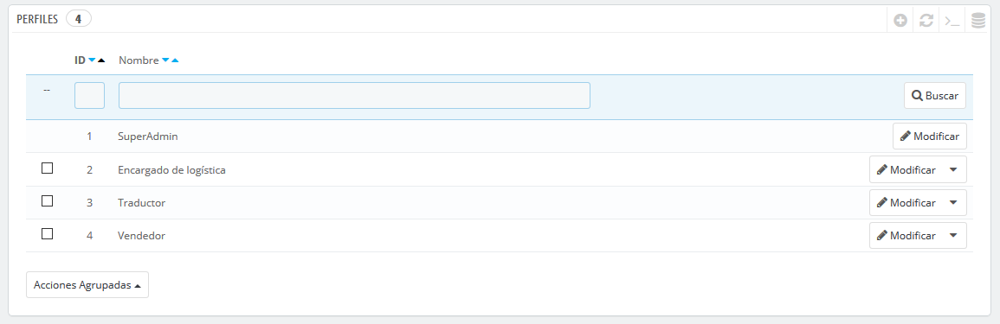
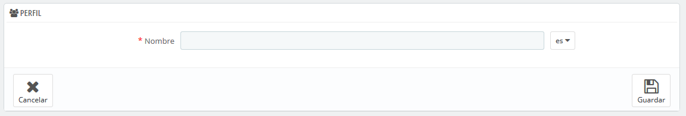

# Perfiles

PrestaShop te permite asignar deberes y derechos específicos a cada uno de los empleados que te ayuda a administrar tu tienda en línea. Por ejemplo, el administrador podría tener acceso a toda la tienda, sin ningún tipo de restricción, mientras que un empleado podría tan sólo tener acceso al catálogo de productos o pedidos.

De manera predeterminada, PrestaShop tiene 4 perfiles ya preparados para utilizar:

* **SuperAdmin**. El rango más alto. Cuenta con todos los derechos y pueden acceder a todas las funcionalidades de PrestaShop.
* **Encargado de logística**. El personal encargado del embalaje y del envío de pedidos. Sólo pueden acceder a los pedidos, transportistas, páginas de gestión de stock, y una parte de las páginas del catálogo y de los clientes.
* **Traductor**. Aquellos empleados que están encargados de traducir el contenido textual de tu tienda. Pueden acceder a productos y categorías, páginas de contenido y a la página "Traducciones".
* **Vendedor**. Tu personal de venta, si lo tienes. Además de los derechos de acceso del perfil traductor, también puedes acceder a las páginas de los clientes, módulos, webservice, y algunas estadísticas.

Puedes ver detalladamente los derechos de acceso revisando cada perfil en la página "Permisos".

El perfil SuperAdmin no puede ser eliminado, sólo renombrado.

Debe haber por lo menos un empleado con un perfil SuperAdmin.

## Añadir un nuevo perfil 

Puedes añadir tanto perfiles como consideres necesario.

  
Añadir un perfil es muy sencillo: simplemente haz clic en el botón "Añadir nuevo perfil", introduce un nombre exclusivo para el nuevo perfil, y guárdalo.

La parte más compleja llega a la hora de establecer los nuevos derechos de acceso a los perfiles. Esto se realiza desde la página "Permisos".

