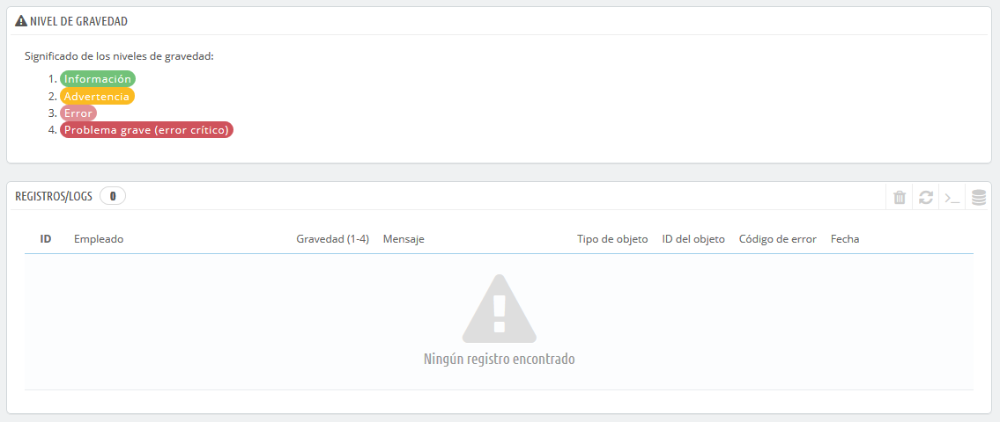
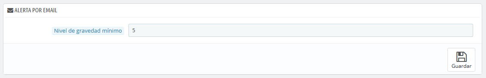

# Registros/Logs

Los problemas se producirán tarde o temprano. La mayoría de las veces, no será conscientes de ellos porque PrestaShop los gestiona por ti de manera silenciosa. Pero es posible que quieras conocerlos, para poder corregir aquellos que se producen con mayor frecuencia, y dar una mayor estabilidad a tu tienda.

La página "Registros/Logs" te permite consultar los errores PHP que se producen. Estos se registran en la tabla central de esta página, y se presentan en 4 niveles según su gravedad:

* **1: Solamente con fines informativos**. Notificaciones en tiempo de ejecución. Indican que el script encontró alguna cosa que podrían indicar un error, pero también puede ser un evento normal de la vida de un script.
* **2: Advertencia**. Indican una advertencia en tiempo de ejecución \(error no crítico\). La ejecución del script no es interrumpida.
* **3: Error**.
* **4: Problema grave \(error crítico\)**. Errores fatales en tiempo de ejecución. Estos indican errores que no pueden ser ignorados, como un problema de asignación de memoria. La ejecución del script es detenida.

Estas informaciones han sido extraídas del manual oficial de PHP. Puedes obtener mayor información en el siguiente enlace: [http://www.php.net/manual/es/errorfunc.constants.php](http://www.php.net/manual/es/errorfunc.constants.php.).

## Alertas por email 

Estos niveles de error también sirven como valores para la funcionalidad "Alerta por e-mail".  
PrestaShop añade un último valor, 5, el cual indica que el administrador no desea recibir ninguna notificación por e-mail, ya sean éstos de gravedad o no.

La herramienta de registro de errores te permite recibir una notificación cuando se produzca un error. Las notificaciones se envían a la dirección de correo electrónico del propietario de la tienda, y puedes configurar el grado de importancia a la hora de comenzar a recibir este tipo de mensajes de correo electrónico:

* "1" si deseas recibir todo, incluso la información más nimia.
* "3" si tan sólo quieres conocer los errores que se produzcan \(errores y problemas importantes\).
* "4" si tan sólo quieres conocer los errores críticos.
* "5" es el valor por defecto, y significa que no te será enviada ninguna notificación.

