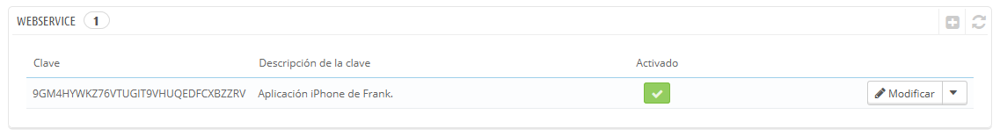
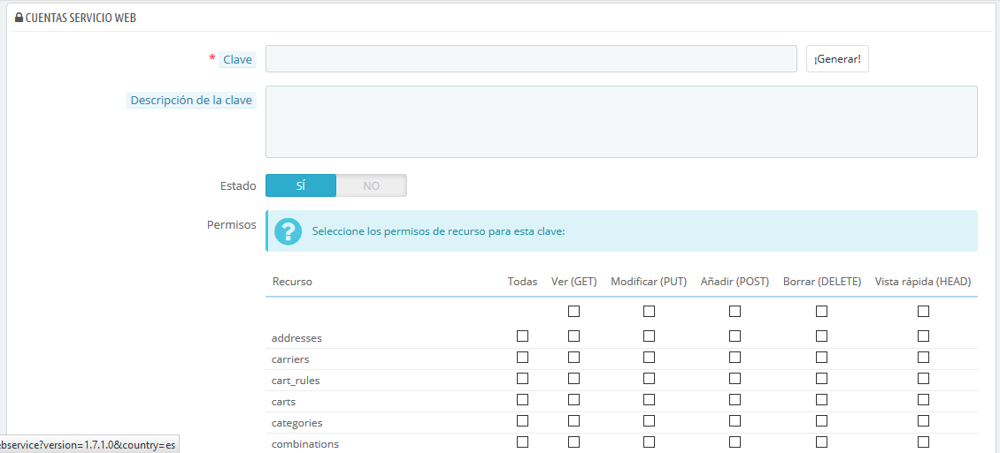
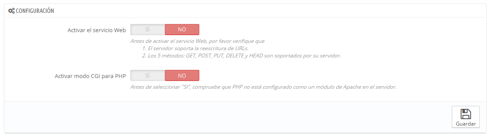

# Webservice \(Servicio Web\)

En esta página, puedes habilitar el webservice \(servicio web\) de tu tienda, para que herramientas de terceros puedan acceder a tus datos. Potencialmente, esto abre la puerta a la creación de herramientas útiles que ayudarán a tus clientes o a ti mismo a utilizar tu tienda más eficazmente \(como por ejemplo aplicaciones móviles\).

Un webservice \(servicio web\) es un método de comunicación entre dos dispositivos a través de una red. Estos se basan en un conjunto conocido de métodos, formatos y permisos de acceso, que se utilizan para acceder al contenido del servicio web desde cualquier herramienta autorizada, y obtener o intercambiar datos. Puedes obtener más información sobre éste en la siguiente página de la Wikipedia: [http://es.wikipedia.org/wiki/Servicio\_web](http://es.wikipedia.org/wiki/Servicio_web).

Al abrir la página se lista las claves del servicio web existentes en una tabla. Una clave de servicio web es un acceso único que tu proporcionas al desarrollador, la cual puede ser utilizada para vincularla con la herramienta de tu tienda. Debes compartir estas claves con moderación, de no hacerlo así muchas personas podrían tener acceso a tus datos.

No todas las aplicaciones pueden acceder a tu tienda a través del servicio web de PrestaShop: tu decides cuales pueden hacerlo, y determinar lo que cada una de ellas puede realizar. Cada aplicación tiene una clave de conexión única, con derechos de acceso específicos.

## Añadir una nueva clave 

El botón "Añadir una nueva clave webservice" te redirecciona al formulario de creación de claves del servicio web:

* **Clave**. Una clave única. Puedes crear una tu mismo, u optar por utilizar una generada, haciendo clic en el botón "¡Generar!" o bien utilizando cualquier generador de claves online. Las claves generadas son más seguras, porque son más difíciles de adivinar.
* **Descripción de la clave**. Un recordatorio del destinatario de la clave, y los derechos que le das.
* **Estado**. Puedes desactivar una clave en cualquier momento. Esto te permite conceder sólo temporalmente el acceso a tus datos a una determinada clave.
* **Permisos**. No debes compartir TODOS tus datos con cada clave. Puedes elegir entre una amplia gama de permisos, ya sea por sección o por tipo de acceso. Es posible que desees que algunas aplicaciones sólo sean capaces de visualizar algunos de tus artículos, mientras que otras \(por ejemplo, la que utilizarías para gestionar la tienda de forma remota\) podrían tener permisos para modificar y eliminar casi todos los datos. Te recomendamos que cumplimentes esta selección de permisos con cuidado.

Haz clic en "Guardar" cuando tu clave esté lista.

## Configuración 

¡Por razones de seguridad, asegúrate de que el servidor de tu tienda acepta conexiones SSL!.

La configuración webservice es bastante fácil:

* **Activar el webservice de PrestaShop**. Si no quieres que nadie tenga acceso a tu tienda a través de herramientas y aplicaciones de terceros, mantén esta opción desactivada.
* **Activar el modo CGI para PHP**. El modo CGI es una configuración especial del servidor Apache con el que se especifica que se utilice PHP en modo CGI en lugar de como un módulo de Apache. Si bien el modo CGI tiene una reputación de ser más seguro, se han encontrado fallos de seguridad en mayo de 2012. Consulta esta configuración con tu proveedor de hosting.

