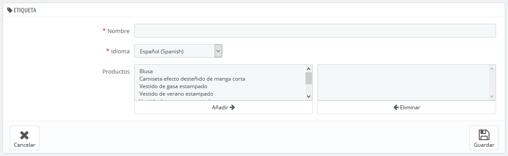

# Etiquetas

La funcionalidad de etiquetado permite asociar tus productos con palabras clave. Tus clientes pueden utilizar las palabras clave para encontrar rápida y fácilmente los productos que están buscando.

Por ejemplo, supongamos que un cliente quiere encontrar un reproductor de MP3 en tu tienda. Para encontrar el producto que corresponde a su búsqueda, es necesario que haya una etiqueta que asocie la palabra clave "MP3" al producto "iPod nano".

Las etiquetas de productos y las palabras clave de una página son cosas diferentes: las primeras \(las etiquetas\) no tienen un impacto directo sobre el posicionamiento en los motores de búsqueda.Para trabajar el posicionamiento de tu tienda en los motores de búsqueda, abre la pestaña "SEO" disponible en la página de creación de productos.

Tienes dos maneras de establecer esta característica.

## Primera solución: Al crear un nuevo producto 

Puedes asociar varias etiquetas a tu producto desde el momento en que se crea en PrestaShop, directamente en el campo "Etiquetas" en la pestaña "Opciones" del producto.

## Segunda solución: Gestionar etiquetas 

La página "Etiquetas" en el menú "Catálogo" te permite crear nuevas etiquetas y gestionar las etiquetas existentes. Una vez que hayas especificado las etiquetas para cada uno de tus productos, tendrás una amplia lista de etiquetas disponibles en dicha página.

Para crear una nueva, haz clic en el botón "Añadir nueva etiqueta", la página de creación aparecerá en pantalla.

Esta interfaz te permite añadir etiquetas a uno o varios de tus productos.

* **Nombre**. Proporciona un nombre a la etiqueta. Este nombre de ser claro y conciso, con el fin de ayudar a tus clientes a encontrar los productos asociados a ellas.
* **Idioma**. Indica en qué idioma aparecerá la etiqueta en tu tienda. PrestaShop es lo suficientemente inteligente como para no mostrar palabras clave en español a los clientes que optan por ver la versión francesa del sitio, por ejemplo.
* **Productos**. Selecciona los productos de la columna de la derecha a la que deseas aplicar la etiqueta. Mantén presionada la tecla Ctrl del teclado para seleccionar varios productos a la vez.

Una vez guardada la página, las etiquetas se aplicarán a todos los productos que figuran en la lista de la derecha.

Para añadir la misma etiqueta para otro idioma, sólo tienes que repetir la operación, sólo que esta vez, cambiando el idioma en la lista desplegable.

Después de guardar la etiqueta, serás redirigido al listado de etiquetas, donde puedes modificarlas o eliminarlas, o incluso eliminar varias a la vez utilizando el botón que aparece en la parte inferior de la lista.  
 Junto a los iconos de papelera, un número indica el número de productos que hacen uso de la etiqueta.

A partir de ahora, cuando tus clientes realicen una consulta de búsqueda en tu sitio, los resultados que recibirán también dependerán de las etiquetas que hayas asociado a los productos.

