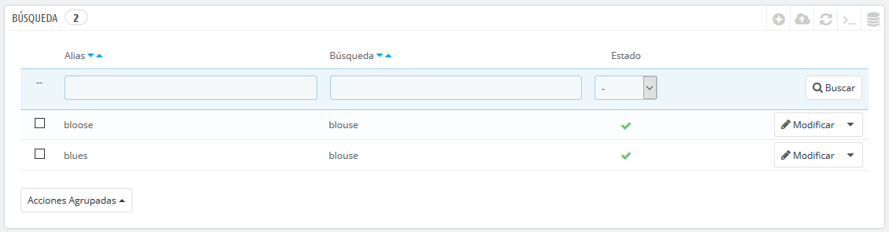
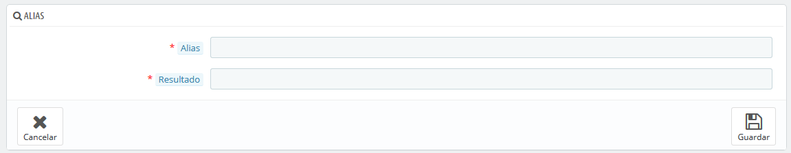
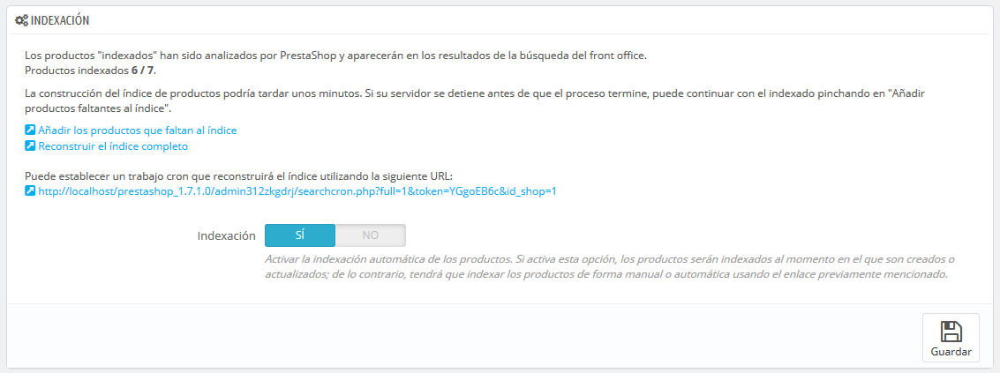
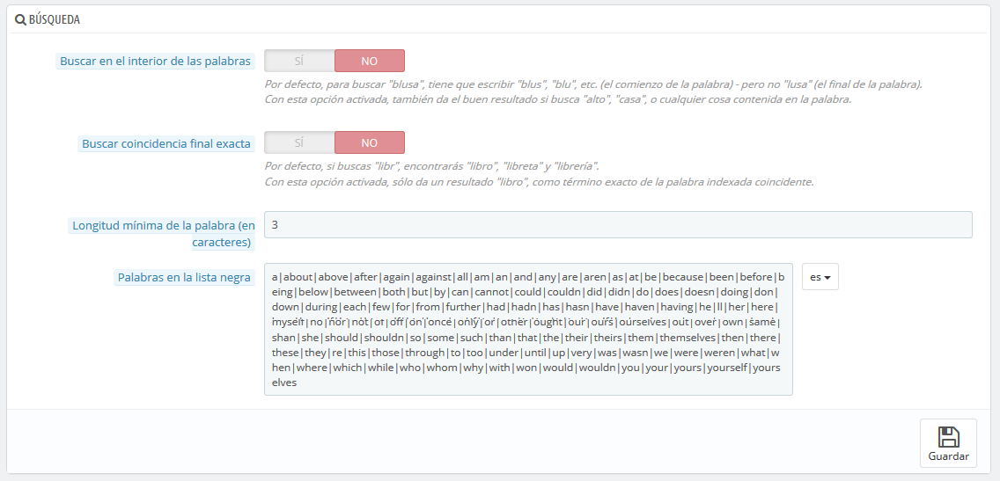
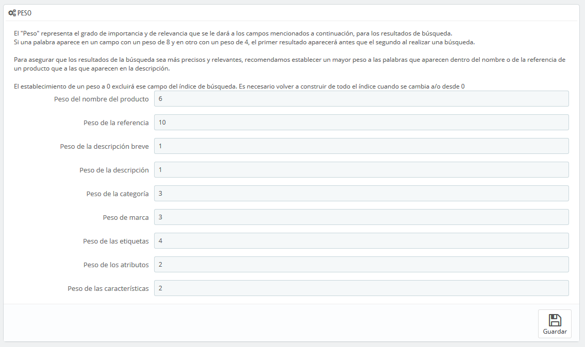

# Parámetros de Búsqueda

La página "Búsqueda" permite configurar las funciones de búsqueda de tu tienda.

## Listado de alias 

Cuando los clientes realizan una consulta utilizando el buscador interno de tu tienda, podrían cometer errores. Si PrestaShop no encuentra resultados correctos para la consulta del cliente, la característica "alias" podría proporcionar al cliente ciertas alternativas. De esta forma podrías registrar productos que pudieran causar errores al escribirlos, y corregir las consultas erróneas de los clientes.

Para crear un nuevo alias, deberías primero conocer los errores de escritura cometidos más frecuentemente por tus clientes:

1. Dirígete a la pestaña "Búsquedas en la tienda" de la página "Estadísticas", bajo el menú "Estadísticas". Desde aquí puedes ver las palabras escritas por tus clientes, así como los errores más frecuentes que cometen.
2. Toma nota de los errores más frecuentes, y añádelos a tu listado de alias, para indicar al usuario el producto correcto que seguramente esté buscando.
3. Haz clic en el botón "Añadir nuevo alias" en la página de preferencias "Búsqueda".

El formulario de creación es muy sencillo: indica el error tipográfico que deseas corregir y la palabra correcta a la que deben dirigirse.

Por ejemplo, supongamos que tus clientes con frecuencia escriben erróneamente la palabra "player" utilizando los términos "palyer" y "plaier". Puedes crear una etiqueta alias para cada uno de estos errores, el cual corresponderá con la palabra "Player". Tus alias pueden ser utilizados tan pronto como se guarden.

Te invitamos a que consulte las secciones de esta guía dedicadas a las meta etiquetas de los productos y las categorías, para que comprendas mejor cómo PrestaShop muestra los productos basándose en las palabras escritas por tus clientes.

## Indexación 

Esta sección proporciona información sobre el número de productos que se pueden buscar a través del buscador de tu tienda, y lo compara con el número de productos presentes en la base de datos. Si los valores no coinciden, debes hacer clic en el enlace "Añadir los productos que faltan al índice". Sólo los nuevos productos serán indexados.  
Si has realizado cambios a los productos ya indexados, es posible que prefieras volver a reconstruir todo el índice. El proceso "Reconstruir el índice completo" toma más tiempo, pero es más completo.

PrestaShop también te ofrece una dirección URL para ejecutar una tarea periódicamente, usando "cron" \(en Linux\) o "Tareas programadas" \(en Windows\) que reconstruye el índice automáticamente. Si no sabes lo que es una tarea cron o un archivo crontab, pónte en contacto con tu proveedor de hosting.

Finalmente, la opción "Indexando" te permite indexar los productos tan pronto como son creados o son modificados, de lo contrario, tendrás que indexar los productos de forma manual o automática usando el enlace previamente mencionado.

## Opciones de búsqueda 

Esta sección permite configurar el comportamiento de la función de búsqueda de tu tienda:

* **Buscar en el interior de las palabras**. Esta opción mejora las búsquedas, permitiéndote encontrar coincidencias no solamente al inicio de la cadena, sino también en el interior de las mismas; por ejemplo, "lus" para "blusa".
* **Buscar coincidencia final exacta**. Con esta opción puedes ofrecer resultados que coincidan exactamente con el final de la palabra de búsqueda. Por ejemplo, si buscas "libro", verás "cuaderno", pero no "estantería".
* **Longitud de palabra mínima**. Puedes seleccionar el tamaño mínimo que debe tener una palabra para que esté registrada en el índice de búsqueda y pueda ser encontrada por tus clientes. Esta característica te permite eliminar palabras cortas en la búsqueda, como preposiciones o artículos \(el, y, por, etc.\)
* **Palabras en la lista negra**. Puedes añadir las palabras que serán descartadas automáticamente de los términos de búsqueda. Introdúcelas directamente en este campo, separando cada una de ellas con un carácter "\|". \(carácter "pleca" o también denominado "barra vertical", no L minúscula\). De manera predeterminada, PrestaShop rellena la lista con palabras cortas comunes.

## Peso 

PrestaShop te permite dar prioridad a ciertos datos cuando se realiza una búsqueda en tu tienda.

Como se indica en la sección, el "Peso" representa el grado de importancia y de relevancia que se les dará a los campos en los resultados de una búsqueda.  
Un artículo con un peso 8 tendrá 4 veces más valor que un artículo con peso 2.

Por ejemplo, por defecto el "Peso del nombre del producto" tiene un valor 6, el "Peso de las etiquetas" tiene un valor 4, y tanto el "Peso de la descripción breve" como el "Peso de la descripción" tienen un valor 1. Esto significa que un producto con "ipod" en su nombre aparecerá más alto en los resultados de la búsqueda que otro producto que tenga "ipod" sólo en sus etiquetas. Mientras tanto, un producto que sólo tenga "ipod" en cualquiera de sus campos de descripción ocupará la posición más baja en los resultados de la búsqueda.

Dispones de muchos elementos a los que puede asignar un peso: descripción breve, categorías, etiquetas, atributos, etc. Te darás cuenta de que los resultados pueden revertirse simplemente cambiando el peso de ciertos campos. El refinamiento de estos ajustes será especialmente visible en los catálogos con muchas referencias.

Una vez hayas guardado los cambios realizados, estos se aplicarán inmediatamente.

