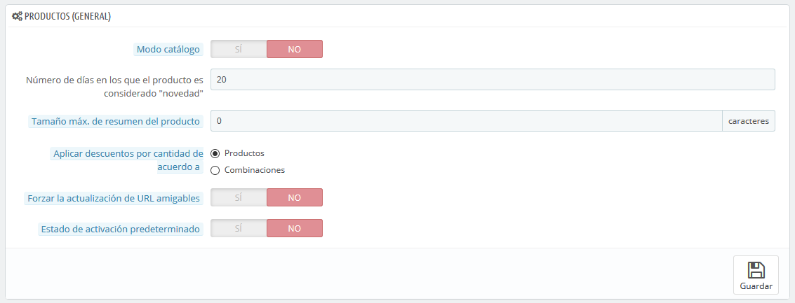
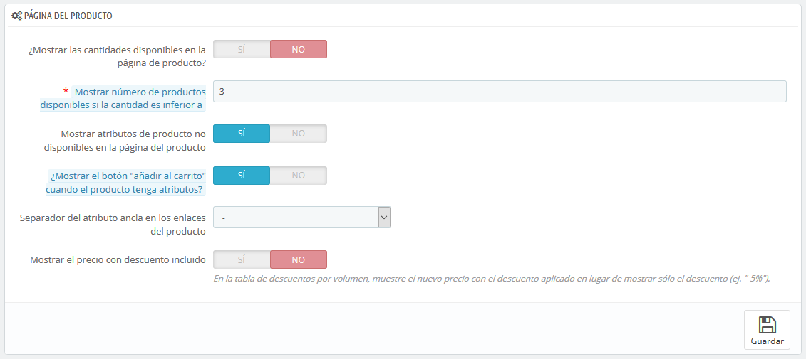

# Configurar los Productos

Esta página contiene algunas preferencias relativas a cómo tus productos son gestionados y mostrados por PrestaShop.

## Preferencias generales 

* **Modo catálogo**. La activación del Modo Catálogo convierte a tu tienda en una simple galería de productos, sin posibilidad de comprar productos.
* **Número de días en los que el producto es considerado 'novedad'**. Cuando añades un producto a tu tienda, este es considerado nuevo y será visible tanto en el bloque "Novedades" como en la página "Nuevos productos". El campo te permite especificar el número de días que el producto permanecerá visible en el bloque y en la página. Con esta funcionalidad, tu decides cómo mostrar y actualizar las novedades de tu tienda. La página de "Novedades" es generalmente la más visitada por tus clientes habituales.
* **Tamaño máximo para la descripción corta**. Tu producto tiene dos descripciones: una "descripción corta" y otra normal. La descripción corta, aparece en los buscadores y en la sección descripción de tu producto. De manera predeterminada, está limitada a 400 caracteres, pero esta opción te permite cambiar este límite. 0 significa que la descripción corta, no está limitada.
* **Aplicar descuentos por cantidad de acuerdo a**. Esta configuración indica la base en la que Prestashop debe basarse para aplicar descuentos: por producto, o por combinación \(que puede presentar múltiples productos\).
* **Forzar la actualización de URL amigables**. De manera predeterminada, la URL amigable de la página de un producto es generada a partir del nombre del producto, y ésta continuará siendo la misma, aunque cambies el nombre del producto – con la finalidad de que tus productos estén bien referenciados, sus URL deben ser estables. Al activar esta opción, PrestaShop actualizará la URL amigable cada vez que cambies el nombre del producto o el título de la página.
* **Activar nuevos productos de manera predeterminada**. Si activas esta opción, los nuevos productos se activarán automáticamente al crearlos.

## Preferencias de Paginación 

* **Productos por página**. Indica cuántos productos se mostrarán en las páginas de tus categorías.
* **Ordenar productos por**. Indica el orden de los productos en las categorías de tu tienda. Seis opciones están disponibles: 
  * **Nombre del producto**. Muestra tus productos por orden alfabético.
  * **Precio del producto**. Muestra tus productos conforme a sus precios.
  * **Fecha de creación**. Muestra tus productos de acuerdo a la fecha en la que fueron añadidos a tu tienda.
  * **Fecha de modificación**. Cuando se edita un producto, su fecha de modificación cambia. Esta opción hace que tus productos aparezcan en el orden de la fecha de modificación.
  * **Posición dentro de la categoría**. Muestra tus productos tal como ellos fueron posicionados en las categorías de tu catálogo. La posición de los productos puede ser modificada en el catálogo de tu tienda usando las flechas de posición. De esta manera, podrás mostrar primero los productos más interesantes para tus clientes.
  * **Marca**. Muestra tus productos en orden alfabético de los nombres de tus marcas.
  * **Cantidad de producto**. Muestra tus productos en base a su cantidad disponible.
  * **Referencia del producto**. Muestra tus productos en función de su número de referencia.
* **Método de ordenación predeterminado**. Las opciones anteriores pueden ser ordenadas de forma ascendente o descendente.

## Preferencias de la página del producto 

* **Mostrar las cantidades disponibles en la página de producto**. Al activar esta funcionalidad, los visitantes pueden ver las cantidades en stock disponibles de cada producto. La visualización de esta información se puede utilizar para estimular las ventas en el caso de que la cantidad en stock sea baja. Las cantidades mostradas dependerán de los atributos y combinaciones seleccionadas.
* **Mostrar número de productos disponibles si su cantidad es inferior a**. Puedes optar por mostrar una alerta cuando el stock disponible restante de un producto se encuentre por debajo de un cierto nivel. Esta opción es particularmente útil para promocionar compras. Tanto el texto como el posicionamiento de la alerta dependerán del tema que estés utilizando; en el tema predeterminado, ésta muestra el mensaje "Advertencia: ¡Últimas unidades en stock!", próximo al botón de "Añadir al carrito".
* **Mostrar productos no disponibles en la página de producto**. Tus productos pueden estar compuestos de combinaciones o atributos diferentes: color, tamaño, capacidad, etc. Los atributos pueden ser editados desde la página "Atributos y Características" en el menú "Catálogo". Cuando un producto con uno o varios atributos ya no está disponible, tienes dos posibilidades: 
  * Primera posibilidad: Dejar esta preferencia activa. Ejemplo: El "iPod Shuffle" no está disponible en color "Azúl" en tu tienda. Al mantener esta opción activada, la combinación del producto permanecerá visible en la tienda. Un mensaje indicará que el producto ya no está disponible en la opción elegida, e invitará a los clientes a seleccionar otra combinación. Si has activado la opción "Permitir comprar productos fuera de stock" \(véase más adelante\), los clientes podrán añadir los productos a sus carritos, aunque la combinación no esté disponible.
  * Segunda posibilidad: Desactivar esta preferencia. Si la combinación "Azúl" del producto "iPod Shuffle" no está disponible, esta selección no se mostrará en el front-office y los clientes no podrán seleccionarla. Esta característica ayuda a visualizar claramente la disponibilidad de tus productos.
* **Mostrar el botón "añadir al carrito" cuando el producto tiene atributos**. Esta opción evita que los clientes puedan añadir un producto a sus carritos directamente desde la página de la categoría, si ese producto tiene combinaciones. Esto obliga a que los clientes visiten la página del producto y allí sea donde elijan una combinación, así evitas la confusión de que los clientes añadan el producto con la combinación por defecto que aparece en la página de la categoría. Ten en cuenta que los productos que no tienen ninguna combinación tendrán un botón "Añadir al carrito", en la página de la categoría.
* **Separador del atributo ancla en los enlaces del producto**. Elige el separador que deseas, entre las dos opciones disponibles: "," y "-".
* **Mostrar el precio con descuento incluido**. En la tabla de descuentos por volumen, muestra el nuevo precio con el descuento aplicado en lugar de mostrar sólo el porcentaje de descuento.

## Preferencias de productos en stock 

* **Permitir ventas de productos que no están en stock**. Aunque un producto no tenga unidades disponibles en stock, el cliente podría comprar o no este artículo.
* **Activar el manejo automático del inventario**. Esta opción te permite ajustar la función principal del gestor de existencias: puedes establecer la cantidad actual que tiene un producto \(stock\), y permitir que PrestaShop reduzca esta cantidad cada vez que se produzca un pedido, e incremente esta cantidad por cada pedido cancelado o devuelto. De manera predeterminada, deberías dejar esta función activada, ya que desactivar esta afectaría a todo el inventario de tu tienda. Solamente debes desactivar esta opción, si no tienes ningún inventario físico – por ejemplo, si sólo vendes productos virtuales.
* **Gestión predeterminada del stock** **de packs de productos**. Cuando vendes packs de productos, la forma en que se actualiza tu stock depende de esta opción. Tienes tres posibilidades: 
  * Decrementar sólo packs. Cuando un pack se vende, sólo el stock para los packs se verá afectado.
  * Decrementar sólo productos en el pack. Cuando se vende un pack, sólo se afectará al stock de cada producto.
  * Decrementar ambos. Cuando se vende un pack, tanto el stock del pack como el stock de cada producto serán afectados.

Esta configuración se puede cambiar para cada uno de los packs individualmente, desde tu propia página de producto, en la pestaña "Cantidades".

