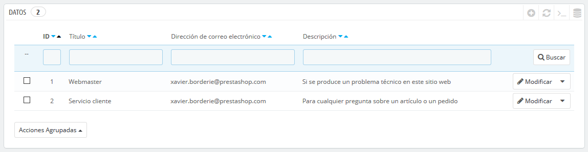
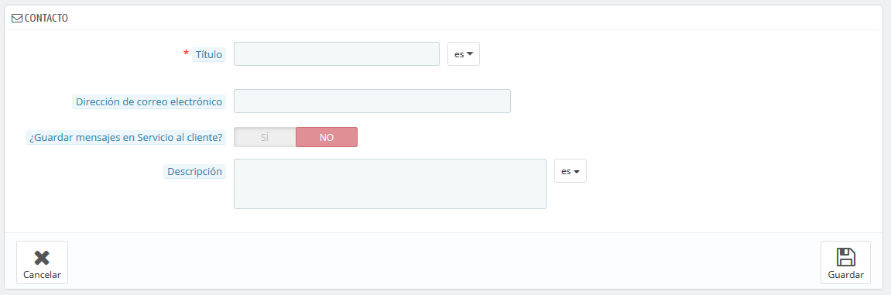
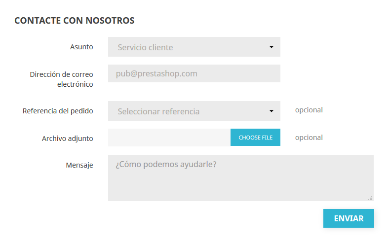

# Contactos

La página "Contáctanos" en tu tienda muestra un formulario de contacto para ponerse contigo. De acuerdo con las necesidades de tus clientes, sus mensajes pueden ser enviados a diferentes departamentos para que la persona adecuada se encargue de las solicitudes.

Puedes crear varias cuentas de contacto para recibir más ordenadamente las solicitudes de tus clientes. Por ejemplo: servicio al cliente, soporte técnico, departamento de ventas, etc.

En la página "Datos", puedes acceder a la lista de contactos existente. Para que el mensaje se redirija al destinatario deseado, debes configurar los contactos en tu tienda.

## Crear un nuevo contacto 

Haz clic en el botón "Añadir nuevo contacto", para acceder al formulario de creación de contactos:

* **Título**. El nombre del contacto: o bien el nombre de una persona, o el nombre del servicio en sí. También puedes optar por utilizar una frase, tales como "Tengo un problema con mi pedido", "Quiero devolver un producto" o "Quiero convertirme en asociado". Esta información se muestra en el menú desplegable "Asunto" del formulario de contacto, y esto es lo que verá tu cliente al ponerse en contacto contigo.
* **Dirección de correo electrónico**. La dirección puede ser la misma que la de otro contacto. De hecho, todos los contactos pueden compartir la misma dirección si realmente no tienes un equipo de personas trabajando en tu tienda – los clientes nunca lo sabrán, pero tener muchos contactos ayuda a que ellos confíen en tu tienda, ya que significará que hay muchas personas trabajando en ella.
* **¿Guardar mensajes en Servicio al cliente?**. Indica si los mensajes de correo se van a guardar en la herramienta "Servicio al Cliente", o simplemente serán enviados a la dirección de correo electrónico. Si se desactiva, PrestaShop no te ayudará a gestionar el servicio al cliente para este contacto. Esto puede ser útil para contactos tipo "Asociados", ya que es posible que prefieras que estos mensajes lleguen directamente a tu bandeja de entrada sin que sean leídos por tu equipo.
* **Descripción**. Establece una descripción corta, de no más de una línea, ya que esta se muestra al cliente en el formulario de contacto \(dependiendo del tema\).

## Cómo puede el cliente ponerse en contacto contigo 

Para contactar con el equipo de empleados desde el front-office de tu tienda, el cliente puede hacer clic en el enlace "Contacta con nosotros" situado en la parte superior de la página principal, o bien en el enlace "Contáctanos" situado en la parte inferior de la página. El formulario de contacto aparecerá en pantalla.

El cliente deberá seleccionar la persona con la que desea contactar, introducir su dirección de correo electrónico y a continuación escribir el mensaje. Un menú desplegable permite seleccionar la referencia del pedido, e incluso el producto para el que se está realizando la consulta.

El módulo "Información de contacto" y y la página "Contacta con nosotros" de tu tienda, también te permite mostrar tus datos de contacto en el pie de página. Tus detalles de contacto se gestionan en la pestaña "Contactos de la Tienda".

