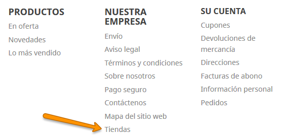
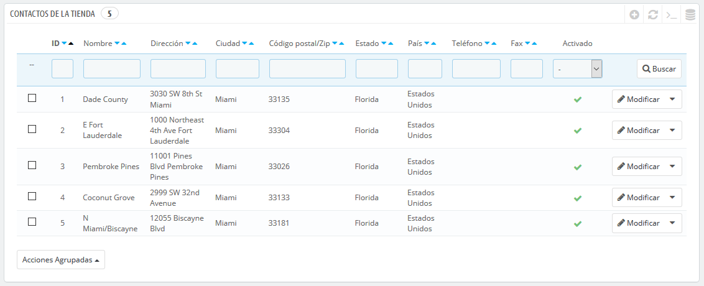
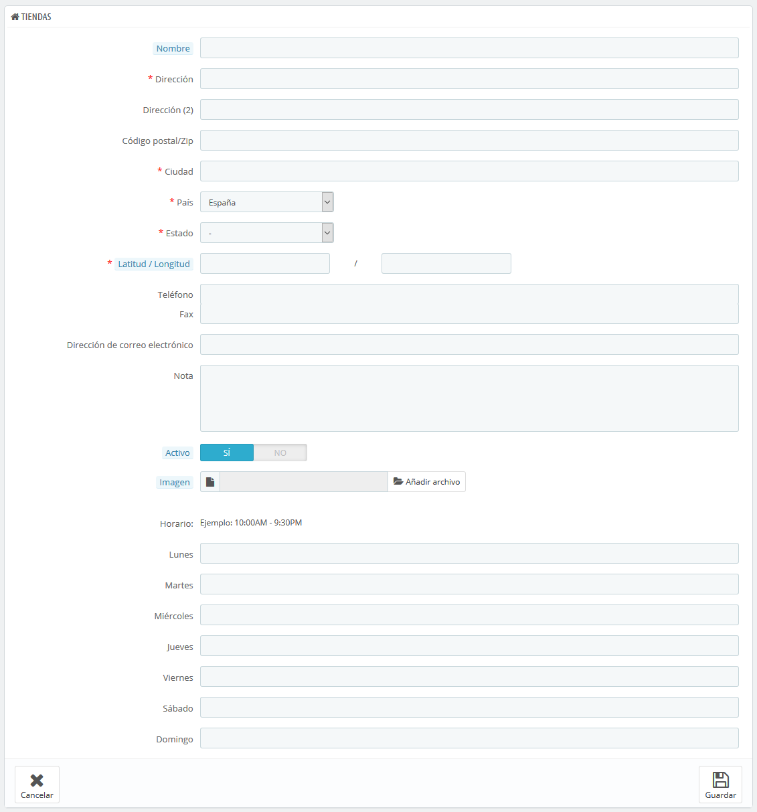
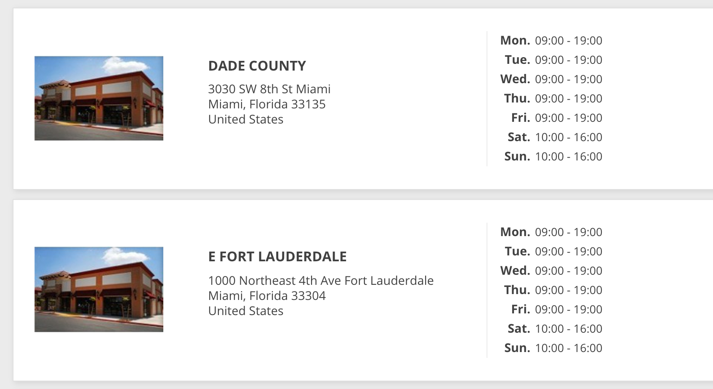
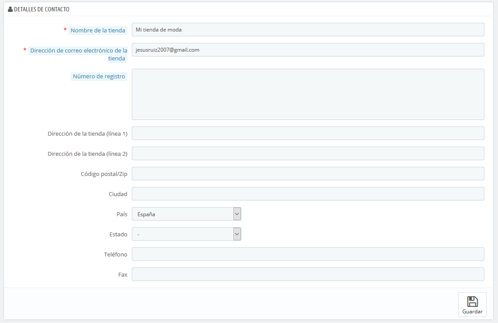

# Tiendas y Datos de Contacto

## Preferencias de Contactos de la tienda 

PrestaShop proporciona un listado sobre tus tiendas físicas a tus clientes \(si tiene\), con información de contacto detallada. Obviamente, esta característica sólo es útil si tienes tiendas físicas, donde los clientes puedan ir a comprar tus productos.

Los clientes pueden encontrar la ubicación de tu tienda física, desde el enlace "Tiendas", situado al pie de página del front-office.

No se puede desactivar esta característica, pero puedes hacer que ésta no sea accesible por tus clientes:

* Desactiva o elimina todas las tiendas listadas en la página de administración "Contactos de la tienda".
* Desactiva el enlace situado en el pie de página: en la página de administración "Widget de enlaces", elimina el enlace "Tiendas" del bloque "Nuestra empresa".

En este punto, la página seguirá existiendo y seguirá siendo accesible por los motores de búsqueda. Para eliminarla definitivamente, debes:

* Dirígirte a "Parámetros de la tienda &gt; Trafico y SEO &gt; SEO y URLs"
* Encontrar la página "Tiendas"
* Elimínarla.

Si algún día deseas volver a disponer de la página "Tiendas", debes crear una nueva página en la página "SEO y URLs", con la siguiente información:

* Nombre de la página: Selecciona "Stores"
* Título de la página: "Tiendas"
* Reescritura URL: "tiendas"

### Listado de tiendas 

Puedes elegir cómo se muestran estas tiendas en el front-office. El cliente puede acceder a ellas a través del enlace "Tiendas" \(dependiendo del tema\)

Todas tus tiendas se enumeran en un listado, que ofrece la información principal de las mismas y un indicador de si la tienda está activa – es posible que, por ejemplo, quieras añadir la información de tu propia tienda física, para que tus clientes locales puedan comprar tus productos sin necesidad de pedirlos a través de tu tienda en línea.

#### Añadir una nueva tienda física 

Haz clic en el botón "Añadir nueva tienda", para acceder al formulario de creación:

Rellena todos los campos que consideres necesarios. Estos datos serán visualizados por tus clientes.

Un campo muy importante es el de "Latitud / Longitud", ya que este es el que utiliza PrestaShop para indicar la ubicación de tu tienda. Puedes utilizar la herramienta en línea de Steve Morse para obtener las coordenadas de tu tienda: [http://stevemorse.org/jcal/latlon.php](http://stevemorse.org/jcal/latlon.php).

Asegúrate de añadir una foto de la fachada de tu tienda, ya que esta ayudará a tus clientes a encontrarla.

Finalmente, el horario de oficina es una parte esencial de cualquier tienda física, así que debes ser lo más preciso posible con este dato.

## Datos de contacto 

Esta sección te permite especificar mayor información sobre tu empresa \(sede central o tienda principal\), y no de una tienda en particular. Debes rellenar todos los campos con la información de tu sede central o tienda principal, ya que esta será sin duda la dirección a la que los clientes escriban, o incluso visiten en caso que lo necesiten.

Estos campos deben ser rellenados con especial atención:

* **Nombre de la empresa o tienda**. El nombre de tu negocio: empresa o tienda. Este debe ser corto, ya que será utilizado en toda tu correspondencia y en los títulos de las páginas.
* **Dirección de correo electrónico de la tienda principal o sede central**. La dirección de correo electrónico oficial de tu negocio. Utiliza la dirección de correo electrónico de contacto general que los clientes deben ver cuando reciban un mensaje de correo electrónico de tu tienda.
* **Número de registro mercantil**. Indica el número de registro legal de tu empresa, el cual depende del sistema jurídico de tu país \(número Duns en EE.UU., número SIRET en France, número CNPJ en Brasil, etc.\). Esto demuestra que tu negocio ha sido registrado oficialmente, lo que dará confianza a tus clientes.
* **Dirección de la tienda principal o sede central \(línea 1\)** / **Dirección de la tienda principal o sede central \(línea 2\)** / **Código Postal/ZIP** / **Ciudad** / **Provincia** / **País**. Utiliza la dirección de contacto oficial de tu negocio. La opción "Provincia" sólo aparece cuando el país seleccionado tiene provincias registradas en la base de datos \(puedes comprobarlo desde la página "Estados \(Provincias\)" en la página "Localización" del menú "Internacional"\).
* **Teléfono**. El número de teléfono oficial de tu negocio. Si prefieres que los clientes no te llamen, no pongas nada en este campo.
* **Fax**. El número de fax oficial de tu negocio.

No utilices el signo de puntuación dos puntos \(":"\) en el nombre de tu tienda, ya que éste podría provocar que alguna funcionalidad no trabaje correctamente \(por ejemplo, podría producirse errores al enviar correos electrónicos\).

Puedes reemplazar el signo de puntuación dos puntos con un guion, si necesitas especificar dos secciones en el título. Por ejemplo, utiliza "Mi Tienda – El mejor lugar para comprar artículos" en lugar de "Mi Tienda: El mejor lugar para comprar artículos".

