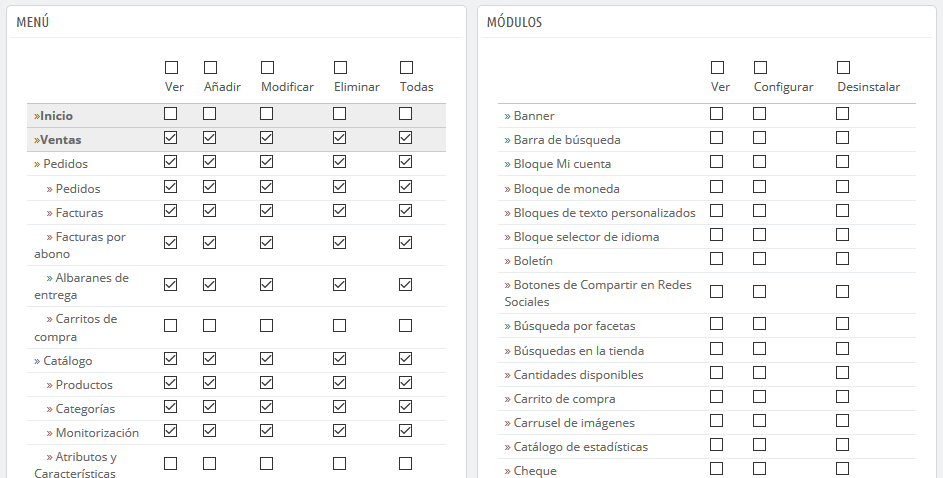

# Permisos

Los permisos son la parte central de los perfiles de PrestaShop. Estos te permiten ver de manera muy precisa lo que una cuenta de empleado puede y no puede hacer en tu tienda.

La página de administración "Permisos" está construida con pestañas:

* A la izquierda de la pantalla, encontrarás tantas pestañas como perfiles haya disponibles.
* En la parte derecha de la pantalla, PrestaShop muestra los permisos al hacer clic en cualquier perfil. Esta pestaña contiene dos tablas:

Al hacer clic en cualquier perfil \(excepto en el perfil SuperAdmin\), aparecen dos tablas que te dan acceso a tus criterios:

* A la izquierda, se encuentran los permisos relacionados con los menús: puedes decidir qué acciones puede realizar el perfil en un menú / página. Como comprobarás, puedes evitar que un perfil pueda modificar el contenido de una página, o incluso ocultar el menú completamente.
* A la derecha, los permisos relacionados con los módulos: aunque puedes permitir que ciertos perfiles vean los módulos disponibles, es posible que prefieras que tan sólo los empleados más capacitados puedan configurar algunos de estos módulos.

Para cada uno de estos criterios de menú, tienes 5 opciones disponibles:

* **Ver**. Los empleados pueden ver la información.
* **Añadir**. Los empleados pueden añadir nueva información.
* **Editar**. Los empleados pueden modificar la información.
* **Eliminar**. Los empleados pueden eliminar información.
* **Todas**. Activar todas las opciones anteriores para la fila actual.

Mientras tanto, los criterios de módulos tienen tan sólo 3 opciones:

* **Ver**. Los empleados pueden ver la configuración de un módulo.
* **Configurar**. Los empleados pueden configurar el módulo.
* **Desinstalar**. Los empleados pueden desinstalar módulos

Los permisos SuperAdmin no pueden ser modificados: el perfil simplemente cuenta con todos los derechos para cada criterio.

## Establecer permisos para un nuevo perfil 

Para este ejemplo vamos a crear un nuevo perfil, "Preparador de pedidos". Primeramente, crea el perfil en la página "Perfiles", rellenando el campo "Nombre". Tan pronto como se guarda, éste aparece en la lista de perfiles.

A continuación, tienes que asignar los permisos a este nuevo perfil. Dirígete a la página "Permisos", y haz clic en la pestaña perteneciente al nuevo perfil: la lista de criterios aparece. Por defecto, un nuevo perfil no tiene acceso a ninguna de las páginas del back-office, y sólo se puede ver el impacto de algunos módulos en el back-office \(para las páginas que tiene permiso a ver\).

Tienes dos maneras de rellenar los criterios, en función de los límites o en función de la libertad que quieras que tenga el perfil:

* Hacer clic en las casillas de verificación de los permisos de una en una hasta que tenga los suficientes derechos de acceso para realizar el trabajo.
* Marcar todas las casillas de verificación, y a continuación, eliminar los permisos de uno en uno hasta que tengas establecidos solamente los necesarios.

Tienes dos maneras para marcar y desmarcar varias casillas de verificación con un sólo clic de ratón:

* Por columna: en la parte superior de cada columna, una casilla de verificación hace posible marcar todas las casillas de verificación de esa columna de una sola vez. Al desmarcar esta casilla, todas las casillas de verificación pertenecientes a esa columna que se encontraban activas pasarán a estar desmarcadas.
* Por fila: si haces clic en la opción "Todos" de una fila determinada, todas las casillas de verificación de esta columna serán marcadas. Al desmarcar esta casilla, todas las casillas de verificación pertenecientes a esa fila que se encontraban activas pasarán a estar desmarcadas.

Por supuesto tras realizar esta acción, puedes posteriormente marcar o desmarcar individualmente cualquier casilla de verificación que hayas o no seleccionado, en lugar de perder tanto tiempo marcando o desmarcando las casillas de verificación una a una.

Para evitar errores durante la configuración de los permisos, PrestaShop guarda automáticamente la configuración cada vez que realices un cambio. Esto significa que tu no tienes que hacer clic en ningún botón "Guardar". Una vez que hayas asignado al perfil sus derechos, puedes volver a la página de administración "Empleados" y comenzar a asignar este nuevo perfil a los empleados que lo requieran.

