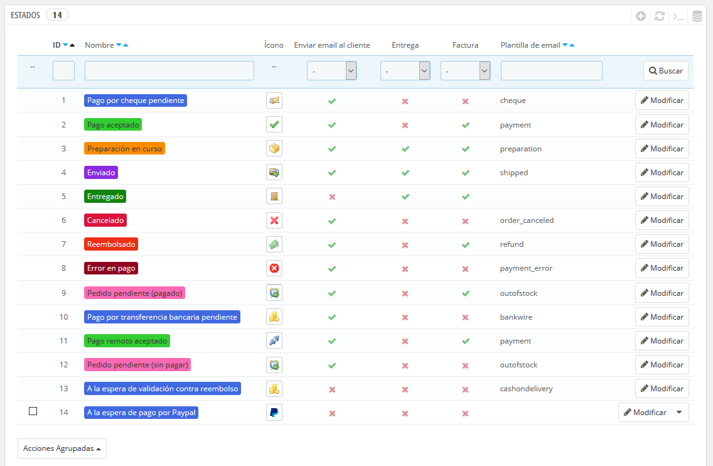
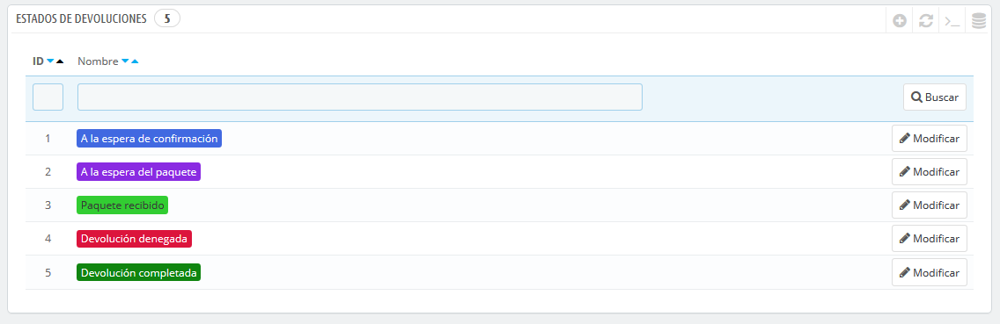
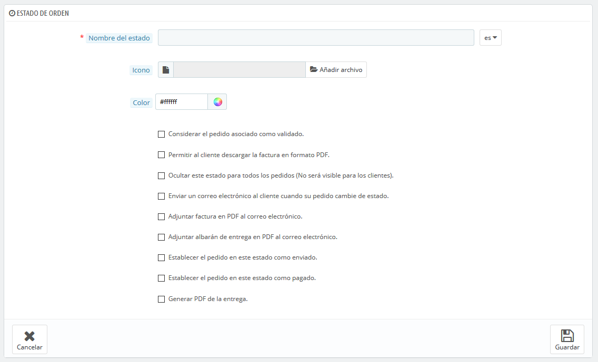
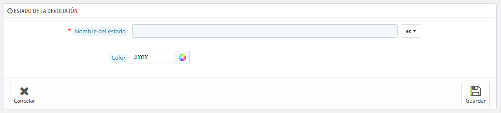

# Estados

Tener diferentes estados de pedidos o de devoluciones de pedidos te permite gestionar fácilmente tus pedidos y devoluciones, y mantener informados a tus clientes sobre la evolución de sus compras.

Los distintos estados disponibles son visibles y editables en la página "Estados", bajo el menú "Parámetros de la tienda &gt; Configuración de Pedidos".

La página muestra un listado de los estados de los pedidos registrados actualmente, junto con:

* Sus colores distintivos: los estados existentes tienen colores que te ayudan a determinar rápidamente si hay un problema con el pedido o si todo va bien.
* Sus iconos.
* Sus vinculaciones con tres comportamientos PrestaShop \(hay más disponibles\): 
  * ¿Debe el cliente recibir un mensaje de correo electrónico cuando el pedido reciba este estado?
  * ¿Es éste un estado de entrega?
  * ¿Permite este estado al cliente descargar y ver una versión en PDF de la factura del pedido?
* El nombre de tu plantilla de e-mail: puede editar estas plantillas, idioma por idioma, en la página "Traducciones" bajo el menú "Internacional". En la sección "Modificar traducciones" de esta página, selecciona "Traducciones de correo electrónico" en el menú desplegable, y a continuación selecciona en la lista desplegable el código del idioma en el que deseas editar estas plantillas.
* Sus iconos de acción: "modificar" y "eliminar".

La lista de estados de las devoluciones cuenta con menos información, porque los estados no son más que etiquetas que no tienen ningún tipo de efecto sobre el pedido.

## Crear un nuevo estado de pedido 

Puedes crear un nuevo estado haciendo clic en el botón "Añadir nuevo estado de pedido" situado en la parte superior. El formulario de creación se mostrará en pantalla.

Rellena el formulario:

* **Nombre del estado**. Este nombre debe ser corto y conciso.
* **Icono**. Puedes utilizar cualquier icono de 16\*16; por ejemplo, el excelente y gratuito pack de iconos FamFamFam Silk: [http://www.famfamfam.com/lab/icons/silk/](http://www.famfamfam.com/lab/icons/silk/).
* **Color**. Debes tratar de darle al estado un color que coincida con los colores existentes \(si este es relevante\). El uso de colores por defecto es:
  * Rojo/Naranja: pedidos cancelados o reembolsados,
  * Rojo carmesí: error de pago,
  * Azul: pedidos que están pendientes de pago,
  * Verde claro: pedidos pagados,
  * Verde oscuro: pedidos entregados,
  * Púrpura: pedidos enviados,
  * Rosa: pedidos pendientes de entrega.
* Opciones: 
  * **Considerar el pedido asociado como validado**. Si está activado, este estado marca todos los pedidos asociados como "pagados", y los pone en este mismo estado.
  * **Permitir a los clientes descargar y visualizar sus facturas en formato PDF**. Si está desactivada, tendrás que enviarles tu mismo las facturas a los clientes.
  * **Ocultar este estado para todos los pedidos**. Esto te permite crear estados internos, para ti y tu equipo. Los clientes no verán esto en su página de estado del pedido.
  * **Enviar un correo electrónico al cliente cuando su pedido cambie de estado**. Cuando está activado, aparece un menú desplegable que te permite elegir qué plantilla de correo utilizar.
  * **Adjuntar factura en PDF al correo electrónico**. Enviar un correo electrónico al cliente con la factura en formato PDF adjunta. 
  * **Adjuntar albarán de entrega en PDF al correo electrónico**. Envía un correo electrónico al cliente con el albarán de entrega en formato PDF adjunto. 
  * **Establecer el pedido en este estado como enviado**. Ten cuidado: una vez que el pedido se establece como "enviado", no se puede volver al estado anterior.
  * **Establecer el pedido en este estado como pagado**. Al igual que en la opción anterior: una vez que el pedido se establece como "pagado", no se puede volver al estado anterior.
  * **Generar PDF de entrega**. Generar el PDF de la entrega.

## Añadir un nuevo estado de devolución 

Puedes crear un estado de devolución utilizando el botón "Añadir nuevo estado de devolución del pedido" en la parte inferior. El formulario de creación se mostrará en pantalla.

Este formulario sólo cuenta con dos campos:

* **Nombre del estado**. Establece el nombre del estado que deseas.
* **Color**. Establece su color.

Finalmente, recuerda guardar su creación.

