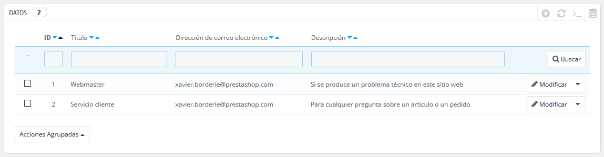
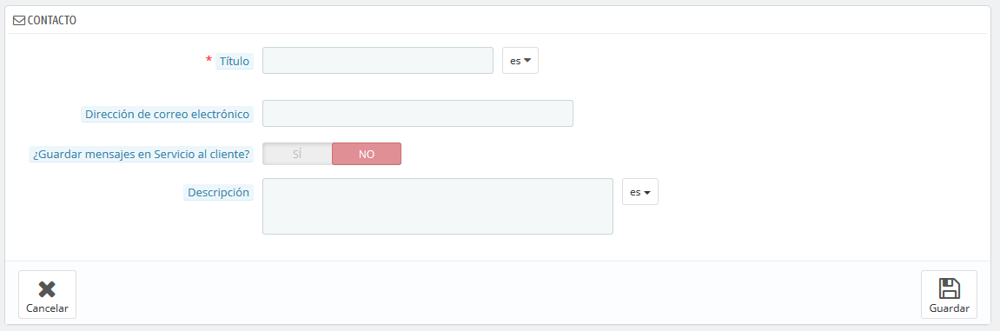
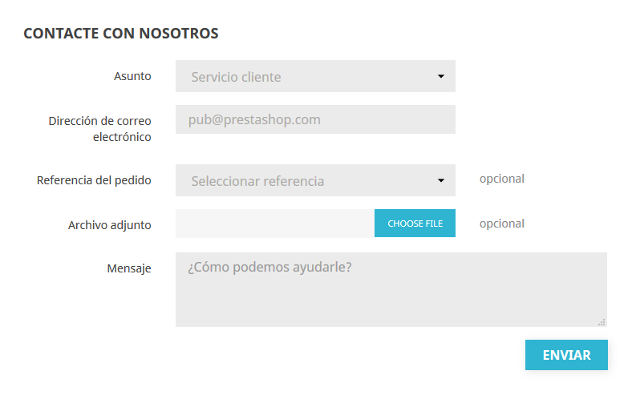
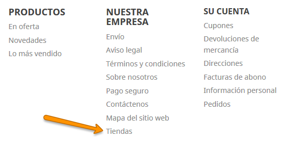
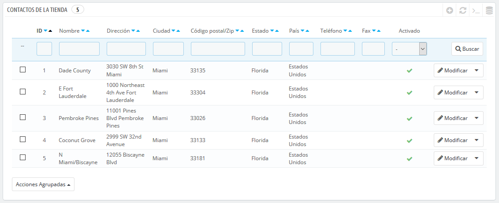
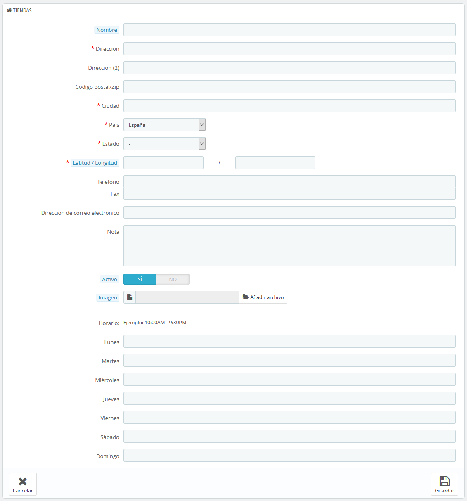
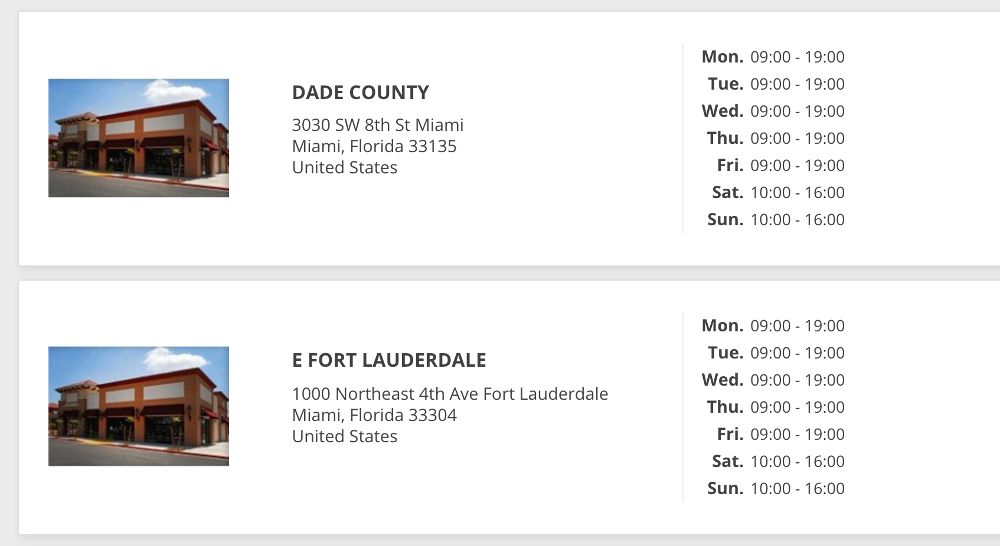
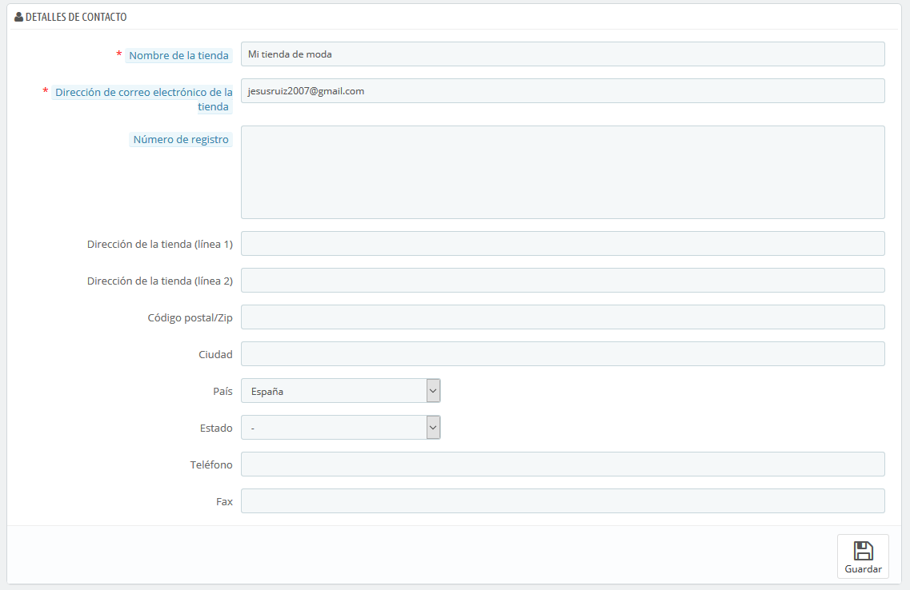

# Contacto

Tu tienda ofrece varios puntos de contacto a tus clientes, ya sea a través del formulario de contacto, o del listado de tus tiendas físicas \(si tienes\). Estas páginas permiten configurar cualquier cosa relacionada con tus datos de contacto.

## Contactos

La página "Contáctanos" en tu tienda muestra un formulario de contacto para ponerse contigo. De acuerdo con las necesidades de tus clientes, sus mensajes pueden ser enviados a diferentes departamentos para que la persona adecuada se encargue de las solicitudes.

Puedes crear varias cuentas de contacto para recibir más ordenadamente las solicitudes de tus clientes. Por ejemplo: servicio al cliente, soporte técnico, departamento de ventas, etc.

En la página "Datos", puedes acceder a la lista de contactos existente. Para que el mensaje se redirija al destinatario deseado, debes configurar los contactos en tu tienda.

### Crear un nuevo contacto

Haz clic en el botón "Añadir nuevo contacto", para acceder al formulario de creación de contactos:

* **Título**. El nombre del contacto: o bien el nombre de una persona, o el nombre del servicio en sí. También puedes optar por utilizar una frase, tales como "Tengo un problema con mi pedido", "Quiero devolver un producto" o "Quiero convertirme en asociado". Esta información se muestra en el menú desplegable "Asunto" del formulario de contacto, y esto es lo que verá tu cliente al ponerse en contacto contigo.
* **Dirección de correo electrónico**. La dirección puede ser la misma que la de otro contacto. De hecho, todos los contactos pueden compartir la misma dirección si realmente no tienes un equipo de personas trabajando en tu tienda – los clientes nunca lo sabrán, pero tener muchos contactos ayuda a que ellos confíen en tu tienda, ya que significará que hay muchas personas trabajando en ella.
* **¿Guardar mensajes en Servicio al cliente?**. Indica si los mensajes de correo se van a guardar en la herramienta "Servicio al Cliente", o simplemente serán enviados a la dirección de correo electrónico. Si se desactiva, PrestaShop no te ayudará a gestionar el servicio al cliente para este contacto. Esto puede ser útil para contactos tipo "Asociados", ya que es posible que prefieras que estos mensajes lleguen directamente a tu bandeja de entrada sin que sean leídos por tu equipo.
* **Descripción**. Establece una descripción corta, de no más de una línea, ya que esta se muestra al cliente en el formulario de contacto \(dependiendo del tema\).

### Cómo puede el cliente ponerse en contacto contigo

Para contactar con el equipo de empleados desde el front-office de tu tienda, el cliente puede hacer clic en el enlace "Contacta con nosotros" situado en la parte superior de la página principal, o bien en el enlace "Contáctanos" situado en la parte inferior de la página. El formulario de contacto aparecerá en pantalla.

El cliente deberá seleccionar la persona con la que desea contactar, introducir su dirección de correo electrónico y a continuación escribir el mensaje. Un menú desplegable permite seleccionar la referencia del pedido, e incluso el producto para el que se está realizando la consulta.

El módulo "Información de contacto" y y la página "Contacta con nosotros" de tu tienda, también te permite mostrar tus datos de contacto en el pie de página. Tus detalles de contacto se gestionan en la pestaña "Contactos de la Tienda".

## Preferencias de Contactos de la tienda 

PrestaShop proporciona un listado sobre tus tiendas físicas a tus clientes \(si tiene\), con información de contacto detallada. Obviamente, esta característica sólo es útil si tienes tiendas físicas, donde los clientes puedan ir a comprar tus productos.

Los clientes pueden encontrar la ubicación de tu tienda física, desde el enlace "Tiendas", situado al pie de página del front-office.

No se puede desactivar esta característica, pero puedes hacer que ésta no sea accesible por tus clientes:

* Desactiva o elimina todas las tiendas listadas en la página de administración "Contactos de la tienda".
* Desactiva el enlace situado en el pie de página: en la página de administración "Widget de enlaces", elimina el enlace "Tiendas" del bloque "Nuestra empresa".

En este punto, la página seguirá existiendo y seguirá siendo accesible por los motores de búsqueda. Para eliminarla definitivamente, debes:

* Dirígirte a "Parámetros de la tienda &gt; Trafico y SEO &gt; SEO y URLs"
* Encontrar la página "Tiendas"
* Elimínarla.

Si algún día deseas volver a disponer de la página "Tiendas", debes crear una nueva página en la página "SEO y URLs", con la siguiente información:

* Nombre de la página: Selecciona "Stores"
* Título de la página: "Tiendas"
* Reescritura URL: "tiendas"

### Listado de tiendas 

Puedes elegir cómo se muestran estas tiendas en el front-office. El cliente puede acceder a ellas a través del enlace "Tiendas" \(dependiendo del tema\)

Todas tus tiendas se enumeran en un listado, que ofrece la información principal de las mismas y un indicador de si la tienda está activa – es posible que, por ejemplo, quieras añadir la información de tu propia tienda física, para que tus clientes locales puedan comprar tus productos sin necesidad de pedirlos a través de tu tienda en línea.

#### Añadir una nueva tienda física 

Haz clic en el botón "Añadir nueva tienda", para acceder al formulario de creación:

Rellena todos los campos que consideres necesarios. Estos datos serán visualizados por tus clientes.

Un campo muy importante es el de "Latitud / Longitud", ya que este es el que utiliza PrestaShop para indicar la ubicación de tu tienda. Puedes utilizar la herramienta en línea de Steve Morse para obtener las coordenadas de tu tienda: [http://stevemorse.org/jcal/latlon.php](http://stevemorse.org/jcal/latlon.php).

Asegúrate de añadir una foto de la fachada de tu tienda, ya que esta ayudará a tus clientes a encontrarla.

Finalmente, el horario de oficina es una parte esencial de cualquier tienda física, así que debes ser lo más preciso posible con este dato.

## Datos de contacto 

Esta sección te permite especificar mayor información sobre tu empresa \(sede central o tienda principal\), y no de una tienda en particular. Debes rellenar todos los campos con la información de tu sede central o tienda principal, ya que esta será sin duda la dirección a la que los clientes escriban, o incluso visiten en caso que lo necesiten.

Estos campos deben ser rellenados con especial atención:

* **Nombre de la empresa o tienda**. El nombre de tu negocio: empresa o tienda. Este debe ser corto, ya que será utilizado en toda tu correspondencia y en los títulos de las páginas.
* **Dirección de correo electrónico de la tienda principal o sede central**. La dirección de correo electrónico oficial de tu negocio. Utiliza la dirección de correo electrónico de contacto general que los clientes deben ver cuando reciban un mensaje de correo electrónico de tu tienda.
* **Número de registro mercantil**. Indica el número de registro legal de tu empresa, el cual depende del sistema jurídico de tu país \(número Duns en EE.UU., número SIRET en France, número CNPJ en Brasil, etc.\). Esto demuestra que tu negocio ha sido registrado oficialmente, lo que dará confianza a tus clientes.
* **Dirección de la tienda principal o sede central \(línea 1\)** / **Dirección de la tienda principal o sede central \(línea 2\)** / **Código Postal/ZIP** / **Ciudad** / **Provincia** / **País**. Utiliza la dirección de contacto oficial de tu negocio. La opción "Provincia" sólo aparece cuando el país seleccionado tiene provincias registradas en la base de datos \(puedes comprobarlo desde la página "Estados \(Provincias\)" en la página "Localización" del menú "Internacional"\).
* **Teléfono**. El número de teléfono oficial de tu negocio. Si prefieres que los clientes no te llamen, no pongas nada en este campo.
* **Fax**. El número de fax oficial de tu negocio.

No utilices el signo de puntuación dos puntos \(":"\) en el nombre de tu tienda, ya que éste podría provocar que alguna funcionalidad no trabaje correctamente \(por ejemplo, podría producirse errores al enviar correos electrónicos\).

Puedes reemplazar el signo de puntuación dos puntos con un guion, si necesitas especificar dos secciones en el título. Por ejemplo, utiliza "Mi Tienda – El mejor lugar para comprar artículos" en lugar de "Mi Tienda: El mejor lugar para comprar artículos".

