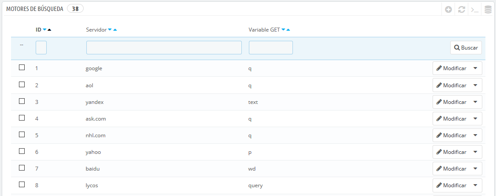

# Motores de búsqueda

Muchos de tus visitantes llegarán a tu tienda desde un motor de búsqueda. Con el fin de saber lo que ellos estaban buscando, y hacer que tu tienda sea más productiva utilizando esta información, es necesario conocer las consultas que ellos hicieron.

Esta página presenta una tabla de todos los motores de búsqueda que tu instalación de PrestaShop soporta – es decir, aquellos motores que PrestaShop puede reconocer y de los que puede extraer la consulta que realizó el visitante en el motor de búsqueda para llegar a tu tienda.

Aunque Google es el buscador más utilizado, hay muchos otros motores de búsqueda que tus visitantes podrían utilizar para encontrar tu tienda. Por lo tanto, también debes tener a estos en cuenta para recoger y analizar las consultas realizadas en ellos. Cuando un motor de búsqueda desconocido comience a atraer visitantes regularmente, deberás añadirlo a tu base de datos – de lo contrario, estos visitantes aparecerían marcados en tus estadísticas como procedentes de "otros motores de búsqueda", lo que no te será de utilidad.

## Añadir un motor de búsqueda 

Es muy fácil añadir un motor de búsqueda a tu listado.

Supongamos que queremos añadir DuckDuckGo, un motor de búsqueda que respeta la privacidad de los datos de sus usuarios:

1. Obtén la URL de referencia para la búsqueda. Por ejemplo, [http://duckduckgo.com/?q=zapatos+niños](http://duckduckgo.com/?q=zapatos+ni%C3%B1os)
2. Toma tan sólo la parte del servidor, que es específica para este motor de búsqueda, y escribe está en el campo "Servidor". En nuestro caso, "duckduckgo".
3. Encuentra la variable de consulta: 
   1. Encuentra la cadena de consulta. Esta debe ser una letra, seguida por un signo "=", seguido por la propia consulta, y cerradas con un carácter "&" o el final de la cadena. En nuestro caso, esta es "q=zapatos+niños".
   2. La variable de consulta es la letra anterior al signo "=". En nuestro caso: "q". Escribe está en el campo "$\_GET variable".
4. Haz clic en el botón "Guardar", y de ahora en adelante, PrestaShop será capaz de reconocer a los visitantes provenientes desde DuckDuckGo.

