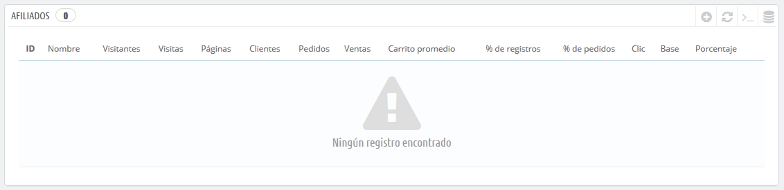
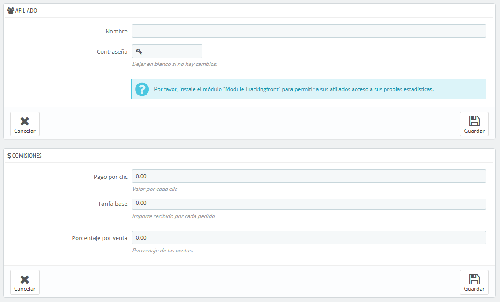
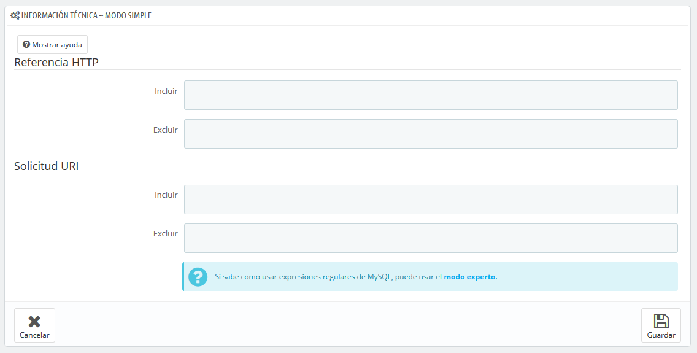
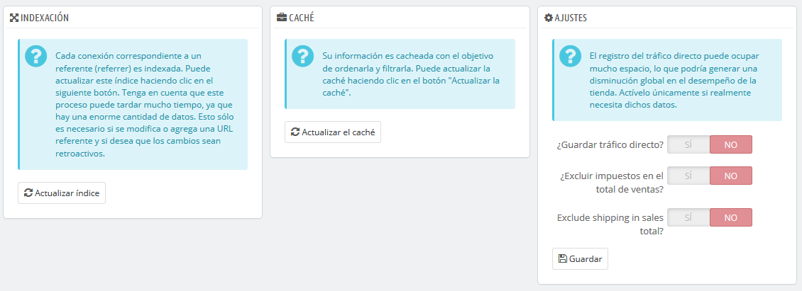

# Programa de afiliados

Un referente es un sitio web que trae al menos un visitante a tu tienda. Este sitio web cuenta con un enlace a tu tienda, y por lo tanto te ayuda a tener mayor audiencia y a realizar un mayor número de ventas.

Algunos referentes son más importantes que otros: puedes tener asociados que tengan establecidos enlaces a tu tienda en sus propios sitios web, y posiblemente tanto tu como tus asociados quieran saber cuántos visitantes llegaron a tu tienda desde estos enlaces. Mediante esta opción es posible conocer lo que tienes que pagar a tus asociados por todos los visitantes que han traído hasta tu tienda, en función del pago acordado con ellos por cada visita.  
 A esto, se le llama afiliación, y utilizando esta página podrás crear un completo programa de afiliados, al que incluso tu asociado podrá conectarse para ver el número de visitas y ventas que tu enlace ha generado. Los afiliados registrados generan tráfico a tu tienda, por lo que querrá recompensar a ellos por tus visitantes, y el programa de afiliados es la herramienta que debes utilizar para conocer las cifras en las que se basa esta recompensa.

La herramienta de afiliados de PrestaShop puede ser comparada a la del panel de estadísticas del personal de tu tienda. Al crear una campaña de afiliación para un sitio, puedes dar acceso a toda la actividad que el sitio ha generado en tu tienda a través de una URL protegida con contraseña: [http://URL-DE-SU-TIENDA.com/modules/trackingfront/stats.php](http://URL-DE-SU-TIENDA.com/modules/trackingfront/stats.php).

En el listado de afiliados, los valores Clic, Base y Porcentaje son calculados en función de los clics reales, las ventas y el tanto por ciento de las ventas provenientes desde el sitio referente.

## Añadir un nuevo afiliado 

El espacio de afiliación te permite crear un acceso privilegiado para tus socios. Ellos tendrán acceso a todas las estadísticas relacionadas con el flujo de visitantes procedentes desde tu sitio web. Para crear tu espacio privilegiado, debes crearles una cuenta en tu programa de afiliación, y a continuación definir cuánto les va a pagar a ellos en función del tráfico y las ventas generadas.

Para crear un nuevo afiliado, haz clic en el botón "Añadir nuevo", para abrir el formulario de creación de afiliados.

Cada sección es importante:

* **Afiliado**. La cuenta del asociado en tu programa de afiliación. 
  * **Nombre**. Para conectar a tu back-office como afiliado, tu socio necesita un nombre para identificarse y poder iniciar sesión; puedes utilizar un simple nombre o una dirección de correo electrónico, pero asegúrate de utilizar un identificador que pueda fácilmente ser recordado por ti y por tu socio.
  * **Contraseña**. La primera vez que creas la cuenta, PrestaShop almacena la contraseña junto con el nombre de usuario. Cuando necesites editar la cuenta \(por ejemplo, para cambiar la comisión\), la contraseña estará en blanco. Esto no significa que no haya ninguna contraseña; si especificas una nueva contraseña en este campo vacío, reemplazarás la contraseña que registraste.
* **Comisiones**. Aquí es donde puedes indicar las cuotas de tus afiliados – es decir el dinero que tendrás que pagar a tu asociado según las acciones que realicen los visitantes en tu sitio. 
  * **Pago por clic**. Esto define cuánto te cuesta recibir a un visitante procedente del sitio del afiliado. Cada vez que un visitante llega a tu tienda haciendo clic en el enlace disponible en el sitio del asociado, el asociado gana la cantidad indicada.
  * **Comisión base**. También puedes recompensar a tus asociados si los visitantes que proceden desde sus sitios compran uno de sus productos. Ten en cuenta que esta compra es solamente válida si la compra se realiza durante la misma sesión de navegación que se crea tras hacer clic en el enlace del asociado.
  * **Porcentaje por venta**. Además de la comisión base por venta, o como un reemplazo de esta, puedes recompensar a tus asociados con un porcentaje de las ventas realizadas durante la misma sesión de navegación que se crea tras hacer clic en el enlace del asociado.
* **Información técnica - Modo simple**. Ésta es muy importante, ya que es la que te garantiza que el sistema distinga a este asociado de otros enlaces de afiliados. Una vez configurada, debes hacer un par de pruebas para asegurarte de que sigue correctamente al afiliado. 
  * **HTTP del referenciado**. En el campo "Incluir", establece el nombre de dominio del asociado del que deseas realizar un seguimiento como afiliado.
  * **URI de petición**. En el campo "Incluir", establece la última parte de la cadena de consulta. El sistema realizará un seguimiento utilizando una cadena de consulta especial. Por ejemplo, puedes realizar un seguimiento de los sitios referentes que utilizan el argumento `?prestaff=` en sus URLs. Esto puede ayudarte a diferenciar aún más a tus afiliados.
* **Información técnica - Modo experto**. Aunque el modo simple encuentra palabras coincidentes utilizando la función "LIKE" de MySQL, el modo experto te permite utilizar las expresiones regulares de MySQL. Esto puede resultar mucho más potente, pero también es mucho más difícil de mantener. Asegúrate de ser un experto en el tema de las expresiones regulares antes de poner cualquier cosa en estos campos.

La sección "Ayuda" te da algunas indicaciones precisas sobre cómo mejorar la configuración de tu afiliado. Lee estas instrucciones con detenimiento.

## Ajustes 

Estas herramientas te ayudarán a sacar el mayor beneficio de tu programa de afiliación.

Existen tres posibilidades:

* **Indexación**. Debes hacer clic una vez en el botón "Actualizar índice" cuando añadas un nuevo afiliado y desees analizar su tráfico transmitido.
* **Caché**. PrestaShop almacena en caché los datos que recoge. Puedes utilizar el botón "Actualizar la caché " para actualizar regularmente la caché de datos.
* **¿Guardar tráfico directo?**. El tráfico directo representa a los visitantes que llegan a tu tienda directamente, tecleando la URL en el navegador. Si bien éstas son importantes porque son visitantes que realmente conocen tu tienda y están interesados en tus productos \(contrariamente a los visitantes que llegan desde tus sitios afiliados, que podrían haber llegado a tu tienda de casualidad\), guardar este tráfico puede llegar a suponer una carga excesiva para tu base de datos. Es por ello que este tráfico no se guarda ni se analiza por defecto. Sólo habilita esta opción si sabes realmente lo que estás haciendo.

