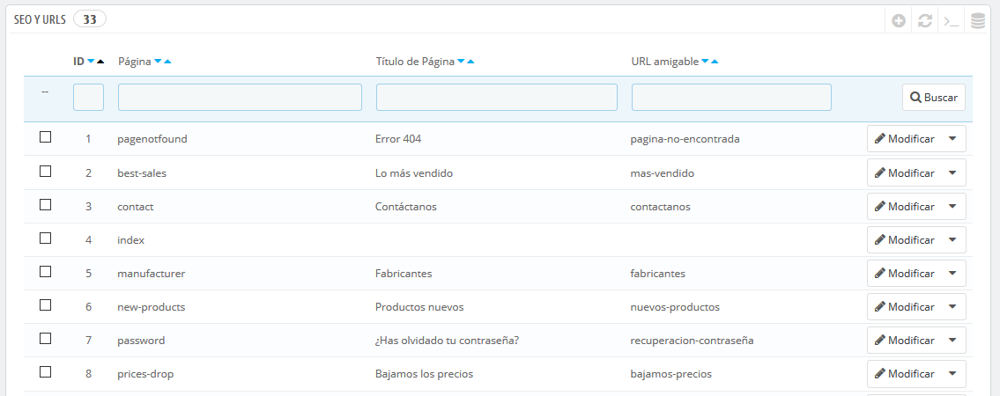
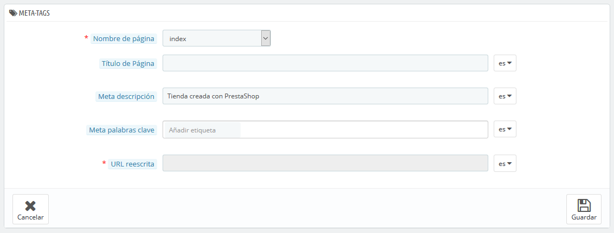
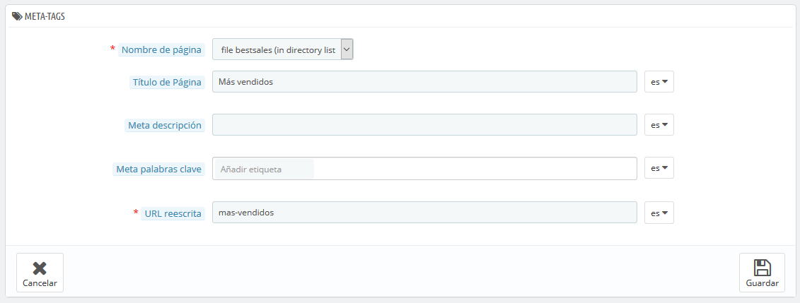
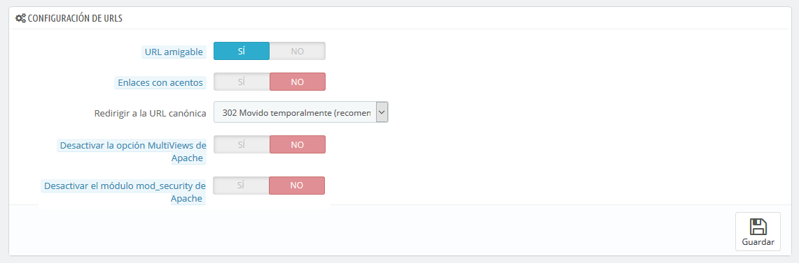
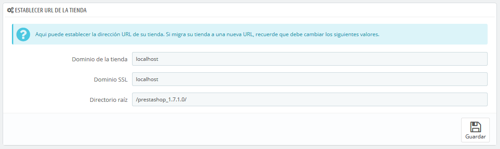
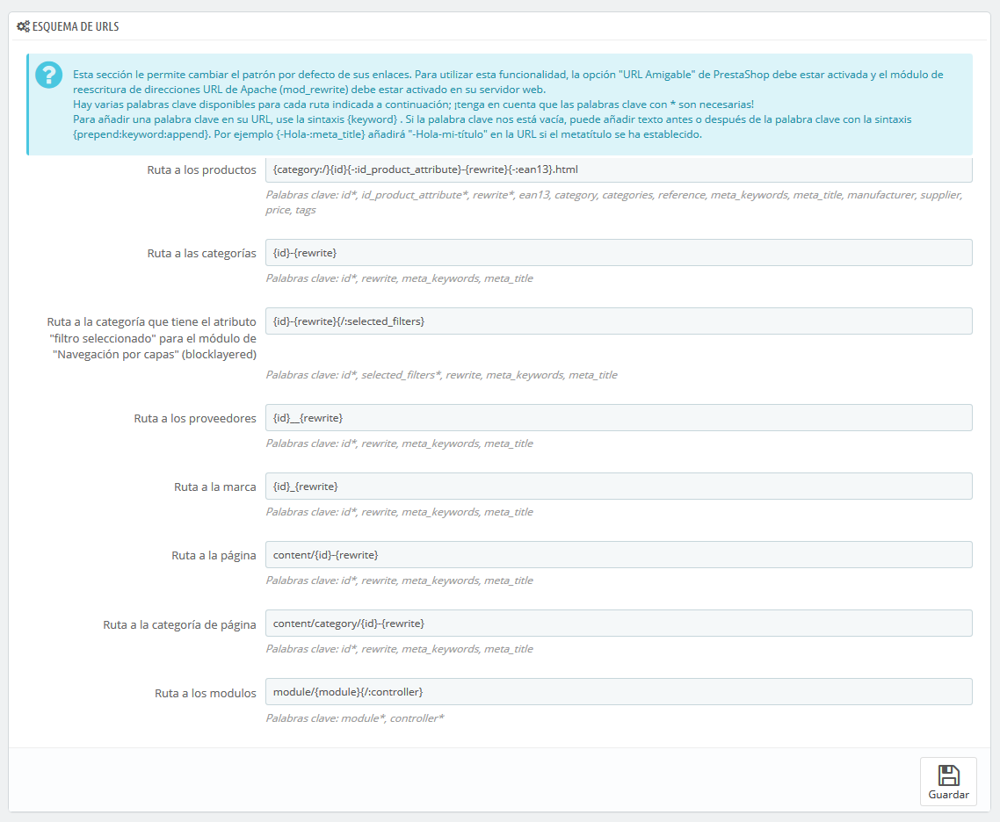

# SEO y URLs

Las herramientas incluidas en esta página te ayudarán a mejorar el posicionamiento de tu sitio PrestaShop en los motores de búsqueda, y así llegar a más clientes potenciales.

"SEO" significa "Search Engine Optimization", en español "Optimización en los Motores de búsqueda". Ésta representa un conjunto de técnicas y de mejores prácticas destinadas a mejorar la visibilidad de un sitio web en los motores de búsqueda. Tienes más información en la Wikipedia: [http://es.wikipedia.org/wiki/Posicionamiento\_en\_buscadores](http://es.wikipedia.org/wiki/Posicionamiento_en_buscadores.).

URL es la abreviatura de "Uniform Resource Locator" \(en español, Localizador uniforme de recursos\), o en pocas palabras, la dirección online de una página web. Tienes más información en la siguiente página de la Wikipedia: [http://es.wikipedia.org/wiki/Localizador\_uniforme\_de\_recursos](http://es.wikipedia.org/wiki/Localizador_uniforme_de_recursos.).

Por defecto, las URLs profundas de PrestaShop \(es decir, las páginas especificadas tras el nombre del dominio\) son bastante informativas para el cliente y para los motores de búsqueda: una dirección como por ejemplo: [http://www.miprestashop.com/product.php?id\_product=27](http://www.miprestashop.com/product.php?id_product=27) no ayuda a los visitantes a saber qué producto se encuentra tras esta dirección de página. Las URLs amigables son el camino para lograrlo, y obtener, por ejemplo, una dirección como: [http://www.miprestashop.com/2-music-players/27-ipod-nano-green](http://www.miprestashop.com/2-music-players/27-ipod-nano-green).

Como puedes ver en el segundo ejemplo anterior, tanto las categorías como los productos pueden tener una URL amigable: `id_category=2` se convierte en `2-music-players`, y `id_product=27` se convierte en `27-ipod-nano-green`. Aunque el número ID no puede ser eliminado de forma predeterminada, las palabras son generadas a partir del nombre de la categoría y el nombre del producto, o escritas manualmente. Esto se realiza directamente en la página de configuración del producto o categoría \(en el menú "Catálogo"\): encontrarás el campo "URL amigable" en la página principal de configuración de una categoría, y en la pestaña "SEO" de la página de configuración de un producto.

Hay otras páginas individuales en tu instalación de PrestaShop que sin duda se beneficiarán de las URLs amigables: páginas estáticas, páginas de la cuenta de usuario, páginas con contenidos generados automáticamente... La página "SEO y URLs" te presenta un listado de todas esas páginas, y te permite editar sus URLs amigables, así como sus etiquetas meta \(título, descripción, palabras clave\).

Las URLs amigables sólo funcionan en servidores que soporten la reescritura URL \(a través de la función `mod_rewrite` de Apache Web Server, por ejemplo\). Asegúrate de verificar que tu servidor lo soporta \(¡pregunta a tu proveedor de hosting!\), ya que al utilizar esta opción puedes hacer que tu tienda deje de trabajar correctamente.

Configuración SEO de la página de inicio

Para modificar las etiquetas meta de tu página de inicio, tan sólo necesitas abrir la página "SEO y URLs", hacer clic en la página "index" y editar la información SEO.

Algunos consejos:

* El título de la página de inicio por defecto es el nombre de la tienda, por lo que el título de la página "Index" se encuentra vacío. Si escribes algún contenido en este campo, el título completo de la página será "&lt;su contenido&gt; – &lt;el nombre de la tienda&gt;". El nombre de la tienda se establece durante la instalación de PrestaShop, y puede ser cambiado desde la página de preferencias "Parámetros de la tienda &gt; Contacto &gt; Contactos de la tienda", utilizando el campo "Nombre" de la sección "Detalles de contacto".
* Escribe una breve descripción del producto: un párrafo es suficiente.
* Añade etiquetas, haz clic en el campo "Añadir etiqueta", escribe una etiqueta, y pulsa "Enter". Puedes eliminar las etiquetas haciendo clic en la cruz de color rojo.
* No tienes que añadir una URL de redireccionamiento si ya existe una.

Ten en cuenta que, si tu tienda ya ha sido indexada por Google o cualquier otro buscador, tomará algún tiempo que tus cambios aparezcan en los resultados de búsqueda. Por favor, sea paciente.

En la parte inferior de la página "SEO y URLs" hay tres secciones con opciones adicionales: Configuración de las URLs, Establecer URL de la tienda y Esquema de URLs. Más abajo encontrarás una explicación de estas opciones.

## Añadir una nueva URL amigable 

Las URL amigables se han de establecer en la página de configuración de cada producto, categoría, página de contenido estático... Esta página de creación tan solamente es útil para algunas páginas automáticas, así que generalmente no tendrás que preocuparte de esta opción.

Asegúrate de rellenar los campos para todos los idiomas disponibles en tu tienda: no sólo es inmensamente útil para los usuarios locales, sino también para los buscadores que pueden hacer uso de esta información local.

Haz clic en el botón "Añadir una nueva página" para acceder al formulario de creación de URLs amigables. Estos son los campos que tendrás que rellenar:

* **Página**. La lista desplegable te ofrece un listado de todas aquellas páginas que pueden beneficiarse de una URL amigable.
* **Título de la página**. El título que aparecerá en buscadores cuando se realice una solicitud.
* **Meta descripción**. Una presentación de la página, en pocas palabras, la intención de captar el interés de un cliente. Aparecerá en los resultados de búsqueda.
* **Meta palabras clave**. Palabras clave que definan a la página. Éstas son importantes para un buen posicionamiento en los buscadores. Puedes introducir varias: teclea la palabra, pulsa la tecla Enter, y observarás cómo la etiqueta queda encapsulada en el interior de un bloque azul, acompañada de un pequeño icono de una cruz por si deseas eliminarla.
* **Reescritura URL**. Aquí es donde debes establecer la URL amigable. Asegúrate que esta sea corta y descriptiva, y reemplaza los espacios \(" "\) por guiones \("-"\).

## Configurar URLs 

Las opciones principales para las URLs amigables:

* **URL amigable**. Cambia esta opción **si sabes que tu servidor** permite la reescritura URL. Si no, déjala en "No".

  Si lees un mensaje como "_La reescritura URL \(mod\_rewrite\) no está activa en tu servidor o no es posible comprobar la configuración del servidor. Si deseas utilizar URLs amigables debes activar este módulo_". En este caso, PrestaShop no puede detectar la configuración del servidor, pero eso no significa que está característica no funcione. Deberás comprobarlo por tí mismo.

* **URL acentuada**. PrestaShop es ahora capaz de producir URLs con caracteres especiales, para los productos con nombres no ASCII. Puedes desactivar esta opción desde aquí.
* **Redirigir automáticamente a la URL canónica**. Una página PrestaShop específica puede tener muchas direcciones URLs, con mayor frecuencia cuando hay parámetros a tener en cuenta: por ejemplo, [`http://example.com/product.php?id=5&option1`](http://example.com/product.php?id=5&option1) y [`http://example.com/product.php?id=5&option2`](http://example.com/product.php?id=5&option2) son utilizadas para el mismo producto, y sólo presentan una diferencia. Si quieres que tu producto tenga una única dirección URL y no muchas duplicadas, deberías permitir las URLs canónicas. Las URLs canónicas es una forma de eliminar el contenido duplicado – que podría perjudicarte en el posicionamiento de tu tienda en los buscadores, ya que tener contenido duplicado es considerado spam. Para evitar que los motores de búsqueda te consideren un spammer, PrestaShop utiliza un elemento de enlaces `rel="canonical"` para indicar cuál es la URL base para un contenido dado. Aunque es recomendable activar esta opción, esto también dependerá de si el tema actual de tu tienda implementa correctamente la etiqueta de cabecera `<link>` header tag. Tendrás que preguntarle al diseñador del tema sobre esta cuestión. Hay tres opciones disponibles: 
  * **Sin redirección**. Puede haber problemas de contenido duplicado.
  * **301 Movido permanentemente**. Devuelve el código de estado HTTP 301, apuntando a la URL principal y notificando a los motores de búsqueda que esta es la única URL a tener en cuenta.
  * **302 Movido temporalmente**. Devuelve el código de estado HTTP 302, apuntando a la URL principal y notificando a los motores de búsqueda que la dirección URL principal podría cambiar más adelante.
* **Desactivar opción MultiViews de Apache**. Apache es el servidor web más popular, y es muy probable que es el que utilice tu proveedor para alojar tu tienda \(aunque debes comprobarlo\). Multiviews es un sistema de negociación de contenidos donde el servidor Web trata de servir al usuario la versión de la página que piensa que mejor se adapta a su idioma, bajo la misma URL. Desafortunadamente, esto puede ocasionarte problemas con las URLs amigables. Si este es el caso, bastará con que desactives Multiviews utilizando esta opción.
* **Desactivar el módulo mod\_security de Apach**. `mod_security` es un módulo del servidor Apache que actúa como cortafuegos, protegiendo a los servidores de intrusiones. Sin embargo, puedes bloquear algunas características importantes, e incluso producir errores dependiendo de la configuración. En tales casos, desactiva este módulo desde aquí.

En versiones previas de PrestaShop, tenías que generar manualmente un archivo `.htaccess` tras habilitar las URLs amigables. Este ya no es el caso, ya que desde la versión 1.5: el archivo `.htaccess` es gestionado por PrestaShop, así no tienes que preocuparte de esto.

## Establecer URL de la tienda 

En esta sección, puedes ver y editar algunos de los ajustes predeterminados del servidor:

* **Dominio de la tienda**. Nombre del dominio principal de tu tienda, o la dirección IP del mismo.
* **Dominio SSL**. Nombre del dominio de seguridad de tu tienda \(https://\), o la dirección IP del mismo.
* **Directorio raíz \(Base URI**\). La carpeta en la que instalaste PrestaShop. Si se encuentra en la raíz del dominio, utiliza "`/`". 

No debes modificar estos campos sin saber exactamente lo que estás haciendo. Un error podría provocar que tu tienda deje de estar accesible.

## Esquema de URLs 

**Novedad en Prestashop 1.6**.

Puedes cambiar la forma en la que las URLs amigables son generadas, mediante el cambio de la ruta a un recurso de tu tienda.

Por ejemplo, la ruta por defecto para mostrar la página de un producto es `{category:/}{id}-{rewrite}{-:ean13}.html`, cuyo resultado por ejemplo podría ser `/summer-dresses/7-printed-chiffon-dress.html`  
Podrías cambiar esa ruta a `{manufacturer:/}{id}-{rewrite:/}` para obtener `/fashion-manufacturer//7-printed-chiffon-dress/`

Ocho campos están disponibles de forma predeterminada, y cada uno de ellos está acompañado con una lista de palabras clave disponibles. Algunas palabras claves son obligatorias, y se indican con un `*`.

Una vez que hayas actualizado los campos, no te olvides de guardar los cambios que has realizado. Haz clic en el botón "Guardar" en la sección "Establecer URL" para regenerar su archivo `.htaccess`, lo cual es necesario para tus URLs amigables.

## Generación de archivos Robots 

El archivo `robots.txt` restringe el acceso a un sitio por parte de los robots de los motores de búsqueda que rastrean la Web. Estos robots están automatizados y, antes de acceder a las páginas de un sitio, verifican si existe un archivo nombrado como `robots.txt` que les impida el acceso a determinadas páginas. El archivo `robots.txt` solo es necesario si tu sitio incluye contenido que no deseas que los motores de búsqueda indexen.

La herramienta de PrestaShop que genera el archivo `robots.txt`, simplemente crea un archivo con directivas de exclusión para los archivos y directorios que no están destinados a ser públicos, y que por tanto no deben ser indexados. Estas directrices se aplican a todos los robots: el archivo generado utiliza la cadena "User-agent: \*".

Al hacer clic en el botón "Generar el archivo robots.txt" reemplazarás cualquier archivo `robots.txt` existente por uno nuevo. Por lo tanto, si quieres añadir tus propias reglas a este archivo, hazlo después de que PrestaShop haya generado el archivo.

Video - 4 consejos para empezar bien el SEO de tu sitio web e-commerce

