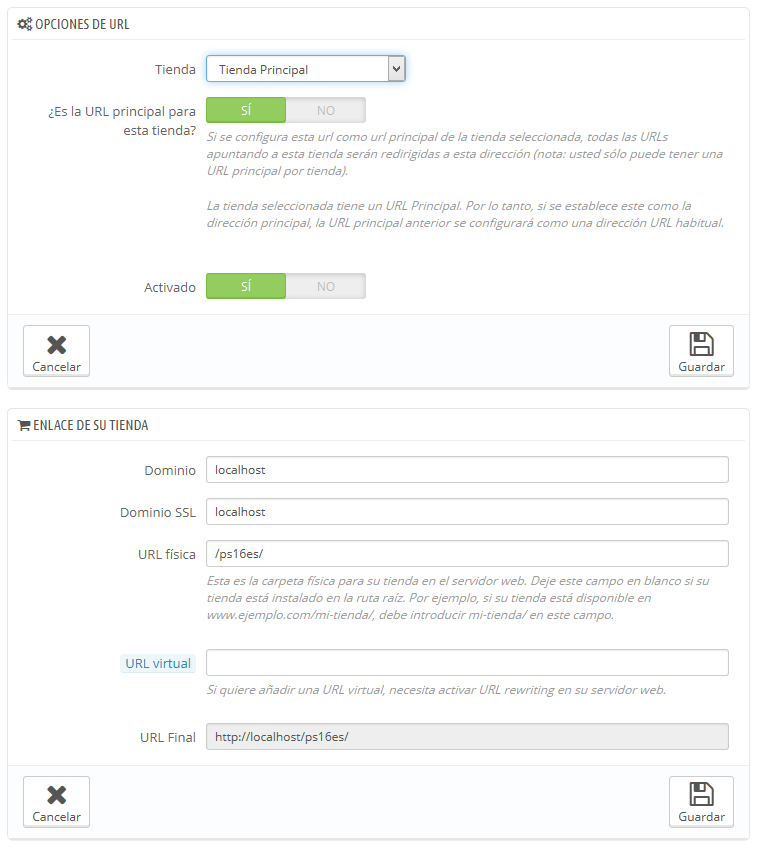

# Configurar la URL de una tienda

Cada tienda puede tener su propia URL – o incluso varias URLs – totalmente independiente de la tienda principal.  
Debes definir al menos una URL para cada tienda.

**Dos tiendas no pueden compartir la misma URL**. Si tratas de dar a una nueva tienda una URL que ya está siendo usada por otra tienda, PrestaShop mostrará un error en pantalla.  
 Por otra parte, puedes tener tantas tiendas como desees en el mismo dominio:

* Utilizando subcarpetas: [http://www.ejemplo.com/hombres/](http://www.ejemplo.com/hombres/), [http://www.ejemplo.com/mujeres/](http://www.ejemplo.com/mujeres/), [http://www.ejemplo.com/niños/](http://www.ejemplo.com/ni%C3%B1os/), [http://www.ejemplo.com/mascotas/](http://www.ejemplo.com/mascotas/), etc.

  En el caso de utilizar subcarpetas, ¡asegúrate de crear dos direcciones URL para cada tienda: una utilizando "www.", y otra sin ellas!

  Por ejemplo: [http://www.ejemplo.com/hombres/](http://www.ejemplo.com/hombres/) y [http://ejemplo.com/hombres/](http://ejemplo.com/hombres/)

  De lo contrario, los clientes que traten de acceder a tu tienda sin utilizar las "www." en la URL serán redireccionados a tu tienda principal.

* Utilizando subdominios: [http://hombres.ejemplo.com/](http://hombres.ejemplo.com/), [http://mujeres.ejemplo.com/](http://mujeres.ejemplo.com/), [http://niños.ejemplo.com/](http://ni%C3%B1os.ejemplo.com/), [http://mascotas.ejemplo.com/](http://mascotas.ejemplo.com/), etc.

No crees ninguna subcarpeta o dominio por ti mismo, ya sea en tu servidor o en tu equipo: PrestaShop se encarga de crear la ruta absoluta para ti en tu servidor. Cuando los visitantes accedan a esta URL, PrestaShop los dirigirá a la tienda correcta automáticamente.

Por supuesto, una tienda también puede tener su propio nombre de dominio.

Utilizar un nombre dominio

En caso de que desees utilizar un nombre de dominio diferente para tu tienda suplementaria en lugar de un subdominio / subcarpeta, debes configurar tu dominio para que apunte a la carpeta donde se encuentra PrestaShop. La reescritura URL será realizada por el propio PrestaShop.

Alternativamente, puedes crear un alias para el nombre de dominio que redireccione a la URL absoluta donde se encuentra instalado PrestaShop. La manera de lograr esto depende del panel de control y de las opciones que tu empresa de hosting te proporcione: "Alias" para Plesk, "Forward" para CPanel, "Aliasdomain" para ISPConfig, etc.

Para añadir una dirección URL a una tienda, selecciona la tienda en el selector "Árbol Multitienda", y a continuación haz clic en el botón "Añadir nueva URL". PrestaShop cargará una pantalla con dos secciones y ocho opciones:

* **Opciones URL**.
  * **Tienda**. Un recordatorio de la tienda a la que estás añadiendo una URL. También puedes simplemente seleccionar otra tienda.
  * **URL principal**. Al activar esta opción, indicas que quieres que todas las demás URLs que apuntan a esta tienda, sean redireccionadas a esta nueva URL principal \(ésta cambiará cualquier otra URL principal para que sea una URL normal\).
  * **Estado**. Puedes activar y desactivar una URL en cualquier momento.
* **URL de tu tienda**.  

  * **Dominio**. La dirección propia de la tienda. Esta no tiene que estar limitada al nombre de dominio: puedes indicar un subdominio si lo necesitas. Tan solamente asegúrate de no añadir '`http://`', ni ninguna '`/`'. Ejemplo: [`www.ejemplo.com`](http://www.ejemplo.com) o [`niños.ejemplo.com`](http://ni%C3%B1os.ejemplo.com).
  * **Dominio SSL**. Si tu dominio SSL es diferente a tu dominio principal, asegúrate de indicarlo en este campo. Ejemplo: [`www.ejemplo.com`](http://www.ejemplo.com) o [`niños.ejemplo.com`](http://ni%C3%B1os.ejemplo.com).
  * **URI física**. Aquí debes establecer la ruta de acceso física de tu tienda en el servidor. Si la tienda está en la raíz del dominio o del subdominio, deja este campo vacío. Ejemplo: `/` o `/niños/`.
  * **URI virtual**. Puedes utilizar esta opción para crear una tienda con una URL que no existe en tu servidor: a través de la reescritura URL, sin tener que crear una subcarpeta. Por supuesto, la redirección URL debe estar activa en PrestaShop \(es decir la opción URLs amigables, que encontrarás en la pestaña "SEO y URLs" de la página "Tráfico y SEO" del menú "Parámetros de la tienda"\). Ejemplo: `/zapatos/`. Ten en cuenta que esto sólo funciona en caso de utilizar subcarpetas de tienda, no subdominios de tienda.
  * **La URL final será**. Te muestra el resultado de su configuración mostrándole la URL final.

  

