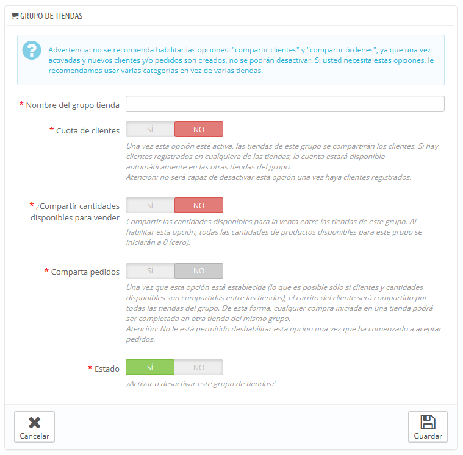

# Crear un nuevo grupo de tiendas

Tener un grupo de tiendas te permite compartir ciertas características entre las tiendas de ese grupo: catálogo, empleados, transportistas, módulos, etc. Esto te permite gestionar un conjunto de tiendas tan fácilmente como lo harías con una sola tienda, teniendo la posibilidad de ajustar con precisión los detalles de cada tienda de forma manual.  
Aplicar nuevos parámetros a todas las tiendas de un grupo sólo requiere de una simple acción. En modo multitienda, encontrarás un menú desplegable disponible en la parte superior de la mayoría de las páginas del panel de administración, el cual te permite filtrar sus cambios para cada tienda o grupo de tiendas.

Técnicamente hablando, cuando se selecciona un grupo de tienda en el menú desplegable, las entidades que se muestran reflejan la **unión** de las entidades pertenecientes a las tiendas en ese grupo.

En términos generales, los parámetros son aplicados a todas las entidades que pertenecen a la entidad seleccionada en el menú desplegable multitienda. Todo esto se explica en detalle en este capítulo.

Haz clic en el botón "Añadir nuevo grupo de tienda" se abrirá un formulario con pocas opciones, pero con una gran cantidad de texto: asegúrate de leer cada descripción de principio a fin, ya que te ayudarán a tomar las decisiones correctas para estas opciones. Dado que algunos son irreversibles \(no pueden ser desactivados una vez sean activados\), es importante que sepas exactamente lo que estas opciones activan.

Los ajustes de configuración disponibles son:

* **Nombre del grupo** **de tienda**. El nombre es privado, los clientes no pueden verlo. Sin embargo, asegúrate de usar un nombre descriptivo: cuanto mayor sea el número de grupos que tenga, mayor será la necesidad de tengas que encontrar un grupo rápidamente. Puedes editar el nombre en cualquier momento.
* **Compartir clientes**. _**Una vez activada, no puedes desactivar esta opción**_. Esta funcionalidad es ideal cuando quieres que tus clientes utilicen las mismas credenciales para iniciar sesión en todas las tiendas pertenecientes a este grupo
* **Compartir cantidades disponibles para vender**. Puedes tener diferentes cantidades del mismo producto a la venta dependiendo de la tienda. Con esta opción, todas las tiendas de este grupo compartirán la misma cantidad disponible de productos. Esto facilitará en gran medida la gestión de dichas cantidades.
* **Compartir pedidos**. _**Una vez activada, no puedes desactivar esta opción**_. Esta opción sólo se puede activar si las opciones "Compartir clientes" y "Compartir cantidades disponibles para vender" se encuentran activas. Con esta opción, los clientes que inicien sesión en cualquier tienda de este grupo podrán ver su historial de pedidos para todas las tiendas del grupo.
* **Estado**. Elige si deseas activar este grupo inmediatamente o hacerlo más tarde. Puedes activar/desactivar un grupo de tiendas en cualquier momento.

Dos grupos de tiendas no pueden compartir clientes, carritos o pedidos.

Los grupos de tiendas existentes pueden ser editados desde el listado de grupos de tiendas disponible en la página principal "Multitienda": simplemente haz clic en el icono 'modificar' situado a la derecha de la fila de la tienda para abrir el formulario. Como era de esperar, no se pueden cambiar las opciones "Compartir clientes" y "Compartir cantidades disponibles para vender".

