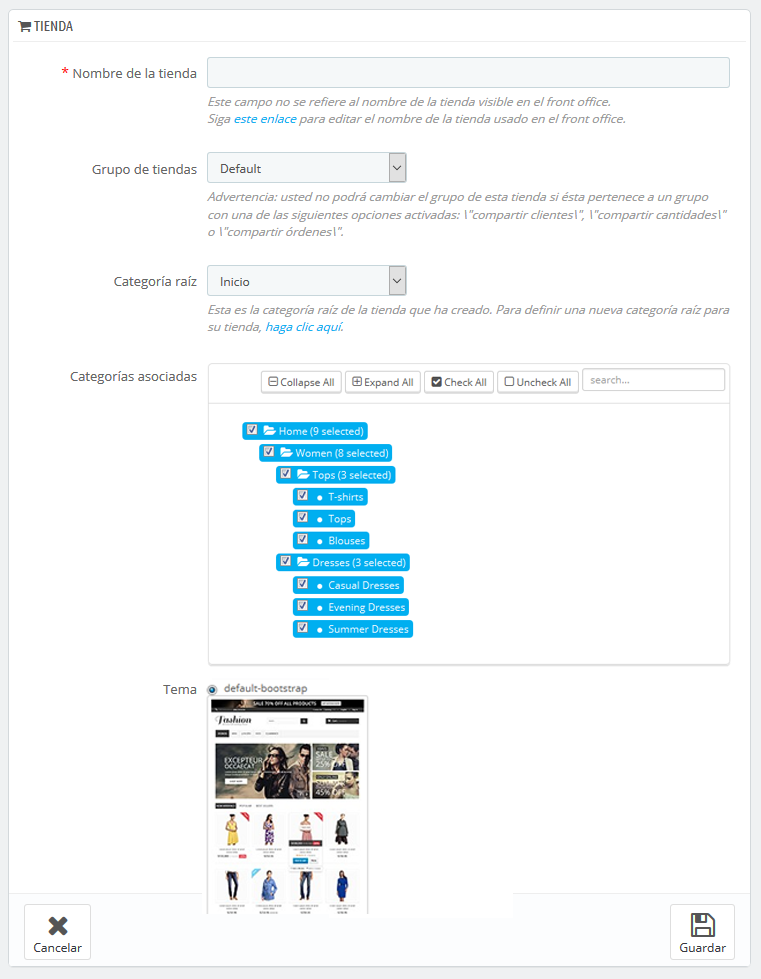
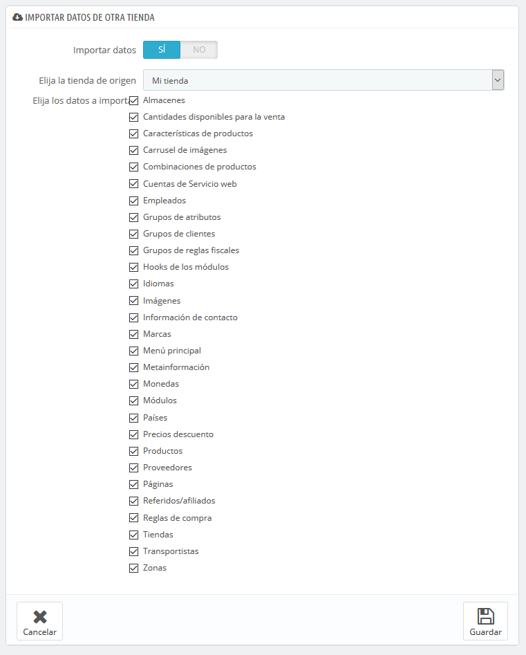

# Crear una nueva tienda

La herramienta de creación de tienda, ubicada en la página "Multitienda", permite definir con sencillez y precisión tanto la apariencia del front-office de tu tienda \(es decir, tu tema\) como de los elementos que deseas importar desde tu tienda principal en esta nueva.

Al hacer clic en el botón "Añadir nueva tienda" se abre un formulario con dos secciones. El primero de ellos tiene 5 opciones:

* **Nombre de la tienda**. El nombre es público: los clientes pueden ver este en muchos lugares, tales como el título del sitio o los correos electrónicos que reciban desde la tienda. Asegúrate que este nombre sea descriptivo tanto para los clientes como para ti.
* **Grupo de tiendas**. Una tienda sólo puede pertenecer a un grupo de tiendas. Además ésta, **debe** pertenecer a un grupo: ésta no puede existir fuera de un grupo de tiendas – incluso si es la única tienda en ese grupo.  Advertencia: No podrás cambiar el grupo de esta tienda si ésta pertenece a un grupo con una de las siguientes opciones activadas: "compartir clientes", "compartir cantidades" o "compartir pedidos".
* **Categoría raíz**. Aunque tu tienda principal tiene la raíz del catálogo \(Inicio\) como su categoría raíz, cualquier otra tienda puede utilizar la misma raíz, o utilizar cualquiera de las categorías del catálogo como su raíz – de hecho utilizará un subconjunto del catálogo principal como su propio catálogo.
* **Categorías asociadas**. Además de poder limitar el catálogo de una tienda a un sub-conjunto del catálogo principal \(véase la opción "Categoría raíz"\), puedes optar porque sólo estén disponibles determinadas subcategorías de la categoría principal de esta tienda.
* **Tema**. Puedes utilizar cualquiera de los temas disponibles como tema para esta tienda. De hecho, puedes tener el mismo catálogo disponible en dos tiendas con un tema, una URL, e incluso los precios de los productos totalmente diferentes.

La segunda sección, "Importar datos de otra tienda", es en donde definirás los datos de la tienda principal que deseas utilizar en esta nueva tienda.

Ésta tiene tres opciones

* **Importar datos**. Si está desactivada, tu tienda no compartirá los datos con ninguna otra tienda, y la sección se cerrará. Si bien esta opción es útil cuando se desea gestionar dos tiendas totalmente diferentes desde una sola instalación de PrestaShop, esto también significa que tendrás que configurar las dos tiendas de la A a la Z, mientras que compartiendo los datos no tendrías que volver a crear los transportistas, monedas o módulos, por ejemplo. Asegúrate de seleccionar la opción que necesitas, ya que este cambio no se puede revertir.
* **Elige la tienda \(origen\)**. Si deseas importar datos, debes indicar desde cuál de las tiendas existentes deseas importar los datos. Si ya has definido una sub-tienda de la tienda principal, esto puede ayudarte a hacer una "copia" de esa sub-tienda, evitando tener que volver a configurar las diversas opciones de importación.
* **Selecciona los datos a importar**. Aquí es en donde decidirás qué clase de datos quieres importar desde la tienda origen. Por lo menos, debes importar todos los módulos, incluso aunque tenga algunos desactivados, ya que tanto el front-office así como gran parte del back-office son mostrados a través de algunos de estos módulos.

Cuando creas un producto en una nueva tienda y ese producto ya existe en otra tienda, PrestaShop probará a sugerirte el producto existente, por lo que no es necesario volverlo a recrearlo otra vez.

Al guardar la tienda, PrestaShop te advierte que ésta aún no tiene todavía una dirección URL. Haz clic en la advertencia de color rojo para añadir una \(véase más adelante\).

