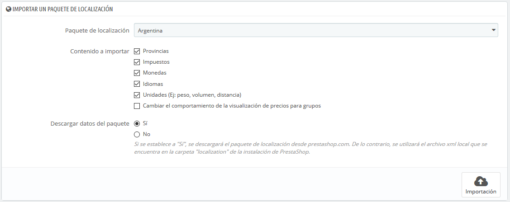
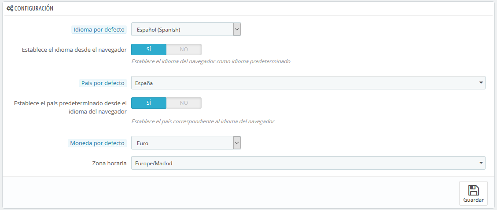
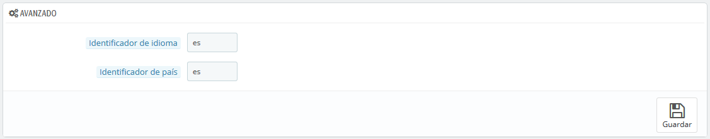

# Ajustes de Localización

La página principal bajo el menú "Localización" te permite configurar las unidades utilizadas para tus productos.

## Importar un paquete de localización 

Esta sección te ofrece una extensa lista de los paquetes de localización existentes que puedes importar. No sólo te permite configurar tu instalación de PrestaShop con tus propias unidades locales, sino también te permite añadir otros datos:

* **Provincias \(Estados\)**. Cuando envías un producto a un país, puede ser importante saber a qué zona geográfica o estado se envía éste, ya que esto podría tener un impacto en gastos de aduanas e impuestos locales. Las provincias o estados añadidos pueden ser visualizados y editados en la pestaña "Provincias \(Estados\)" de la página "Ubicaciones geográficas" bajo el menu “Internacional”.
* **Impuestos**. La verdadera importancia de la localización son los impuestos locales, y pueden ser numerosos y variados, dependiendo del país o el estado o provincia. PrestaShop te proporciona un soporte básico para los principales impuestos y reglas tributarias. Los impuestos y reglas tributarias añadidos pueden ser visualizados y editados en las pestañas "Impuestos" y "Reglas de impuestos" de la página "Impuestos” bajo el menu “Internacional”.
* **Monedas**. Los clientes extranjeros aprecian la posibilidad de convertir los precios de tu tienda en sus propias monedas. Deberías al menos de disponer de dólares y euros, además de la moneda de tu país \(si ésta no es una de esas dos\). Una vez añadida, tienes que activar la nueva moneda utilizando la pestaña "Monedas" bajo el menú "Localización", y asegurarte de que la tasa de conversión es correcta. Las monedas añadidas pueden ser visualizadas y editadas en la pestaña "Monedas".
* **Idiomas**. Todos los campos públicos de tu tienda pueden estar escritos en varios idiomas, y es muy importante que hagas esto al menos para los nombres y las descripciones de tus productos. Ten en cuenta que al importar un idioma también se importa su formato de fecha \(d/m/A, m/d/A, d.m.A, ...\), entre otras cosas. Los idiomas añadidos se pueden visualizar y editar en la pestaña "Idiomas" de la página "Localización" bajo el menu “Internacional”.

  Puedes añadir solamente un idioma, sin la moneda, impuestos y otros datos dependiendo del país, gracias a la página "Traducciones".

* **Unidades**. Peso, dimensiones, volumen, distancia: estas unidades son esenciales para describir correctamente un producto a tu cliente, y para la información del embalaje de tu producto. Estas pueden ser visualizadas y editadas en esta misma página, en la sección "Unidades locales".
* **Cambiar el comportamiento de los impuestos mostrados para los grupos**. Este campo no trata de datos que puedan importarse, pero es un ajuste de configuración que puedes cambiar al realizar una importación. Esta opción reemplazará el comportamiento de visualización de precios para tus grupos de clientes \(por ejemplo, mostrando el precio con impuestos incluidos o no según cada grupo de clientes, que se encuentren en Parámetros de la tienda &gt; Ajustes sobre clientes &gt; Grupos, al editar o crear un grupo\), y activar en su lugar el comportamiento tributario que generalmente se aplica en el país, para todos los grupos y todos los países. Por ejemplo, si estás importando el paquete de localización para los Estados Unidos y seleccionas esta opción, los precios se mostrarán exentos de impuestos.

  Sólo debes seleccionar esta opción si estás importando un paquete de localización para el país predeterminado de tu tienda, ya que podrías cambiar el comportamiento de visualización de impuestos para todos los grupos y todos los países.

  

Como puedes ver, estos datos adicionales son opcionales: puedes optar por importar la moneda y el idioma de un país determinado, y no sus impuestos, por ejemplo.

Aunque no debes añadir demasiados datos locales ya que esto puede abrumar a tus clientes, puede ser útil importar el paquete de localización de aquellos países que más visitan tu tienda \(según tus estadísticas\).

Además de las unidades por defecto, **no puedes eliminar automáticamente todos los datos de un determinado país**; si necesitas eliminar los datos tendrás que hacerlo manualmente, en sus respectivas páginas bajo el menú "Localización".

## Configuración 

Esta sección agrupa cuatro ajustes locales predeterminados, de primordial importancia:

* **Idioma por defecto**. Este es el idioma principal de tu tienda. Este ajuste influye en el lenguaje del back-office de tu tienda \(incluyendo el idioma principal para tus productos\), así como el front-office. Ten en cuenta que el idioma del front-office podría adaptarse a la configuración del navegador del cliente.
* **País por defecto**. La ubicación de tu negocio. Si tienes sede en muchos países, utiliza tu país principal u original.
* **Moneda por defecto**. La moneda en la que se establecieron por vez primera los precios de tus productos. Las divisas se añaden mediante la importación y la activación de la moneda de un país. Ten en cuenta que, si cambias de moneda después de que ya hayas establecido algunos precios de productos, tendrás que actualizar manualmente todos los precios existentes. Asegúrate de realizar este ajuste de una vez por todas.
* **Zona horaria**. Tu propia zona horaria. Especialmente útil para promociones diarias: debes saber exactamente cuándo empiezan y terminan.

Los ajustes "Idioma predeterminado" y "País predeterminado" tienen un valor adicional:

* Para "Idioma por defecto": **Establecer idioma desde el navegador**. PrestaShop establecerá el idioma predeterminado de la tienda en función de la configuración regional del idioma establecida en el navegador del visitante \(por ejemplo: fr\_CA establecería el idioma francés\).
* Para "País por defecto": **Establecer el país predeterminado desde el idioma del navegador**. PrestaShop establecerá el país predeterminado de la tienda en función de la configuración regional del territorio establecido en el navegador del visitante \(por ejemplo: fr\_CA establecería el país por defecto en Canadá\).

## Unidades locales 

Las unidades físicas que se presentan en esta sección \(peso, distancia, volumen, dimensión\) se utilizan tanto en las páginas de tus productos como para tus propias necesidades de embalaje – y en última instancia, son una parte esencial en la relación con tu transportista.

Estos valores pueden ser establecidos al importar el paquete de localización para un país, pero puedes editarlos manualmente tras la importación. Por ejemplo, si quieres tener centilitros en lugar de litros para la unidad de volumen, cambia el valor predeterminado "L" a "cL".

Los valores deben ser símbolos de las unidades del Sistema Internacional de Unidades \([http://es.wikipedia.org/wiki/Sistema\_Internacional\_de\_Unidades](http://es.wikipedia.org/wiki/Sistema_Internacional_de_Unidades)\).

## Avanzado 

Esta última sección te pedirá que configure el idioma y el país local de tu servidor, en formato de código ISO:

* Para el idioma: código ISO 639-1 \([http://en.wikipedia.org/wiki/List\_of\_ISO\_639-1\_codes](http://en.wikipedia.org/wiki/List_of_ISO_639-1_codes)\).
* Para el país: código ISO 3166-1 Alpha 2 \([http://en.wikipedia.org/wiki/ISO\_3166-1\_alpha-2](http://en.wikipedia.org/wiki/ISO_3166-1_alpha-2)\).

Estos valores pueden ser establecidos al importar el paquete de localización para un país, pero puedes editarlos manualmente en cualquier momento.

