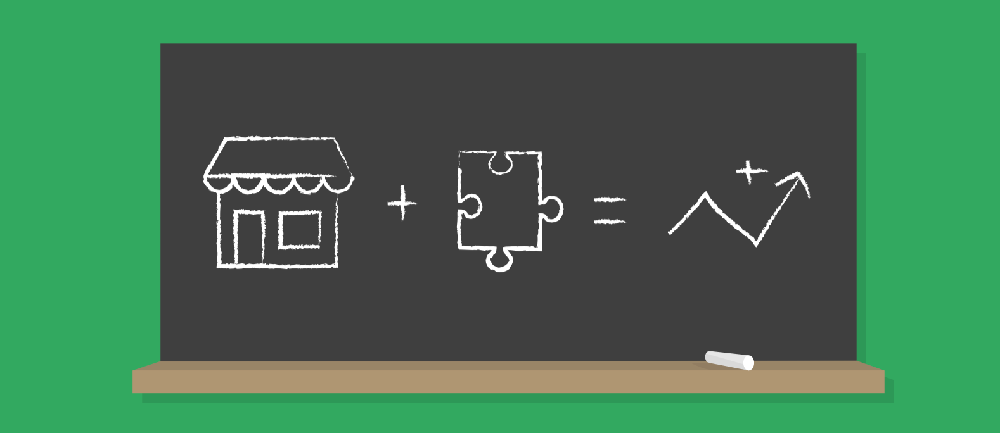

# Gestionar los módulos

PrestaShop trae incluidos un conjunto de módulos que se pueden instalar/desinstalar y configurar como se desee, para personalizar y mejorar tu tienda.

La gama de acciones es prácticamente ilimitada: la extensibilidad de PrestaShop permite que tu tienda realice exactamente lo que quieres que haga, en vez de tener que convivir con limitaciones que no deberían de existir – siempre puedes encontrar el módulo que hace exactamente lo que necesitas.

Este capítulo contiene las siguientes secciones:

* [Módulos y Servicios](modulos-y-servicios/)
* [Catálogo de módulos](catalogo-de-modulos.md)

La sección del back office "Módulos" está actualmente siendo reelaborada. Cabe esperar que se produzcan cambios desde PrestaShop 1.7.5 a las siguientes versiones menores, y es por eso que preferimos no documentarla en estos momentos, y esperar a que finalicemos con todo el trabajo. No te preocupes por esto, ya que queremos que esta sección siga siendo tan intuitiva como siempre, ¡probablemente no necesitarás de ayuda!

