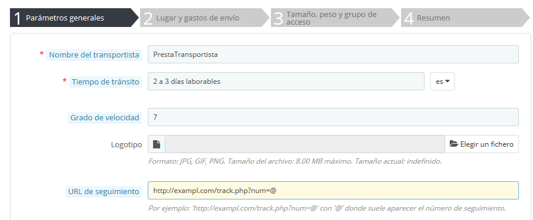
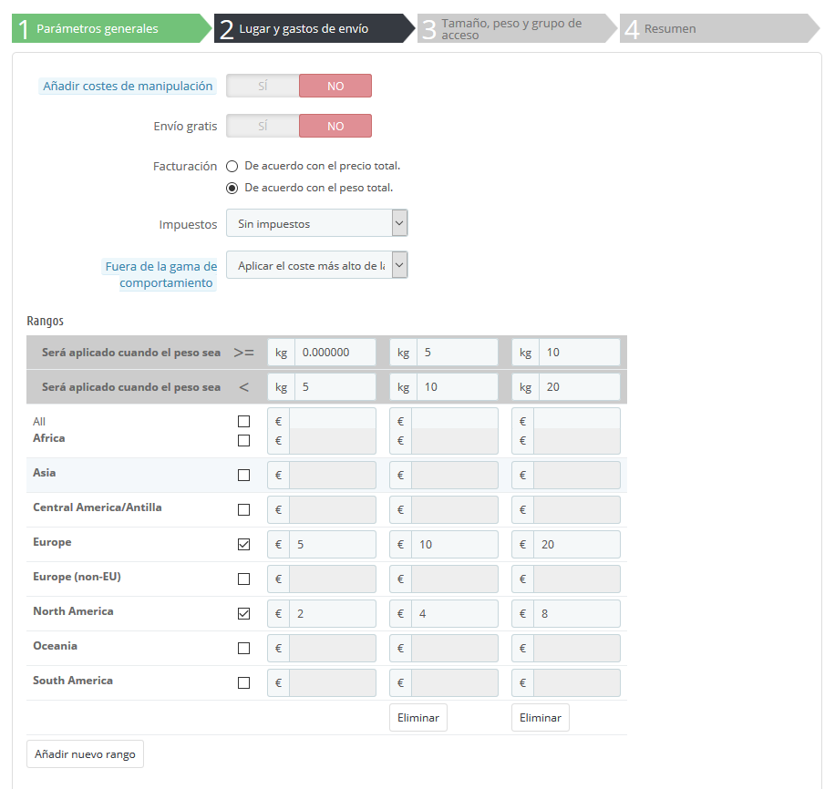
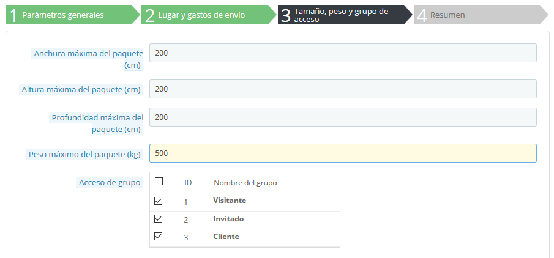
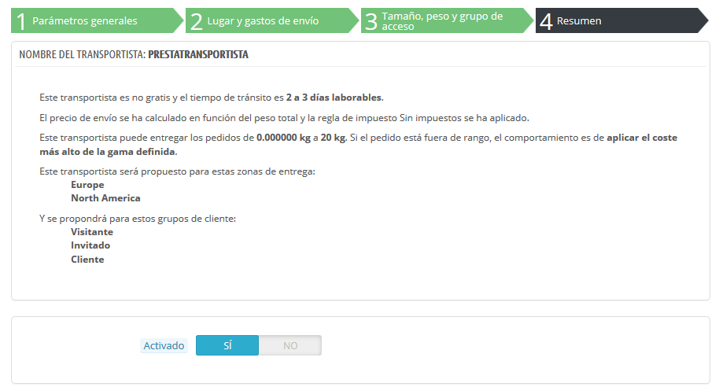

# Gestionar Transportistas

Debes tener transportistas añadidos a tu instalación de PrestaShop – esto es, un indicador claro de que entregarás tus productos. Este transportista podrías ser tu mismo o tu propia tienda \(por ejemplo, si estás vendiendo productos descargables, o sólo trabajas a nivel local\), pero tan pronto como realices los envíos de tus paquetes utilizando sellos y servicios de terceros como por ejemplo el servicio postal local, FedEx, o UPS, deberás tener los detalles de éstos añadidos a la base de datos de tu tienda. Esto permitirá que tus clientes puedan elegir el transportista que más les convengan, en función de sus rangos de entrega, sus precios y sus plazos de entrega.

La página "Transportistas" te presenta una lista de todos tus transportistas actuales. Desde aquí, puedse cambiar directamente sus estados, indicar si el transportista realiza el envío gratuitamente, y cambiar su posición para cuando se les presente a los clientes.

De manera predeterminada, tienes dos transportistas en tu base de datos:

* Tu propia tienda: Representa a tu tienda física, donde los clientes podrán ir a recoger tus productos. Este transportista no tiene establecidos rangos de precio o de peso.
* "My carrier": Es un transportista de ejemplo, que no debes utilizar en producción. Éste tiene establecido un rango de precio \(desde 0 € a 10.000 €\) y un rango de peso \(desde 0 kg a 10.000 kg\).

Te corresponde a ti eliminar estos transportistas y añadir otros nuevos para tus clientes. Por lo menos, debes editar el transportista "My carrier" y sustituir sus datos por los de un transportista real: nombre, detalles, y rangos. Te aconsejamos que elimines el transportista "My carrier", y que utilices algún módulo existente para los envíos de tus pedidos.

Video - 6 consejos para crear una política de entrega que atraiga a los clientes e incremente la lealtad

##  Añadir un transportista utilizando un Módulo nativo de Transporte 

PrestaShop viene acompañado con una serie de módulos gratuitos, entre los que se pueden encontrar un puñado de módulos de transportistas de grandes empresas internacionales y nacionales, que puedes instalar de inmediato.

Los transportistas disponibles dependerán de la configuración inicial de tu tienda: si has establecido que tu tienda está ubicada  en Francia, ¡no dispondrás de los mismos módulos que si has indicado que tu tienda está localizada en EE.UU.!

En la página "Transportistas", puedes elegir entre crear un nuevo transportista utilizando el Asistente de Transportistas, o utilizar uno de nuestros módulos nativos recomendados. Es altamente recomendable registrar transportistas instalando algunos de sus módulos oficiales: esto hace que el proceso sea mucho más rápido, y sus ajustes de configuración mucho más sencillos de realizar.

Dependiendo del módulo, podrás hacer clic en el botón "Instalar" y dejar que PrestaShop realice el trabajo, o hacer clic en el botón de carrito de la compra del módulo. En ese segundo caso, serás redireccionado al mercado oficial PrestaShop Addons, donde podrás comprar el módulo. Una vez que hayas comprado el módulo, podrás instalarlo y configurarlo.

## Añadir un nuevo transportista utilizando el Asistente de Transportistas 

Si no puedes encontrar un módulo para la agencia de transporte que quieres utilizar, ya sea en los módulos nativos o en PrestaShop Addons, debes registrar al transportista por medio del Asistente de Transportistas: haz clic en "Añadir nuevo transportista" para abrir esta herramienta.

En esta sección, vamos a crear un transportista detallando toda su configuración, desde la A a la Z, utilizando el Asistente de Transportistas. Puedes crear tantos transportistas como desees.  
Si un transportista realiza diferentes servicios de entrega, debes crear tantos transportistas en PrestaShop como servicios realicen, y diferenciarlos a través de sus nombres.

Muchos de los datos solicitados por los formularios de PrestaShop deben ser proporcionados por los transportistas una vez que hayas creado una cuenta, o hayas realizado un contrato directamente con ellos. Verifica con ellos los datos establecidos, para asegurarte de que todo está configurado correctamente.

Para crear un nuevo transportista, haz clic en el botón "Añadir nuevo transportista" en la página "Transportistas". Esto abrirá el Asistente de Transportistas, mostrando el primero de sus cuatro paneles.

### Panel 1: Configuración general 

Aquí es donde describes el transportista, dando la información que el cliente necesita con el fin de que lo reconozca y pueda elegir el transportista que más le guste.

Vamos a examinar toda la información que necesitas introducir:

* **Nombre del transportista**. El nombre es público, por lo que debes utilizar el nombre oficial. Si creas un transportista en PrestaShop que ofrece diferentes métodos de envío/servicios de entrega debes crear un número idéntico de transportistas y diferenciarlos a través de sus nombres. También puedes añadir una descripción del servicio que realizan. Por ejemplo, podrías rellenar este campo con "PrestaTransportista – para envíos superiores a 25 kg".
* **Tiempo de tránsito**. El tiempo estimado que le tomará a este transportista entregar tus productos, escrito en un lenguaje sencillo. Este se muestra a los clientes durante la compra. Esto ayudará a ellos a seleccionar un transportista de acuerdo a la cantidad de tiempo que estén dispuestos a esperar para recibir tu envío. En algunas ocasiones, los clientes prefieren pagar más por un transportista más rápido. Debes rellenar este campo en todos los idiomas disponibles, especialmente el que viene por defecto.
* **Grado de velocidad**. Dado que el campo "tiempo de tránsito" puede contener cualquier texto, este no se puede utilizar para comparar los tiempos de tránsito de los transportistas. El ajuste "grado de velocidad" te permite dar al portador una nota, de 0 \(muy lento\) a 9 \(muy rápido\). Esto es utilizado posteriormente para ordenar los transportistas por su grado de velocidad, y ayudar a los clientes a elegir el que prefieran.
* **Logotipo**. Tener un logotipo ayuda a los clientes a elegir entre diferentes transportistas con mayor facilidad. PrestaShop redimensionará la imagen para que se ajuste en el formulario de pedido. El logotipo aparecerá en cada panel del Asistente de Transportistas, como un recordatorio del transportista que estás editando/creando.
* **URL de seguimiento**. Este campo debe ser rellenado con la URL de seguimiento proporcionada por tu transportista \(si existe una\). Por ejemplo, Seur ofrece la siguiente: [http://www.seur.com/seguimiento-online.do?segOnlineIdentificador=@](http://www.seur.com/seguimiento-online.do?segOnlineIdentificador=@) El servicio postal de Francia \(La Poste\) ofrece esta otra: [http://www.colissimo.fr/portail\_colissimo/suivreResultat.do?parcelnumber=@](http://www.colissimo.fr/portail_colissimo/suivreResultat.do?parcelnumber=@). Cuando los clientes finalizan su compra, recibirán esa URL con la "@" reemplazada por el número de seguimiento proporcionado por el transportista, por lo que es posible hacer clic en ese enlace y ver en donde se encuentra el pedido del cliente.

Haz clic en "Siguiente" para pasar al segundo panel.

### Panel 2: Localización de destino y gastos de envío 

Al principio, este panel presenta unos cuantos ajustes:

* **Añadir costes de manipulación**. Incluir o excluir el envío y los costes de manipulación del pedido en los precios de este transportista, como se establecieron en la página "Preferencias" \("Gastos de manipulación y gestión"\).
* **Envío gratuito**. Si está activado, no podrás indicar los gastos de envío. Si está desactivado, podrás editar los rangos de coste por país en el siguiente formulario.
* **Facturación**. Cuando factura al cliente, PrestaShop puede aplicar uno de los dos comportamientos que debes configurar en función de cómo el transportista gestione la facturación \(asegúrate de revisar la documentación ofrecida por el transportista sobre esto\): 
  * **En función del precio total**. La facturación depende del precio total del pedido.
  * **En función del peso total**. La facturación depende del peso total del pedido.
* **Impuestos**. Indica si este transportista requiere un impuesto local para realizar la entrega, y si es así, cuál es este. El impuesto debe existir en PrestaShop \(éste se puede realizar en la página "Impuestos" bajo el menú "Localización"\).
* **Fuera de la gama de comportamiento**. En caso de que el transportista elegido no haya determinado el costo de envío para la zona o el peso requerido, puedes indicar cómo debe reaccionar PrestaShop. Tienes dos opciones: 
  * **Aplicar el coste más alto de la gama definida**. PrestaShop tomará el rango de mayor coste y  lo aplicará.
  * **Deshabilitar transportista**. PrestaShop no sugerirá este transportista, ya que probablemente no pueda entregar este pedido.

A continuación, viene la parte importante: la creación de los rangos del transportista. Este es un paso muy importante, ya que PrestaShop necesita esta información para presentarle al cliente qué o cuáles transportistas pueden realizar la entrega de tu pedido. En efecto, dependiendo del precio o del peso total del pedido, algunas opciones de transporte no estarán disponibles mientras que otras sólo aparecerán cuando se encuentren dentro de ciertos valores. Debes ser muy preciso al rellenar estos valores, y preferiblemente seguir las instrucciones y sugerencias que aparezcan en la documentación de cada transportista.

Aquí es donde el Asistente de Transportistas toma su nombre. Aquí, construirás los rangos de precio o peso de cada transportista \(dependerá de tu elección tomada en la opción "Facturación", aparecida anteriormente\), uno tras otro, aplicando tus precios para cada zona.

Las zonas deben haber sido definidas de antemano. Para ello, dirígete a la página "Ubicaciones geográficas" en el menú "Internacional".

Rellenar cada rango, sólo te tomará unos pasos:

1. **Fijar los límites inferiores y superiores del rango o gama que estás creando**. Dependiendo de la elección en el campo "Facturación", este mostrará "Será aplicado cuando el precio sea" o "Será aplicado cuando el peso sea" para el límite inferior, y "Será aplicado cuando el precio sea" o "Será aplicado cuando el peso sea" para el límite superior.

   Ten en cuenta que el límite inferior es incluido \(&gt;=\) mientras que el límite superior es excluido \(&lt;\). Esto significa que el límite superior de un rango puede tener el mismo valor que el valor más bajo de la siguiente gama, ya que estos no se superponen.

2. **Rellenar los precios**. Tan pronto como sean rellenados los límites inferior y superior, PrestaShop hace que el campo "Todos" pueda ser editado. Este es un campo especial: cualquier valor que introduzcas en este se copiará en el campo de todas las zonas geográficas disponibles, sin ninguna acción por tu parte. A continuación, puedes editar el valor de cada campo de la zona por separado. Marca la casilla de verificación para cada zona de este rango en la que el transportista realice entregas. Si este transportista no realiza entregas en una zona geográfica determinada para este rango actual, asegúrate de desactivar su casilla de verificación.
3. **Crear el rango**. Haz clic en el botón "Añadir nuevo rango". PrestaShop añadirá una nueva columna de campos de zona. Comienza de nuevo a fijar los límites inferior y superior de este rango, posteriormente rellena los precios para cada zona.

Las unidades de peso y precio son las predeterminadas por la instalación de PrestaShop, y las que utilizan tus productos. Puedes cambiar estas unidades en la página "Localización" en el menú "Internacional".

Haz clic en "Siguiente" para alcanzar el tercer panel.

### Panel 3: Tamaño, peso y grupo de acceso 

Este panel presenta dos grupos de opciones:

* **Altura, anchura, profundidad y peso máximo del paquete**. Puedes especificar la mínima y máxima altura y peso de un paquete, lo cual es una información esencial para elegir el transportista de un paquete. Los valores de peso y precio son establecidos en la unidad especificada en la página "Localización" en el menú "Internacional".
* **Acceso de grupo**. Es posible que desees que tan sólo algunos grupos de usuarios puedan utilizar un transportista. Esta opción sirve para este propósito.

Haz clic en "Siguiente" para alcanzar el cuarto y último panel.

### Panel 4: Resumen 

Este último panel te da una visión general de la configuración de este transportista.

Si algunos ajustes son erróneos, puedes volver a cualquier panel anterior, ya sea utilizando el botón "Anterior", o haciendo clic directamente sobre las distintas pestañas del panel.  
Si deseas guardar por el momento este transportista a modo de proyecto de prueba o borrador, y volver a este más tarde, desactiva este transportista utilizando la opción "Activado" situada en la parte inferior de este panel final.  
Haz clic en el botón "Terminar" para guardar tu trabajo, y crear el transportista.

Cuando se utiliza PrestaShop en modo multitienda, otro panel está disponible, y la orden de los paneles cambia ligeramente:

1. Parámetros generales
2. **MultiTienda**
3. Lugar y gastos de envío
4. Tamaño, peso, y grupo de acceso
5. Resumen

Todos los paneles son tal y como se describieron anteriormente. El nuevo, "MultiTienda", hace posible que puedas limitar este transportista a una selección de tus tiendas.

