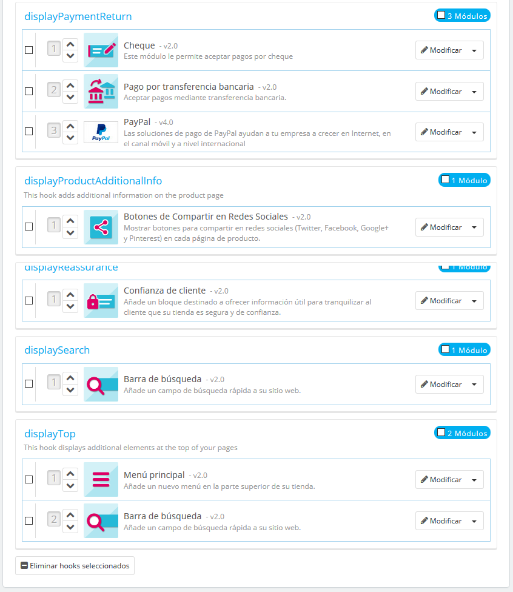
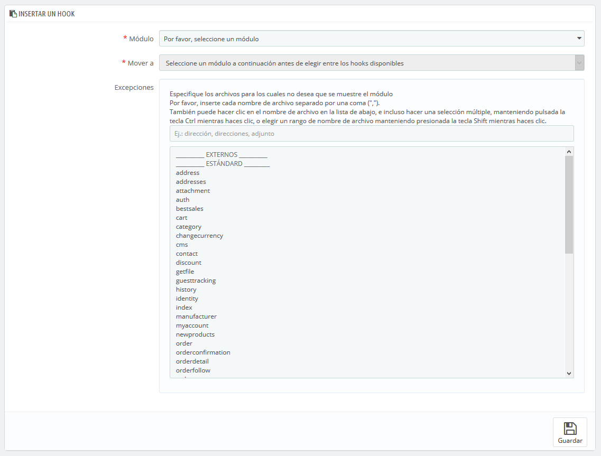
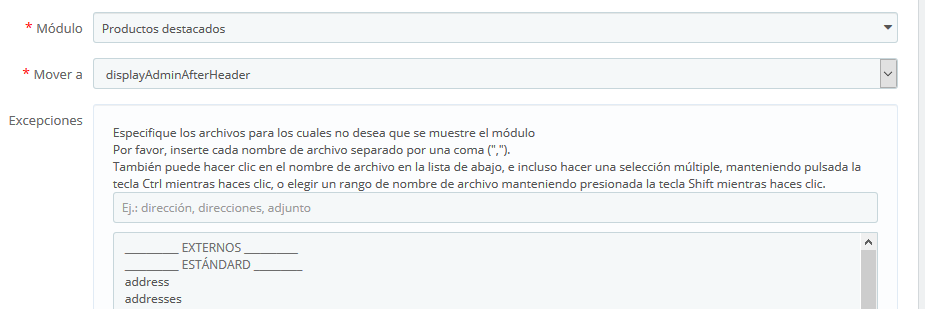

# Posiciones de los módulos en el front-office

Posiciones de los módulos en el front-office:

* [Mover un módulo dentro de un hook](posiciones-de-los-modulos-en-el-front-office.md#mover-un-modulo-dentro-de-un-hook)
* [Insertar un módulo en un hook: Trasplantar](posiciones-de-los-modulos-en-el-front-office.md#insertar-un-modulo-en-un-hook-trasplantar)
* [Editar un módulo trasplantado](posiciones-de-los-modulos-en-el-front-office.md#editar-un-modulo-trasplantado)
* [Eliminar un módulo de un hook](posiciones-de-los-modulos-en-el-front-office.md#eliminar-un-modulo-de-un-hook)
* [Trasplantar un módulo modificando su código](posiciones-de-los-modulos-en-el-front-office.md#trasplantar-un-modulo-modificando-su-codigo)
  * [Widgets](posiciones-de-los-modulos-en-el-front-office.md#widgets)

Un módulo puede tener dos aspectos: uno en el back-office \(sus opciones, o incluso su pantalla de configuración\), y el otro en el front-office. La parte front-office corresponde a cómo y dónde se mostrará el módulo en tu tema.

La posición de un módulo en tu tema puede ser cambiada, porque es posible que desees que el bloque de un módulo esté posicionado más arriba \(o más abajo\) en la página que otros. En la jerga PrestaShop, a esta acción se la denomina "trasplante", y se realiza mediante la herramienta disponible en la página "Posiciones de los módulos", bajo el menú "Diseño". En realidad, ésta te permite conectar un módulo a uno de los muchos hooks disponibles en el tema actual, sin necesidad de escribir ningún código.

La página "Posiciones de los módulos" te muestra todos los hooks \(ganchos\) disponibles, así como los módulos correspondientes que están enganchados a ellos. Muchos están vacíos por defecto, pero la mayoría utilizan fácilmente una docena de módulos.



En la parte superior de la página, un menú desplegable te permite mostrar sólo el hook en el que estás interesado.  
De forma predeterminada, la lista sólo muestra los hooks en los cuales puedes posicionar módulos. Al marcar la casilla "Mostrar hooks no posicionables" se mostrarán todos los hooks, incluso aquellos en donde no puedes colocar nada.

La cabecera de la tabla para cada hook muestra el nombre del hook, su nombre técnico \(para algunos de ellos, una rápida descripción\), y su número de módulos conectados. La tabla muestra los módulos que están conectados a ese hook.

Los módulos son mostrados en el orden en el que aparecen en el hook.

## Mover un módulo dentro de un hook

Tienes dos maneras de cambiar la posición de un módulo dentro de un hook:

* Haciendo clic en las flechas arriba o abajo. La página se actualizará y mostrará el nuevo orden.
* Arrastrando y soltando el módulo a la posición deseada: 
  1. Coloca el cursor del ratón entre las flechas de movimiento y el nombre del módulo para que este cambie a un cursor de "movimiento de elementos".
  2. Haz clic con el botón derecho del ratón y manténlo presionado, mientras mueves el cursor del ratón a la fila / posición deseada: el módulo pasará a ocupar la fila / posición correspondiente.
  3. Suelta el botón derecho del ratón: para guardar la nueva posición del módulo.

Para la mayoría de los módulos, el trasplante se puede hacer fácilmente a través del back-office. Algunos módulos requieren una modificación en su código para poder trasplantarlos.

## Insertar un módulo en un hook: Trasplantar

En PrestaShop, "trasplantar" es la acción de insertar un módulo en un hook. Puedes añadir un módulo a más de un hook.

Hay dos cosas que debes conocer antes de trasplantar un módulo:

* Algunos módulos están escritos para sólo poder conectarlos a un conjunto de hooks específicos.
* Algunos hooks han sido desarrollados para no aceptar ciertos tipos de módulos.

Por lo tanto, debes ser consciente de que no siempre puedes trasplantar un módulo a cualquier hook.

Asegúrate de desactivar la caché al probar el efecto de un nuevo módulo en el front-end. Puedes hacer esto en la página "Rendimiento", bajo el menú "Parámetros avanzados".

El proceso de trasplante tiene su propia interfaz:

1. Dirígete a la página "Posiciones de los módulos", disponible en el menú "Diseño".
2. Haz clic en el botón "Insertar un hook" situado en la parte superior derecha. La interfaz de trasplante de módulos, aparecerá en pantalla.
3. En la lista desplegable "Módulo", selecciona el módulo que deseas trasplantar.
4. En la lista desplegable "Insertar hook en", selecciona el lugar donde quieres trasplantar el módulo. Hay muchos hooks disponibles. Puedes cambiar tu decisión más tarde si es necesario.
5. En el campo "Excepciones", escribe el nombre del archivo\(s\) correspondiente\(s\) a las páginas en las que no deseas que el módulo aparezca. Puedes realizar una selección múltiple, haciendo clic en los nombres de archivo mientras mantienes pulsada la tecla Ctrl. Puedes anular la selección de los archivos de la misma manera: Ctrl + clic.
6. No olvides guardar los cambios realizados.



El menú desplegable "Insertar hook en" te ofrece información sobre dónde puedes colocar el módulo.

A pesar de que en la lista desplegable "Insertar hook en" ofrece una vista global de los hooks disponibles, no siempre puede ser del todo esclarecedora, sobre todo cuando se trata de encontrar un punto en particular donde insertar tu módulo. No dudes en probar con otro hook, si el resultado de tu elección no es el que esperabas.  
La lista te ofrece algunos detalles más: algunos hooks tienen tras su nombre una breve descripción de lo que hacen, por ejemplo, "Añadir campos al formulario 'atributo valor'" para `displayAttributeForm`. Examínalos a todos con detenimiento con el fin de elegir el hook correcto.

## Editar un módulo trasplantado

Cada módulo tiene dos iconos en el lado derecho de su fila: uno para editar su configuración, el otro para eliminar el módulo.

Para editar la configuración de un módulo se utiliza la misma interfaz que para el trasplante de módulos. La única diferencia es que no puedes cambiar la configuración de "Módulo" e "Insertar hook en", ya que están deshabilitados, y por tanto aparecerán en color gris. Tan solamente puedes cambiar la configuración de las excepciones, que funciona como se ha descrito en la sección anterior "Insertar un módulo a un hook: Trasplantar".



Siempre debes comprobar el front-office de tu tienda, para asegurarte de que el módulo aparece en donde deseas.

## Eliminar un módulo de un hook

Hay dos maneras de eliminar un módulo\(s\) de un hook:

* Eliminar un sólo módulo: haz clic en el icono del bote de basura situado a la derecha de la fila del módulo.
* Eliminar un lote de módulos: selecciona los módulos marcando las casillas situadas a la derecha de la fila, y luego haz clic en el botón "Eliminar hooks seleccionados", que encontrarás tanto en la parte superior como en la parte inferior del listado de hooks.

## Trasplantar un módulo modificando su código

Esta opción es indicada tan sólo para usuarios expertos: debes tener un amplio conocimiento de PHP y HTML antes de realizar cualquier modificación a un módulo.

Algunos módulos no pueden ser trasplantados en otras secciones del front-office, porque carecen del código necesario.

Por ejemplo, algunos módulos contienen plantillas para la visualización de la columna y de la cabecera, mientras que otros sólo tienen un archivo de plantilla para hacerlo funcionar en la sección cabecera de la página.

Si deseas mostrar módulos en una posición para la cual no fue programado, debes editar los archivos de su plantilla.  
Los módulos más complejos, también pueden ser modificados para que aparezcan en otras secciones de la página, pero puede ser que tengan que ser reprogramados parcialmente para que su diseño sea funcional en la nueva ubicación.

Para personalizar la posibilidad de trasplantar un módulo, debes dar a este la función PHP exacta para el hook de destino. Por ejemplo, para un módulo que tiene esta función:

```text
function hookTop($params) { ... } 
```

Por ejemplo, para trasplantar este bloque a la columna derecha, necesitas añadir la función `hookRightColumn()`:  


```text
function hookRightColumn($params) { ... } 
```

Una vez hecho esto, debes escribir el código que mostrará el contenido de la página principal. En el mejor de los casos, esto significa copiar/pegar el contenido de la función `hookTop()`; en el peor de los casos, necesitas reescribir el contenido de la función `hookTop()` para que funcione en la nueva ubicación.

### Widgets

PrestaShop 1.7 ha introducido un nuevo sistema para trasplantar módulos: widgets. Gracias a los widgets, un módulo puede ser utilizado y trasplantado a cualquier hook visible.  


Los widgets funcionan solamente con módulos desarrollados para la versión 1.7 \(en módulos de PrestaShop, los nombres técnicos de estos módulos comienzan con "ps\_"\), y no pueden ser utilizados por todos los módulos.  
Puedes obtener más información sobre widgets, en el siguiente enlace: [http://developers.prestashop.com/module/40-Widgets/widget.html?highlight=widget](http://developers.prestashop.com/module/40-Widgets/widget.html?highlight=widget)

