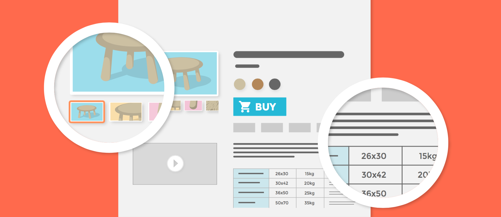

# Gestionar el catálogo de productos

La base principal de un sitio PrestaShop es su catálogo, la cual contiene productos y categorías de productos. Construir y actualizar el catálogo es la principal manera de hacer ver a los clientes que tu sitio está vivo. Aquí es donde tu tienda se convierte en realidad, la creación de contenidos, da valor a tu presencia en línea.

Por ser el corazón de tu tienda, tu catálogo merece gran parte de su atención. Añadir productos no sólo significa añadir una imagen y un texto y, a continuación, validar su contenido. Esto significa dar a conocer realmente tu producto: el precio, el peso, el tamaño, las características, especificaciones, detalles, marca, proveedor, y muchas otras cosas. No debes comenzar a añadir productos a tu catálogo sin saber exactamente lo que quieres presentar al cliente, y para ello necesitarás planificar tus productos y la forma en que se mostrarán. Esto también significa que debes conocer el front-office de tu tienda como si fuera la palma de tu mano con el fin de rellenar correctamente los campos obligatorios.

Se puede acceder a la sección "Catálogo" abriendo el menú con el mismo nombre, el cual enumera todas las páginas relacionadas con los productos. Aquí es donde puedes administrar tu catálogo a través de tu sitio PrestaShop.

Este capítulo contiene las siguientes secciones:

* [Gestionar los productos](gestionar-los-productos.md)
* [Gestionar las categorias](gestionar-las-categorias.md)
* [Monitorear el catalogo](monitorear-el-catalogo.md)
* [Gestionar Atributos del Producto](gestionar-atributos-del-producto.md)
* [Gestionar Características del producto](gestionar-caracteristicas-del-producto.md)
* [Gestionar Marcas](gestionar-marcas.md)
* [Gestionar Proveedores](gestionar-proveedores.md)
* [Gestionar Archivos](gestionar-archivos.md)
* [Gestionar Descuentos](gestionar-descuentos/)
* [Gestionar Stock](gestionar-stock/)

