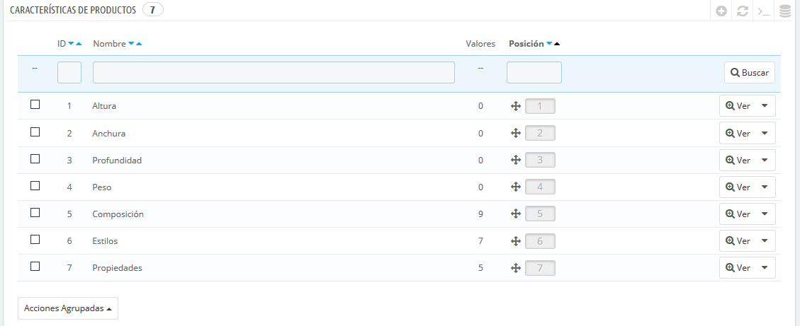
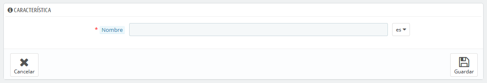
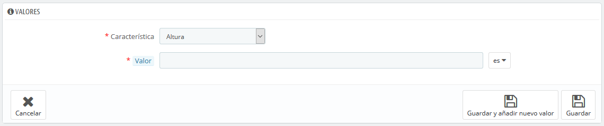

# Gestionar Características del producto

Esta página permite definir las características intrínsecas de un producto: que serán las mismas en todas las variaciones \(o "combinaciones"\) del producto.  
Debes pensar en las características de la misma forma en cómo piensas en los atributos del producto \(véase el capítulo anterior\), con la notable diferencia de que no puedes crear variaciones de un producto basadas en las características.

La diferencia entre un atributo y una característica depende del propio producto. Algunos productos pueden compartir la misma propiedad, el primero es utilizado para la construcción de variantes de productos, el otro es simplemente una característica invariable.

Por ejemplo, un cliente puede comprar una variación del iPod basada en los atributos \(color, capacidad del disco\), pero no en las características \(peso, tamaño\).

Del mismo modo, otra tienda podría vender variaciones de camisetas basadas en los atributos \(color, tamaño, género\), pero no en las características \(peso\).

En tu tienda, las características son mostradas en una tabla, proporcionando información adicional sobre el producto; mientras que los atributos permiten seleccionar entre combinaciones de productos.

Las características son configuradas sobre la base de un producto, desde la página "Productos" bajo el menú "Catálogo", pero primero éstas deben ser introducidas en tu tienda utilizando la pestaña "Características de productos" que se encuentra disponible en la página "Atributos y Características" bajo el menú "Catálogo".

Puedes establecer el orden de los atributos utilizando las flechas de la columna "Posición".   
Los botones de acciones situados en la columna de acciones, la última columna disponible en la tabla, te permite Modificar, Eliminar y Ver los valores disponibles para esta característica. Desde aquí, puedes ordenar, editar y eliminar valores si es necesario.

## Añadir una característica 

Haz clic sobre el botón "Añadir nueva característica". Un formulario muy sencillo aparecerá en pantalla. Aquí es donde se nombra la característica en sí: por ejemplo, los tipos de auriculares proporcionados junto con el reproductor de música.

Introduce un nombre para esta nueva característica, y guárdalo para regresar al listado de atributos.

## Añadir un nuevo valor a la característica 

Haz clic sobre el botón "Añadir un nuevo valor de característica". Un nuevo formulario aparecerá en pantalla.

Rellena el formulario:

* **Característica**. En la lista desplegable, selecciona una de las características disponibles.
* **Valor**. Otorga un valor a la característica: "5 lbs", "27 cm", ...

...y guarda su valor de característica. Puedes añadir más valores para el mismo tipo de característica guardando los cambios con el botón "Guardar y añadir nuevo valor".

