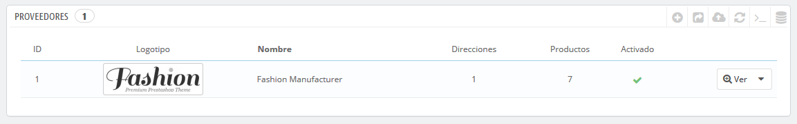
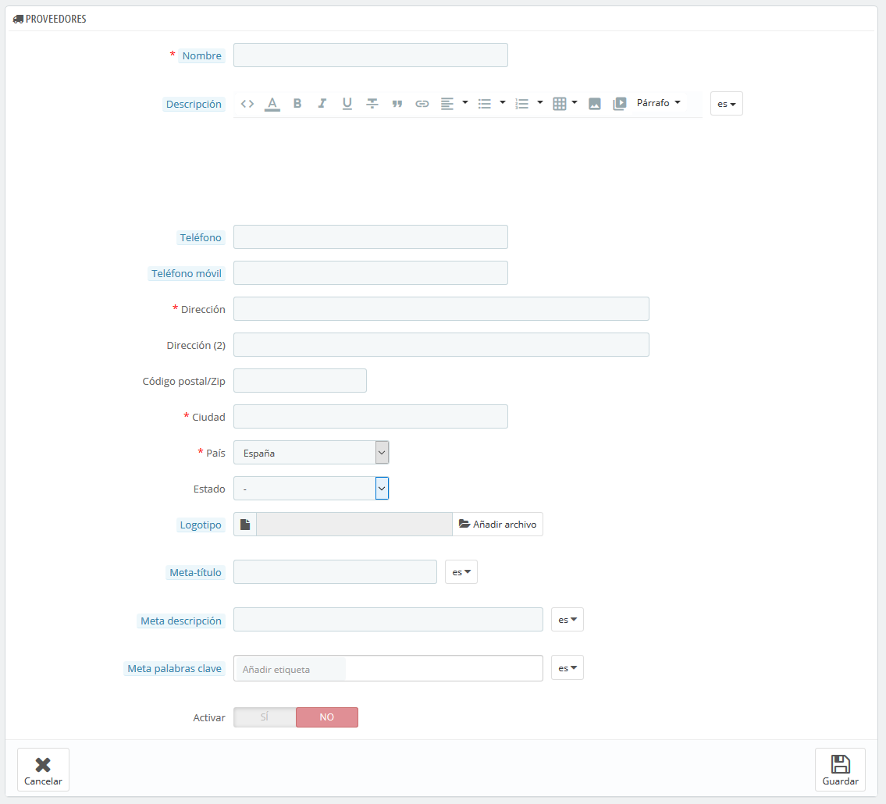

# Gestionar Proveedores

Tener proveedores registrados es opcional si dispones de un fabricante que directamente te suministra los productos. Todo depende de tus necesidades, pero si tu proveedor no es el fabricante del producto, entonces deberías tener ambos registrados en el sistema, y asociarlos con cada producto.

En PrestaShop, un proveedor es la empresa que te proporciona un producto.

Incluso aunque vendas productos propios fabricados por ti, deberás registrar por lo menos a tu empresa como proveedor.

Al igual que ocurría con los fabricantes, los visitantes de tu sitio pueden tener un acceso rápido a todos los productos de un proveedor. Esto facilita a ellos la navegación por tu sitio web. En términos de visibilidad, al rellenar estos campos mejorarás el posicionamiento de tu tienda en los motores de búsqueda.

 Haz clic en "Añadir nuevo proveedor", y aparecerá el formulario de creación.

Rellena todos los campos:

* **Nombre**. Indica el nombre del proveedor con el fin de simplificar las búsquedas a tus visitantes.
* **Descripción**. Añade una descripción más completa de tu proveedor, su actividad y sus productos. Puedes detallar sus especialidades y resaltar la calidad de sus productos. La descripción del proveedor se mostrará dentro de tu tienda.
* Los campos de dirección \(Teléfono, Dirección, Código postal, Ciudad, Provincia y País\). El campo "Provincia" aparece solamente en los países aplicables.
* **Logotipo**. Tener un logotipo del proveedor es esencial: esto consigue el efecto de que los clientes confíen en tu tienda, casi tanto como ellos confían en un proveedor o en una marca.
* Los campos SEO \(Meta título, Meta descripción, y Meta palabras clave\). proporcionan la misma funcionalidad que la que ofrecen en las categorías. 
  * **Meta título**. El título que aparecerá en los motores de búsqueda cuando un cliente realice una solicitud.
  * **Meta descripción**. Una presentación en pocas líneas del proveedor, diseñada para captar el interés de un cliente. Aparecerá en los resultados de búsqueda.
  * **Meta palabras clave**. Palabras clave para que tu sitio web aparezca referenciado en los motores de búsqueda. Puedes introducir varias de ellas, separadas por comas, así como expresiones, que deben ser indicadas entre comillas.
* **Activar**. Puedes desactivar un proveedor, temporalmente. Esto sólo lo eliminará del listado de proveedores del front-end de tu tienda.

Guarda los cambios para regresar a la lista de proveedores. Desde aquí, puedes:

* Hacer clic en el nombre o logotipo del proveedor, y obtener una lista de todos los productos asociados a este. Si no hay ninguno, entonces debes asignar productos a este proveedor, trabajando sobre la base de un producto, desde la página "Productos" bajo el menú "Catálogo". Puedes obtener el mismo resultado haciendo clic en el icono "Ver" situado en el lado derecho de la página actual.
* Desactivar el proveedor, haciendo clic en el icono de verificación de color verde. Una vez desactivado, el icono de una cruz roja aparecerá en su lugar: si haces clic de nuevo sobre este icono volverá a activar el proveedor.
* Ver/editar/eliminar los proveedores haciendo clic en los botones correspondientes a la derecha de la fila.

