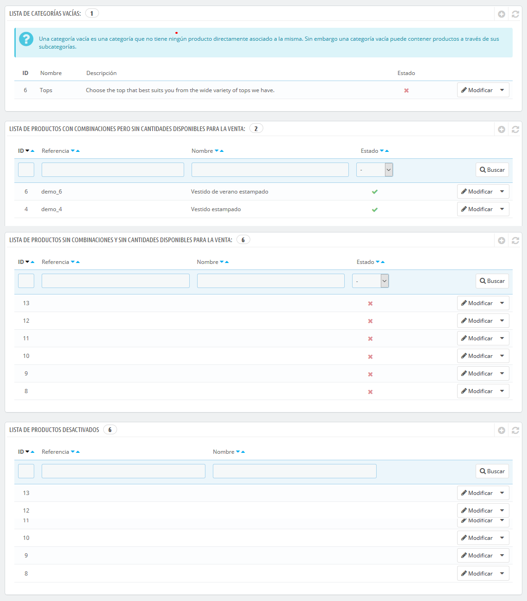

# Monitorear el catalogo

La página "Monitorización" lista las secciones de tu tienda a la que debes prestar mayor atención con el fin de gestionar mejor tu catálogo, y asegurarte de que nada está fuera de control.

Siete secciones están disponibles:

* **Listado de categorías vacías**. Muestra las categorías que no tienen ningún producto. Debes eliminar estas categorías vacías, o llenarlas con al menos un producto. Esto evita que los clientes encuentren en una categoría vacía en tu tienda.
* **Listado de productos con combinaciones, pero sin cantidades disponibles para la venta**. Muestra productos con combinaciones, que no tienen unidades en stock disponibles para la venta. Incrementa el stock de estos productos o elimínalos de tu catálogo. 
* **Listado de productos sin combinaciones y sin cantidades disponibles para la venta**. Muestra productos sin combinaciones, que no tienen unidades en stock disponibles para la venta. Incrementa el stock de estos productos o elimínalos de tu catálogo.
* **Listado de productos desactivados**. Muestra los productos que han sido desactivados en la tienda y que no son visibles por tus clientes. Considera la posibilidad de activarlos \(quizás después de una reposición de stock\) o eliminarlos de tu catálogo.
* **Listado de productos sin imágenes**. Indica los productos para los que aún no se han subido imágenes. ¡Asegúrate de cargar algunas buenas imágenes de estos productos para que los clientes tengan una imagen detallada de lo que están comprando!
* **Listado de productos sin descripción**. A la gente \(y a los motores de búsqueda\) les gusta leer información detallada / descripciones ingeniosas / artículos extensos sobre los productos que compran. Las descripciones son una parte esencial de las páginas de tus productos, no las descuides.
* **Listado de productos sin precio**. Obviamente, debes prestar atención a esta sección, ya que si no te das cuenta a tiempo de que algunos productos no tienen un precio establecido, puedes tener problemas si un cliente los añade a su carrito de la compra. A menos que definas deliberadamente estos precios en 0, debes revisar constantemente los precios de los productos de tu tienda.

La página "Monitorización" debe ser revisada regularmente con el fin de mejorar la gestión del catálogo de tu tienda.

