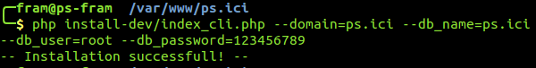

# Instalar PrestaShop usando el script de línea de comandos

PrestaShop también cuenta con un instalador para las instalaciones con línea de comandos. 

## ¿Qué es? <a id="InstalarPrestaShopusandoelscriptdel&#xED;neadecomandos-&#xBF;Qu&#xE9;es?"></a>

Este instalador especial posibilita instalar PrestaShop sin tener que usar un navegador web: solo tienes que colocar el contenido del archivo Zip en el servidor web e instalar PrestaShop mediante la interfaz de línea de comandos \(CLI, del inglés Command-Line Interface\). Puedes usar cualquier software de CLI, siempre y cuando puedas utilizarlo para interactuar con los comandos del servidor: Bash, Windows PowerShell, OS X Terminal, PuTTY, etc.

Tener un instalador de CLI además del instalador habitual integrado en el navegador permite complacer a algunos usuarios avanzados. Estos suelen preferir interfaces de línea de comandos porque tienden a proporcionar un medio más conciso y potente para controlar un programa o sistema operativo.

## ¿Cómo se utiliza? <a id="InstalarPrestaShopusandoelscriptdel&#xED;neadecomandos-&#xBF;C&#xF3;moseutiliza?"></a>

El instalador CLI es fácil de utilizar: desde tu terminal, ve a la carpeta `/install` \(o `/install-dev`\) \(lo que significa que tendrás que haber descomprimido previamente el archivo prestashop.zip\) e inicia el script con este comando:

```text
$ php index_cli.php
```

Esto mostrará las opciones disponibles.


Están disponibles todas las opciones del instalador integrado en el navegador, y se muestra su valor predeterminado. Casi todos los valores predeterminados pueden dejarse como están, porque se pueden editar desde el back‑office de PrestaShop cuando se haya hecho la instalación. Ten en cuenta que el correo electrónico y la contraseña son los que usaste al crear la cuenta del panel de administración de administrador.

Para comenzar con la instalación, solo tienes que proporcionar un argumento. Bueno, en realidad, tienes que dar alguno más:

* **dominio**. La ubicación donde quieres que aparezca tu tienda.
* **db\_server**. La dirección del servidor de la base de datos.
* **db\_name**. El nombre de la base de datos que quieres usar.
* **db\_user**. El nombre de usuario de la base de datos que quieres usar.
* **db\_password**. La contraseña del nombre de usuario de la base de datos anterior.

Por ejemplo:

```text
$ php index_cli.php --domain=example.com --db_server=sql.example.com --db_name=prestashop --db_user=root --db_password=123456789
```

  
También tienes que definir el valor `--email` para tu propia dirección. Recibirás un correo electrónico con toda la información una vez que la instalación haya terminado.

## Lista de argumentos <a id="InstalarPrestaShopusandoelscriptdel&#xED;neadecomandos-Listadeargumentos"></a>

A continuación presentamos la lista de argumentos para index\_cli.php, versión 1.6:

| **Nombre** | **Configuración predeterminada** | **Descripción** |
| :--- | :--- | :--- |
| --step | process |  |
| --language | en | Código ISO del lenguaje |
| --timezone | localhost |  |
| --domain | localhost |  |
| --db\_server | localhost |  |
| --db\_user | root |  |
| --db\_password | \(en blanco\) |  |
| --db\_name | prestashop |  |
| --db\_clear | 1 \(verdadero\) | Deshacerse de las tablas existentes |
| --db\_create | 0 \(falso\) | Crear la base de datos si no existe aún |
| --prefix | ps\_ |  |
| --engine | InnoDB | InnoDB/MyISAM |
| --name | PrestaShop | Nombre de la tienda |
| --activity | 0 |  |
| --country | fr |  |
| --firstname | John |  |
| --lastname | Doe |  |
| --password | 0123456789 |  |
| --email | [pub@prestashop.com](mailto:pub@prestashop.com) |  |
| --license | 0 \(falso\) | Mostrar la licencia de PrestaShop |
| --newsletter | 1 \(verdadero\) | Suscribir al administrador al boletín de PrestaShop |
| --send\_email | 1 \(verdadero\) | Enviar un correo electrónico al administrador tras la instalación |

