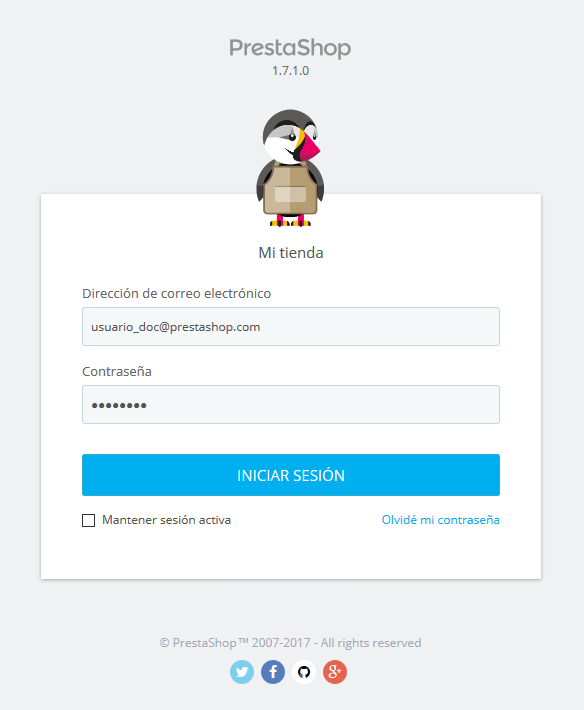
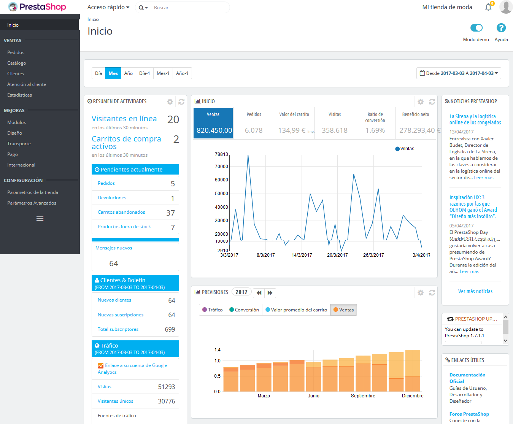

# Conexión al back-office de PrestaShop

En esta guía de usuario, el back-office de PrestaShop es el nombre utilizado para describir el panel de administración de tu tienda. Pasarás la mayor parte de tu tiempo en este panel, ya que todo lo que el usuario ve es gestionado directamente a través del back-office: añadir/editar/eliminar productos, gestionar transportistas, crear paquetes, crear cupones de descuento, mantener el contacto con tus clientes, realizar mejoras en tu tienda, etc.

Durante el proceso de instalación, la carpeta `/admin` es renombrada a un nombre único identificativo para tu tienda (por poner un ejemplo, `/admin091anufki`), por razones de seguridad. Utiliza ese nuevo nombre de carpeta para acceder a tu tienda (por ejemplo: http://www.ejemplo.com/admin091anufki).

El cambio de nombre es realizado automáticamente por PrestaShop. ¡Ten la precaución de anotar o memorizar ese nombre de carpeta la primera vez que accedas al panel de administración tras realizar la instalación!

Tras finalizar el proceso anterior, verás la página para iniciar sesión en el panel de administración de tu tienda.

Introduce la dirección de correo electrónico y la contraseña que registraste en el proceso de instalación de PrestaShop. Haz clic en el botón "Iniciar sesión", y comprobarás como automáticamente el navegador será redireccionado a la página de bienvenida del panel de control.

A partir de este momento, puedes comenzar a configurar tu tienda y vender productos a tus clientes.

Lee el siguiente capítulo de esta guía del usuario, denominado "[Descubriendo el Área de Administración](descubrir-area-administracion.md)", para conocer todas las secciones que forman parte del back-office.
