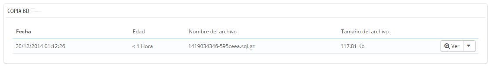
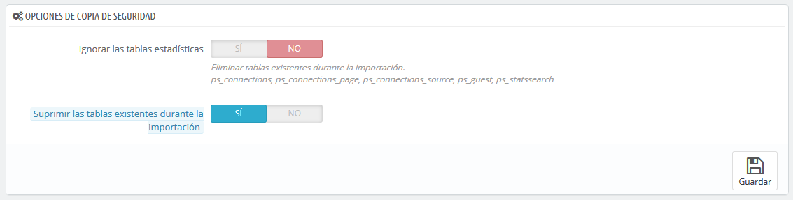

# Copia de seguridad de la Base de Datos

Una copia de seguridad es la acción de guardar el contenido de la base de datos y los archivos de tu tienda en un lugar seguro. El objetivo de esta página es que puedas volver a recuperar la información que tenías almacenada en la base de datos si esta deja de funcionar.

Debes realizar copias de seguridad de tu tienda periódicamente, para que, en caso de accidente, puedas reiniciar tu tienda rápidamente y en las mejores condiciones. La base de datos contiene toda la información de tu tienda, muchas de los cuales son indispensables para el correcto funcionamiento de PrestaShop – y eso sin hablar de tus productos, categorías y otros datos que hayas añadido desde la instalación.

Cuanto más a menudo realices las copias de seguridad, más seguro estarás ante posibles problemas que puedan presentarse en tu tienda. Haz copia de todos sus datos, como mínimo una vez a la semana.

Para realizar las copias de seguridad de la base de datos de tu tienda, tienes varias soluciones. Puedes utilizar herramientas como phpMyAdmin \(reservada para usuarios experimentados\), o utilizar la que está integrada en PrestaShop: disponible en la página "Copia BD".

Al abrir la página visualizarás dos grandes textos, uno de advertencias y otro de consejos. Debes leer ambos por completo para obtener mayor información de lo que puedes hacer desde esta página.

* La sección "Advertencia antes de crear una copia de seguridad" situada a la izquierda te muestra una serie de avisos importantes sobre las copias de seguridad, que debes leer cada vez que realices una copia de seguridad. La sección finaliza con el botón "He leído la advertencia - Crear una nueva copia de seguridad", al que tendrás que hacer clic para crear una copia de seguridad. Una vez creada, la copia de seguridad aparecerá en un listado debajo de estos avisos.
* La sección "10 pasos sencillos para restaurar una copia de seguridad:" te ofrece una serie de consejos sobre cómo recuperar los datos de tu tienda en caso de fallo. Debes recordar estas recomendaciones de memoria, o al menos guardar esta información en algún lugar, ya que en el caso de que la base de datos de tu tienda sufra algún daño, es posible que no puedas acceder a la administración de PrestaShop – y por lo tanto a esta página – de nuevo.  

Cómo restaurar una copia de seguridad de base de datos en 10 sencillos pasos

1. Establece "Activar tienda" en "No" en la página "Mantenimiento" en el menú "Preferencias".
2. Descarga la copia de seguridad de la lista de abajo o de tu servidor FTP \(en la carpeta "admin/backups"\).
3. Comprueba la integridad de la copia de seguridad: Busca errores, archivos incompletos, etc ... Asegúrate de verificar todos tus datos.
4. Solicita a tu proveedor de alojamiento acceso a tu base de datos desde "phpMyAdmin".
5. Conéctate a "phpMyAdmin" y selecciona tu base de datos actual.
6. A menos que activaras la opción "Eliminar tablas existentes", debes eliminar todas las tablas de la base de datos actual.
7. En la parte superior de la pantalla, selecciona la pestaña "Importar".
8. Haz clic en el botón "Examinar" y selecciona el archivo de copia de seguridad de tu disco duro.
9. Comprueba el tamaño de archivo máximo permitido \(por ejemplo, Max: 16 MB\).
10. Haz clic en el botón "Ir" y espera pacientemente para que el proceso de importación concluya. Esto puede tomar varios minutos.

La tabla que aparece bajo estas secciones, muestra todas las copias de seguridad que se han realizado, indicando la fecha de la creación, la edad, el nombre del archivo y el tamaño.  
A la derecha de cada fila hay dos acciones disponibles:

* **Ver**. Te permite descargar esa copia de seguridad.
* **Eliminar**. Te permite eliminar esa copia de seguridad. Ten cuidado, no podrás recuperar esa copia de seguridad de ninguna manera.

Después de realizar el proceso de copia de seguridad, debes descargar el archivo de la copia de seguridad generado haciendo clic en "Ver", o simplemente haciendo clic sobre la fila de la tabla perteneciente a dicha copia de seguridad. Guarda el archivo de la copia de seguridad en un lugar seguro, por si necesitaras utilizarla en algún momento dado. Además, puedes encontrar estas copias de seguridad directamente en la carpeta `/backup` de tu servidor, en el interior de la carpeta `/admin` renombrada de manera personalizada.

Tu base de datos es almacenada utilizando el formato estándar SQL con una extensión de archivo`.sql` y comprimida utilizando el algoritmo BZip2 \(una variante del popular formato ZIP. Tienes más información sobre este algoritmo en el siguiente enlace: [http://es.wikipedia.org/wiki/Bzip2](http://es.wikipedia.org/wiki/Bzip2)\) con extensión de archivo `.bz2`. Esto te da un archivo resultante con extensión `.sql.bz2.`

## Opciones de copia de seguridad 

En la parte inferior de la pantalla, hay dos opciones más disponibles:

* * **Ignorar las tablas de estadísticas**. PrestaShop almacena las estadísticas de tu sitio en varias tablas de la base de datos, y estas tablas pueden ocupar una gran cantidad de espacio rápidamente. A pesar de que puede ser conveniente mantener tus estadísticas en un lugar seguro, esto también hace que los archivos pesen más, tarden más tiempo en descargarse y ocupen un mayor espacio en el lugar en el que almacenas estas copias. Además, probablemente sólo estés interesado en tener una copia de seguridad de tus productos, categorías, clientes, pedidos, etc.  Por defecto, PrestaShop realiza una copia de seguridad de todas las tablas, pero si dispones de poco espacio para almacenar copias de seguridad, cambia esta opción a "Sí".
  * **Eliminar las tablas existentes durante la importación**. Al importar un archivo de copia de seguridad, el sistema puede sobrescribir cualquiera de las tablas existentes con el contenido de la copia de seguridad que realizó, o eliminar todas las tablas existentes sustituyéndolas por el contenido de la copia de seguridad. El primer caso podría dar duplicados, por lo que esta opción está activada de forma predeterminada.  

