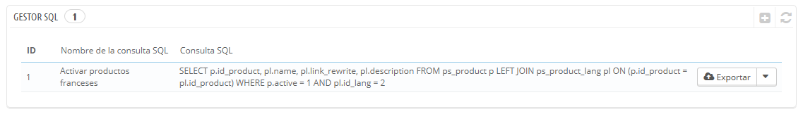
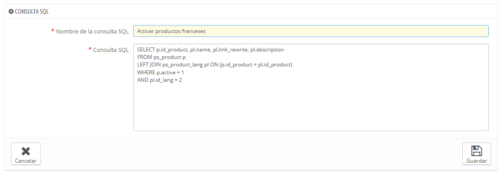
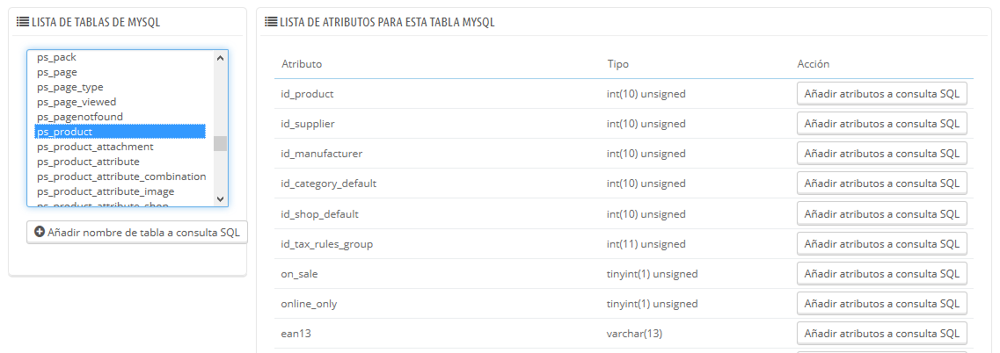
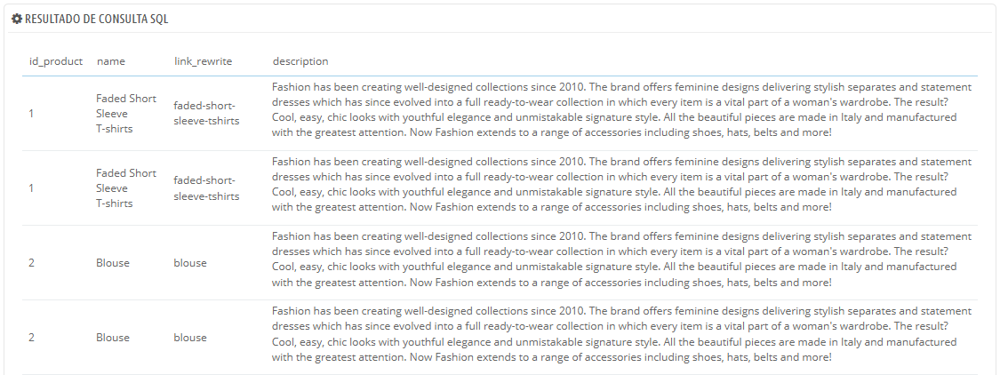
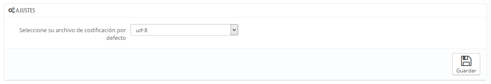

# Gestor de consultas SQL

El gestor SQL es una característica compleja, la cual está destinada a usuarios con perfil técnico que saben cómo explorar una base de datos utilizando el lenguaje SQL. A cambio de esta complejidad, recibes una herramienta muy poderosa, la cual será muy útil para aquellos que la dominen.

Esta herramienta te permite realizar consultas SQL directamente en la base de datos de PrestaShop, y guardarlas para utilizarlas cuando las necesites. Aunque, PrestaShop presenta los datos almacenados en su base de datos de muchas maneras, es posible que necesites visualizar esos datos con mayor detalle, o simplemente, acceder a ellos de una manera más en bruto que la que ofrece la interfaz limpia y sencilla de PrestaShop. Mediante el gestor SQL puedes realizar consultas complejas obteniendo los datos tal y como los necesitas.\
Por ejemplo, utilizando esta herramienta y tus conocimientos de SQL, podrías crear una consulta reutilizable que te muestre una lista actualizada de los clientes que están suscritos a tu boletín de noticias, u obtener una lista de productos en formato HTML o CSV.

Por razones de seguridad, no se permiten algunos tipos de consultas: UPDATE, DELETE, CREATE TABLE, DROP, etc. En definitiva, sólo puedes leer datos (sentencia SELECT).

Además, las llaves de seguridad y contraseñas se ocultarán bajo asteriscos (\*\*\*\*\*\*\*\*\*\*\*).

## Crear una nueva consulta 

Como de costumbre, el botón "Añadir una nueva consulta SQL" te redirecciona al formulario de creación. Este formulario cuenta con dos campos principales:

* **Nombre de la consulta SQL**. Especifica un nombre tan largo y descriptivo como sea necesario.
* **Consulta SQL**. La propia consulta SQL. Puedes utilizar JOINs u otras selecciones complejas.

Adicionalmente, la sección "Lista de las tablas MySQL" te ayuda a explorar la base de datos, lo que le facilita la construcción de tus consultas. Esta sección te ofrece un selector desde el que puedes hacer clic en cualquier tabla disponible en la base de datos. Al seleccionar una tabla, PrestaShop muestra sus atributos y tipos. Haz clic en el botón "Añadir atributo a consulta SQL" para enviar (añadir) estos nombres al campo "Consulta".

Al hacer clic en el botón "Guardar" del formulario, serás enviado de vuelta a la página principal, donde se listarán las consultas que hayas guardado.

## Iniciar una consulta 

Cada consulta grabada en la tabla tiene cuatro iconos a la derecha de su fila:

* **Exportar**. Realiza la consulta, y te ofrece descargar el resultado de la misma en un archivo con formato CSV.
* **Ver**. Realiza la consulta, y muestra está en una tabla HTML, dentro de la interfaz de PrestaShop.
* **Modificar**. Puedes editar una consulta cuando sea necesario, para perfeccionarla y obtener mejores resultados.
* **Eliminar**. Cuando no vayas a utilizar una consulta nunca más (o simplemente esta no funcione), puedes eliminarla haciendo clic en este icono y confirmando tu elección.

## Ajustes 

Tan sólo hay un ajuste disponible:

* **Seleccionar la codificación utilizada en los archivos por defecto**. Puedes establecer la codificación de caracteres del archivo CSV. El valor establecido por defecto, UTF-8, es el recomendado, pero puedes seleccionar la codificación ISO-8859-1 si es necesario.

## Algunas consultas de ejemplo 

Las posibilidades son infinitas, pero aquí hay algunas consultas de ejemplo que te ayudarán a construir tus propias consultas.

### Listar las direcciones de correo electrónico de todos los clientes 

| `SELECT email FROM ps_customer` |
| ------------------------------- |

### Listar las direcciones de correo electrónico de todos los clientes que están suscritos al boletín de noticias 

| `SELECT emailFROM ps_customerWHERE newsletter = 1` |
| -------------------------------------------------- |

### Listar todos los productos activos que tengan una descripción en francés (id\_lang = 4) 

| `SELECT p.id_product,` [`pl.name`](http://pl.name/)`, pl.link_rewrite, pl.descriptionFROM ps_product pLEFT JOIN ps_product_lang pl ON (p.id_product = pl.id_product)WHERE p.active = 1AND pl.id_lang = 4` |
| --------------------------------------------------------------------------------------------------------------------------------------------------------------------------------------------------------- |

### Listar todos los pedidos, mostrando el transportista que lo entregó, la moneda utilizada en la compra, el método de pago seleccionado por el cliente, el total de la compra y la fecha en la que se realizó la compra 

| 
<code>SELECT o.`id_order` AS `id`,    CONCAT(LEFT(c.`firstname`, 1), '. ', c.`lastname`) AS `Customer`,    ca.`name` AS `Carrier`,    cu.`name` AS `Currency`,    o.`payment`, CONCAT(o.`total_paid_real`, ' ', cu.`sign`) AS `Total`,    o.`date_add` AS `Date`FROM `ps_orders` oLEFT JOIN `ps_customer` c ON (o.`id_customer` = c.`id_customer`)LEFT JOIN `ps_carrier` ca ON (o.id_carrier = ca.id_carrier)LEFT JOIN `ps_currency` cu ON (o.`id_currency` = cu.`id_currency`)</code> 
 |
| ------------------------------------------------------------------------------------------------------------------------------------------------------------------------------------------------------------------------------------------------------------------------------------------------------------------------------------------------------------------------------------------------------------------------------------------------------------------------------------------------- |
