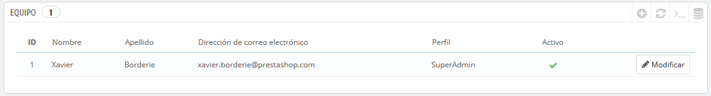
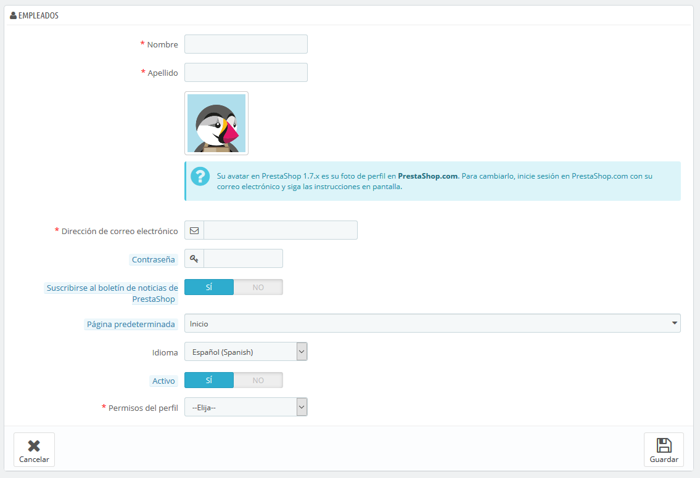

# Empleados

La página de administración "Empleados" lista todas las cuentas de usuario que tienen acceso al back-office de tu tienda. De manera predeterminada, encontrarás la cuenta que creaste durante la instalación de la tienda, la cual se establece automáticamente como usuario SuperAdmin. El usuario con perfil SuperAdmin tiene acceso a todas las funcionalidades de PrestaShop sin restricción alguna.

Debes crear una nueva cuenta de usuario para cada empleado que forme parte de tu grupo de trabajo. Esto significa que nunca se debe tener una única cuenta de uso general que todos ellos puedan utilizar, ya que en algún momento vas a necesitar saber quién hizo tal cosa en tu tienda. Los empleados pueden modificar los pedidos y aceptar los pagos y devoluciones de los clientes entre otras acciones, y como propietario de la tienda, debes conocer quién de ellos realizó una determinada acción. Tener una cuenta personal para cada empleado es la mejor forma de asegurarte de que tu equipo gestiona tu tienda con responsabilidad.

## Añadir un nuevo empleado 

El botón "Añadir nuevo empleado" te lleva al formulario de creación:

Este formulario cuenta con los siguientes campos:

* **Nombre** y **Apellidos**. El nombre no se muestra a los clientes, pero te será de mucha utilidad cuando necesites saber qué empleado realizó cierta acción o tarea en tu tienda.
* **Dirección de correo electrónico**. Si lo permites, el empleado recibirá los correos electrónicos de los clientes y las notificaciones de PrestaShop en esta dirección. Ésta también se utiliza como identificador para iniciar sesión en el panel de administración.
* **Contraseña**. Asegúrate de no utilizar una contraseña demasiado sencilla y obvia. Esto evitará en gran medida que cualquier persona ajena a tu personal de trabajo, pueda acceder a la tienda.
* **Suscribirse al boletín de noticias de PrestaShop**. Suscribirse al boletín de noticias de PrestaShop para recibir consejos de comercio electrónico y noticias del equipo de PrestaShop.
* **Página predeterminada**. Puedes decidir que página verá el usuario tras loguearse. Esta podría ser la página de estadísticas para los SuperAdmins, y la página de pedidos para los comerciales.
* **Idioma**. El idioma predeterminado a utilizar para este usuario. Dado que tu tienda puede trabajar en Inglés, pero tus logistas ser de otro país, asegúrate de añadir los idiomas necesarios, utilizando la página "Traducciones" bajo el menú "Internacional".
* **Activar**. Puedes desactivar temporalmente y definitivamente una cuenta. Esto te permite crear cuentas temporales, por ejemplo, cuando necesitas ayuda durante las vacaciones o en la temporada donde tu tienda produzca un mayor número de ventas.
* **Permisos del Perfil**. Es muy importante que asignes un perfil adecuado a cada cuenta de empleado. Un perfil está ligado a un conjunto de permisos y derechos de acceso, y tu debes conocer todos los existentes. Estos se encuentran listados en la pestaña "Perfiles". El perfil determina a que parte del back-office tiene acceso un empleado; por ejemplo, cuando un empleado inicia sesión, sólo se mostrarán las páginas/menús que se han configurado como accesibles para su perfil. Este es un ajuste muy importante.

El perfil avatar \(la imagen que lo representa en el back-office\) está vinculado a la cuenta del usuario en el foro de PrestaShop. Por lo tanto, si deseas personalizar esta imagen, primero debes crear una cuenta en el foro: [http://www.prestashop.com/forums/](http://www.prestashop.com/forums/)

## Opciones de empleados 

La sección en la parte inferior de la página de "Empleados", justo debajo de la lista de empleados, tiene dos opciones disponibles:

* **Regenerador de contraseña**. Te permite establecer la frecuencia con la que un empleado puede cambiar su contraseña.
* **Memorizar el idioma utilizado en los formularios del panel de Administración**. Si se activa esta opción, permitirá a los empleados establecer su propio idioma predeterminado para los formularios.

Esto significa que nunca se debe tener una única cuenta de uso general que todos ellos puedan utilizar, ya que en algún momento vas a necesitar saber quién hizo tal cosa en tu tienda. 

