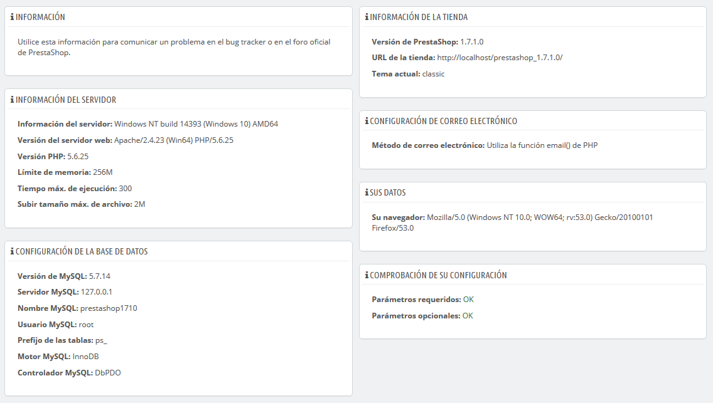

# Información

Esta página sirve como un recordatorio útil de la configuración PrestaShop: versión, información del servidor, versión de PHP, versión de MySQL. Toda esta información resulta muy útil cuando necesitas informar de un problema a los desarrolladores de PrestaShop, al webmaster o a tu proveedor de hosting.

Hay una última sección, titulada "Lista de archivos modificados". Justo después de haber instalado PrestaShop, la única cosa que esta sección muestra es el mensaje "Ningún cambio se ha detectado en tus archivos".  
Pero después de instalar algunos módulos y un par de temas, realizar cambios avanzados en algunas clases o eliminar algunos archivos, esta lista mostrará las diferencias entre la instalación actual de PrestaShop y su estado prístino. Esto te ayuda a ver los cambios que has realizado después de la instalación... y por lo tanto saber lo que tienes que tener en cuenta si deseas actualizar tu tienda de forma manual, o si vas a mover los archivos a un nuevo servidor.

Incluso en una instalación nueva, esta sección podría indicar que los archivos "`.gitattributes`", "`.gitignore`", "[`CONTRIBUTING.md`](http://CONTRIBUTING.md)", "[`CONTRIBUTORS.md`](http://CONTRIBUTORS.md)" o "[`README.md`](http://README.md)" no se encuentran. Estos son archivos específicos de Git, y PrestaShop no los utiliza, por lo que no debes preocuparte si recibes este mensaje.

