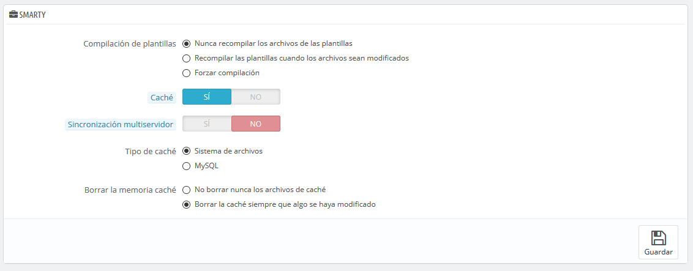
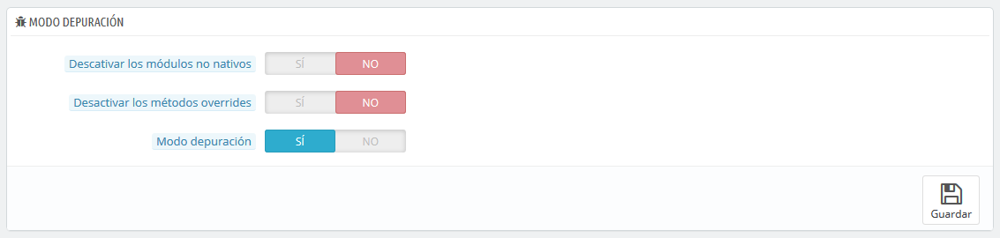
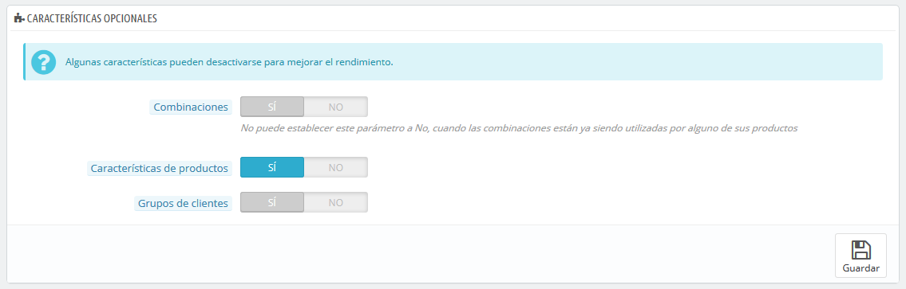
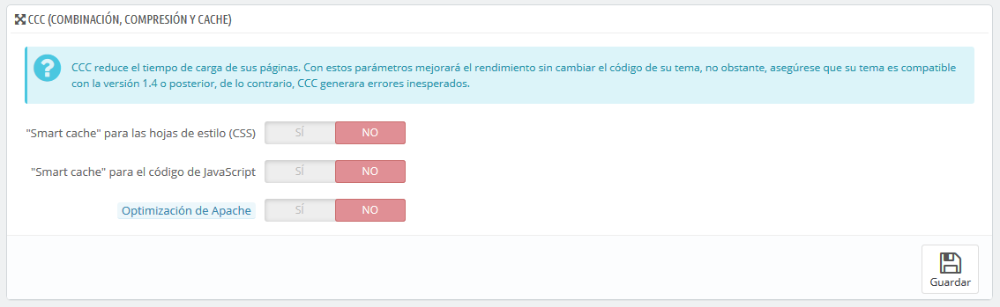
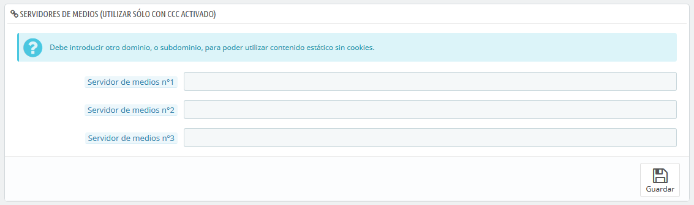
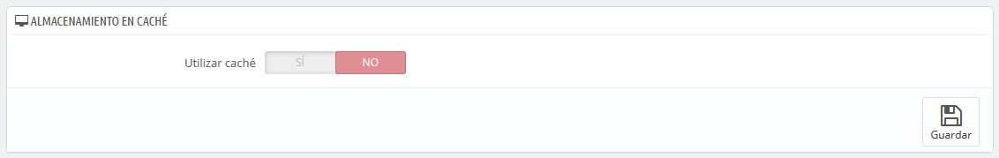

# Rendimiento

Esta página combina muchas herramientas y consejos que te pueden ayudar a mejorar el rendimiento de tu tienda en el servidor – sin fines comerciales, aunque un servidor que tenga un mayor rendimiento será capaz de atender a las consultas y peticiones de un mayor número de usuarios, y por lo tanto podrías obtener más ventas.

## Smarty <a href="#rendimiento-smarty" id="rendimiento-smarty"></a>

Smarty es el nombre del motor de plantillas utilizado por los temas de PrestaShop. Puedes aprender más sobre éste desde el siguiente enlace: [http://www.smarty.net/](http://www.smarty.net/).



Hay varias opciones:

* **Caché de plantillas**. Para mejorar el rendimiento front-end, PrestaShop almacena en caché las páginas HTML.\

  * **Nunca recompilar los archivos de las plantillas**. El comportamiento normal: Las páginas HTML son compiladas y almacenadas en la memoria _caché_ del navegador y se muestran tal y como son, incluso si el tema ha cambiado desde entonces.
  * **Recompilar las plantillas cuando los archivos sean modificados**. PrestaShop es capaz de saber si un tema ha sido modificado.
  * **Forzar compilación**. Sólo activa esta opción si estás editando un tema, y quieres ver los cambios realizados cada vez que recargues la página.
* **Caché**. Esta opción hace posible que puedas desactivar la caché de todos los archivos, y no tan sólo los que pertenecen a los archivos de la plantilla. Desactiva esta opción tan sólo para la depuración de módulos y/o plantillas. En cualquier otro caso, debes dejar esta opción activa.\
  La opción "Borrar la caché Smarty" hace posible borrar la memoria caché con un solo clic de ratón, en lugar de tener que ir a borrar los archivos desde el servidor FTP.
* **Sincronización multiservidor**. Cuando tienes varios servidores, esta opción te ayuda con la sincronización de caché.
* **Tipo de caché**. Por defecto, Smarty utiliza un mecanismo de almacenamiento en caché basado en archivos. Puedes optar porque éste utilice MySQL, como recurso de almacenamiento de memoria caché de salida de Smarty.
* **Borrar la memoria caché**. Dependiendo de la frecuencia con la que se produzcan los cambios en tu tienda, es posible que desees o bien nunca borrar los archivos de la caché, o bien borrarla cada vez que tu tienda es modificada (ya sean productos o diseño).

## Modo Depuración <a href="#rendimiento-mododepuracion" id="rendimiento-mododepuracion"></a>

Desde el modo de depuración, puedes optar por reducir el impacto que tienen ciertas funcionalidades en PrestaShop, y así poder evaluar con precisión de donde proviene un error:



* **Desactivar los módulos no nativos**. Los módulos nativos de PrestaShop son testeados con exhaustividad por lo que no deberían de presentar ningún tipo de problema. Si habilitas esta opción, podrás determinar si el problema proviene del propio código de PrestaShop (núcleo o módulo), o de un módulo de terceros.
* **Desactivar los métodos de sobrecarga (overrides)**. Muchas de las características de PrestaShop pueden ser sobrecargadas. Si habilitas esta configuración, todas las sobrecargas del código serán desactivadas, y podrás determinar si el problema proviene del propio código de PrestaShop, o de un módulo de terceros.
* **Modo depuración**. Al activar esta opción, los mensajes de error técnico serán visibles. Es útil cuando una persona está ayudando otra que no tiene acceso a tu tienda, pero que necesita saber lo que está pasando técnicamente.

## Características opcionales <a href="#rendimiento-caracteristicasopcionales" id="rendimiento-caracteristicasopcionales"></a>

Algunas características de PrestaShop pueden ser desactivadas si no las utilizas, ya que pueden ralentizar tu tienda.

Si tu catálogo tiene actualmente productos que hacen uso de estas características, no podrás desactivarlas. Tendrás que eliminar esos productos para poder desactivar estas opciones.

Puedes desactivar las siguientes características de catálogo:



* **Combinaciones**. Las combinaciones de productos te permiten tener una completa línea de productos en un sólo producto: diferentes tamaños, colores, capacidades, etc.
* **Características**. Las características del producto permiten indicar la información del producto específico: el peso, el material, el país de origen, etc.
* **Grupos de clientes**. Los grupos de clientes te permiten agrupar clientes dentro de un mismo grupo con el fin de darles ciertos privilegios y restricciones: descuentos, restricciones de módulos, etc.

## Combinación, Compresión y Caché (CCC) <a href="#rendimiento-combinacion-compresionycache-ccc" id="rendimiento-combinacion-compresionycache-ccc"></a>

CCC es un conjunto de herramientas destinadas a minimizar la carga del servidor y el tiempo de carga del tema de la tienda.

Esto hace lo que dice: combina archivos textuales del mismo tipo en un archivo más grande, lo que reducen el número de archivos para descargar; comprime el archivo utilizando el algoritmo Zip, lo que hace que se descargue más rápidamente; finalmente, se almacena en caché el archivo comprimido, por lo que el servidor no tiene que hacer este proceso cada vez que se carga una página, lo que alivia la carga sobre el procesador del servidor.



* **"Smart cache" para las hojas de estilo (CSS)**. Los archivos CSS son archivos de texto, que pueden ser combinados y comprimidos de forma segura.
* **"Smart cache" para el código de JavaScript**. Los archivos JavaScript son archivos de texto, pero su combinación a veces puede resultar problemática. Asegúrate de probar todo antes de dejar activada esta opción.
* **Optimización de Apache**. Este ajuste de configuración, modificará el archivo de configuración del servidor web con el fin de hacerlo más eficiente para CCC.

## Servidores de medios (utilizar solamente cuando CCC está activado) <a href="#rendimiento-servidoresdemedios-utilizarsolamentecuandocccestaactivado" id="rendimiento-servidoresdemedios-utilizarsolamentecuandocccestaactivado"></a>

Esta sección te permite redirigir parte del tráfico de tu tienda (imágenes y archivos de vídeo, por ejemplo) a otros servidores bajo tu control, a través de otros dominios o subdominios – generalmente, los archivos están alojados en un CDN (Content Delivery Network).



Poner el nombre de dominio de tu tienda en estos campos no es la forma apropiada para conseguir un fantástico rendimiento. Dicho esto, es fácil implementar un servidor de medios, y obtener sus beneficios reales de manera casi inmediata. He aquí cómo conseguirlo:

1. Abre una cuenta con una empresa de hosting, preferiblemente que esté especializada en el contenido distribuido. Las más populares son Akamai ([http://www.akamai.com/](http://www.akamai.com/)), Amazon (con sus servicios AWS, entre los que se incluye CloudFront: [http://aws.amazon.com/](http://aws.amazon.com/)) o CloudFlare ([http://www.cloudflare.com/](http://www.cloudflare.com/)). También debes preguntar a tu proveedor de hosting, sobre la posibilidad de suscribirte a una red de entrega de contenidos CDN.
2. Copia tus archivos multimedia en el servidor de ese host. Esto significa que el servidor CDN debe contener una copia exacta de las siguientes carpetas del servidor principal de tu tienda: `/img`, `/themes` y `/modules`.\
   Advertencia: Asegúrate de que estos archivos estén siempre sincronizados: incluso si añades nuevos productos o cambias de tema, el servidor CDN debe contener la última versión de estos archivos.
3. Una vez que el servidor CDN ha sido establecido correctamente, añade la dirección web (proporcionada por tu proveedor de hosting CDN) en el primer campo, "Servidor de medios n°1". Si ese host permite más direcciones web, añádelas.

En caso de que quieras que tus archivos se carguen siempre visualmente a partir del nombre de dominio de tu tienda y no de un dominio desconocido, sigue el siguiente proceso:

1. Crea un subdominio para el nombre de dominio de tu tienda, por ejemplo [`http://cdn1.example.com`](http://cdn1.example.com) (la forma de crearlo dependerá de tu proveedor de hosting, pónte en contacto con el soporte técnico para que te expliquen cómo hacerlo).
2.  Añade un archivo `.htaccess` en la raíz del subdominio. Este archivo debe contener una sola línea:

    ```
    Redirect Permanent / http://cdn-adress.com
    ```

    \
    Reemplaza la dirección [`http://cdn-adress.com`](http://cdn-adress.com) por la de tu servidor CDN. De esta manera, estás creando una redirección automática del subdominio en el servidor CDN.
3. Una vez que el subdominio ha sido establecido, añade este en el primer campo, "Servidor de medio nº1". Si ese host permite más direcciones web, puedes crear tantos subdominios como requiera para el dominio principal.

Incluso si no tienes un servidor CDN, puedes utilizar la funcionalidad del servidor de medios para hacer que el navegador del cliente descargue varios archivos a la vez, con lo que todo el proceso de carga de páginas será mucho más rápido:

1. Configura tu servidor web para tener subdominios virtuales, tales como [`imagenes1.ejemplo.com`](http://imagenes1.ejemplo.com), [`imagenes1.ejemplo.com`](http://imagenes2.ejemplo.com), e [`imagenes1.ejemplo.com`](http://imagenes3.ejemplo.com), apuntando a la carpeta principal de PrestaShop.
2. En la página "Rendimiento" del back-office de tu tienda, establece cada campo "Servidor de medio" a estos subdominios virtuales.

Una vez que tengas todo configurado correctamente, PrestaShop cargará tus imágenes en cualquiera de estos subdominios. En efecto, las imágenes provendrán de la misma carpeta (la principal), pero el navegador abrirá varios hilos de conexión más a tu servidor web de lo que lo haría de forma predeterminada, con lo que todo el proceso de carga de páginas será mucho más rápido:

## Caché <a href="#rendimiento-cache" id="rendimiento-cache"></a>

La caché de tus servidores almacena versiones estáticas de tu página web dinámica, con el fin de servirlas a tus clientes, reduciendo la carga del servidor y los tiempos de compilación.

En la mayoría de los casos, debes verificar si tu proveedor de hosting permite esta opción, ya que requiere de una configuración especial en el servidor.

Esta sección te permite activar el almacenamiento en caché, y elegir el método de almacenamiento en caché:



* **Memcached**. Un sistema de almacenamiento en caché distribuido. Muy eficaz, especialmente si utilizas múltiples servidores, pero necesitas asegurarte de que tu servidor/host lo soporta – lo que es probable, si tu configuración de PHP soporta o cuenta con la extensión Memcached PECL (la cual puedes descargar desde el siguiente enlace: [http://pecl.php.net/package/memcache](http://pecl.php.net/package/memcache)). Puedes añadir más servidores Memcached haciendo clic en el botón "Añadir servidor".
* **APC**. Alternativa PHP Caché gratuita, abierta y robusta, pero sólo funciona con un servidor – que es el caso habitual al iniciar un negocio online. Comprueba la disponibilidad de la extensión APC PECL en tu servidor: [http://pecl.php.net/package/APC](http://pecl.php.net/package/APC).
* **Xcache**. Es un nuevo sistema de caché, que es específico para el servidor Lighttpd – por lo tanto, no funciona con el popular servidor Apache. Obtén más información sobre éste, en el siguiente enlace: [http://xcache.lighttpd.net/](http://xcache.lighttpd.net/).
