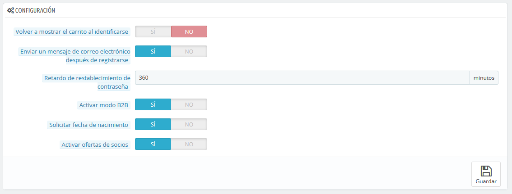

# Preferencias de Clientes

La página "Clientes", reúne todas las opciones relacionadas con los clientes, incluyendo el modo B2B.

* **Volver a mostrar el carrito al identificarse**. Si el cliente tiene un carrito que no completó (no terminó en un pedido) en su última sesión, puedes mostrárselo una vez vuelva a iniciar sesión.
* **Enviar un mensaje de correo electrónico después de registrarse**. Puedes hacer que PrestaShop envíe un mensaje de correo electrónico a cualquier cliente que acabe de crear una cuenta, con un resumen de la información de su cuenta (email, contraseña).
* **Retardo de restablecimiento de contraseña**. Puedes optar por limitar la frecuencia con la que un cliente puede generar una nueva contraseña para su cuenta. Por defecto, está establecida en 360 minutos – 6 horas.
* **Activar modo B2B**. El modo B2B añade nuevas características a tu tienda. Los clientes ya no son considerados individuos sino empresas, y nuevas opciones aparecen:\

  * El perfil de cliente tiene nuevos campos relacionados con la información profesional (Número Duns en USA, número SIRET en Francia, número CNPJ en Brasil, etc.),
  * Los precios pueden ser ocultados a ciertos grupos específicos,
  * Los precios pueden ser personalizados para cada usuario, para todo el catálogo o para determinadas categorías,
  * Las facturas pueden ser generadas manualmente,
  * etc.
* **Solicitar fecha de nacimiento**. Puedes optar por solicitar la fecha de nacimiento del cliente en el registro, o no. Si lo haces, es una buena práctica informar a los clientes por qué, y para qué realmente utiliza tu empresa este dato (por ejemplo, para el envío de un descuento o un pequeño regalo por la fecha de cumpleaños del cliente).
* **Activar ofertas de socios**. Es posible que tengas un acuerdo con uno o varios socios comerciales para sugerir la suscripción a tu boletín a sus clientes. Si es el caso, entonces debes activar esta opción. Al registrarse el cliente, aparecerá una casilla de verificación: "Recibir ofertas de nuestros socios".
