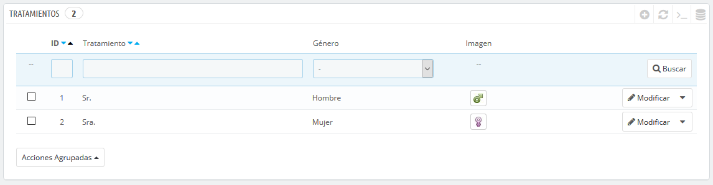
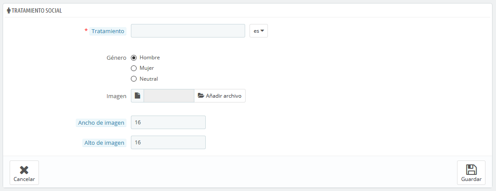

# Tratamientos Sociales - Títulos Sociales

El tratamiento social \(título social\) ayuda a definir mejor a tus clientes: en la lista de clientes, puedes optar por mostrar sólo los clientes que tengan un título social especificado. Los módulos también pueden usar esta información de título social para proporcionar alguna funcionalidad.

Haz clic en el botón "Añadir nuevo tratamiento", esta acción te muestra el formulario de creación:

* **Tratamiento**. Puedes elegir cualquier cosa que se te ocurra, desde el común \("Caballero", "Dama", "Monseñor", etc.\) a los inusuales \("Maestro Jedi", "The Special One", "Cabeza de familia"...\). Lo importante al apartarse de los títulos comúnmente aceptados es reflejar la verdadera identidad de tu tienda.
* **Género**. Algunos nombres \(tratamientos\) pueden aplicarse tanto a los clientes masculinos como a los femeninos. Asegúrate de ajustar esta opción a "Neutral" en ese caso.
* **Archivo de imagen**. Un archivo de imagen de tamaño 16\*16 que represente al título. Los símbolos de género habituales utilizados son los de Marte y Venus \(♂ y ♀\), pero hay muchas otras posibilidades. PrestaShop te permite caracterizar tu creación con una única imagen.
* **Anchura de la imagen** y **Altura de la imagen**. PrestaShop funciona mejor con imágenes de tamaño 16\*16, y redimensionará el tamaño de tu imagen si es más grande. Sin embargo, puedes necesitar el uso de imágenes más grandes, y estas dos opciones te permiten configurar el tamaño exacto requerido para tu imagen. Si introduces "0", PrestaShop simplemente utilizará el tamaño original de la imagen.

