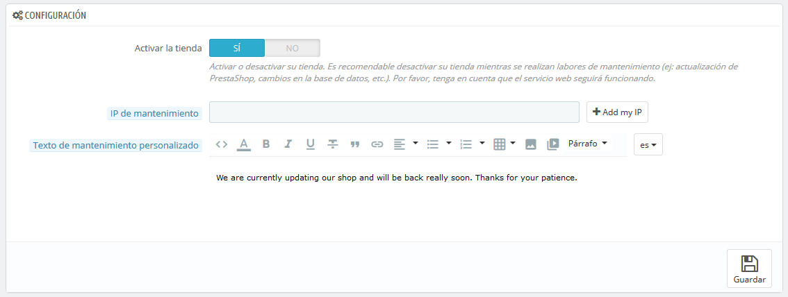
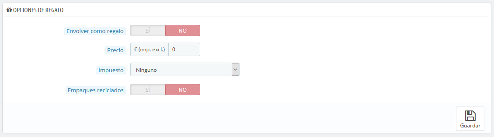

# Preferencias de Pedidos

La página de preferencias "Pedidos", permite configurar aspectos de los pedidos realizados por los clientes, pero también a algunos otros detalles, como los regalos.

## Preferencias Generales 

* **Habilitar resumen final**. Tal como se requiere en algunos países europeos, es posible que tengas que mostrar un resumen final del pedido (carrito, dirección, método de entrega ...), justo antes del botón de confirmación del pedido.
* **Activar el pedido express para cuentas de invitado**. Permite a los visitantes no registrados poder realizar un pedido, sin tener que crear una cuenta.
* **Desactivar la opción reordenar**. Si se establece en "Sí", los clientes no podrán reordenar de nuevo algo realizando un clic desde su historial de pedidos (esto es un requisito obligatorio en algunos países de Europa: por lo que deberás deshabilitar esta opción – y por lo tanto establecerla en "Sí").
* **Compra total mínima requerida para validar el pedido**. Permite indicar la cantidad mínima que debe haber en el carrito para admitir un pedido. Si no se alcanza el importe establecido en este campo, tu cliente no podrá procesar la compra. Si no quieres usar una cantidad mínima, introduce "0" en el campo.
* **Recalcular costes de envío tras edición de pedido**. _Novedad en PrestaShop 1.7. _Con esta opción activa se recalculará automáticamente los costos de envío cuando hayas editado un pedido (añadido un producto, cambiado la dirección de entrega, etc.). También hace posible cambiar un transportista para un pedido que no ha sido confirmado todavía, y por lo tanto actualizar los gastos de envío.
* **Envío parcial**. Si tu tienda tiene activa la opción "Permitir la venta de productos que están fuera de stock" (en la página de preferencias de "Productos"), te asegurarás de que los productos se envían a medida que estén disponibles, en tantos paquetes como sea necesario (tu equipo deberá valorar los paquetes necesarios). Inicialmente, PrestaShop dividirá el pedido en dos partes: los productos en stock serán enviados inmediatamente; el resto de los productos serán enviados tan pronto como se encuentren disponibles.
* **Condiciones generales del servicio**. Obliga a que tus clientes tengan que aceptar las condiciones generales de venta antes de que puedan validar el pedido.
* **Página para los Términos y condiciones del servicio**. Las "condiciones de uso" de tu tienda, estarán almacenadas en una página estática (ver "Diseño > Páginas"). Selecciona la página que deseas utilizar para que PrestaShop pueda apuntar correctamente a ella.

## Opciones de regalo 

* **Envolver como regalo**. Permite al cliente envolver sus paquetes para regalo, acompañados de un mensaje personal. Esta es una opción esencial para las personas que desean enviar regalos desde tu tienda.
* **Precio del servicio de embalaje como regalo**. Establece aquí el precio del servicio de embalaje como regalo.
* **Impuesto** **del servicio de embalaje como regalo**. Si lo requieres, indica el impuesto del servicio de embalaje como regalo. Puedes añadir otros impuestos desde la página "Impuestos", en el menú "Internacional".
* **Ofrecer embalaje reciclado**. Permite que el cliente elija si desea recibir el pedido en embalaje reciclado. Si puedes ofrecer este servicio, muchos clientes te lo agradecerán.
