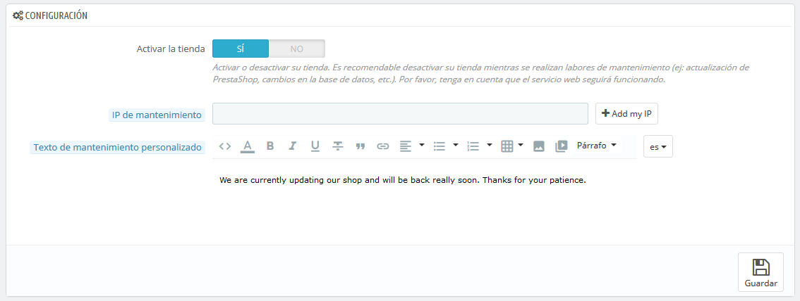

# Preferencias de Mantenimiento

Esta página de preferencias aparentemente sencilla, te será muy útil cuando necesites realizar cambios o labores de mantenimiento en tu tienda, sin que tus clientes lo perciban ni sufran las consecuencias de estos. Por ejemplo, cuando tengas que añadir varios productos nuevos al mismo tiempo, o cuando desees cambiar el tema de tu tienda y estés realizando pruebas antes de que este sea mostrado al mundo.

Esta página cuenta solamente con tres opciones:

*   **Activar la tienda**. Puedes utilizar esta opción para desactivar temporalmente tu tienda. Por ejemplo, es recomendable que desactives tu tienda cuando realices labores de mantenimiento.

    El servicio web seguirá estando activo, por lo que tus datos seguirán estando disponibles para los que tengan la llave. Si deseas desactivar también el servicio web, dirígete a la página de preferencias "Webservice" (Servicio Web), en el menú "Parámetros avanzados".
* **IP de mantenimiento**. La IP de mantenimiento permite acceder a tu tienda a algunas personas, incluso aunque se encuentre desactivada. Esto significa que puedes evitar que todo el mundo a través de Internet tenga acceso a tu tienda, pero puedes permitir el acceso a los ordenadores utilizados por tu equipo y por ti mismo. Para conocer la dirección IP de una máquina, dirígete a la página web [http://www.whatismyip.com/](http://www.whatismyip.com) desde esa máquina. Haz clic en "Añadir mi IP" si tan solo deseas añadir la IP de tu equipo actual.\
  &#x20;Si deseas añadir más direcciones IP, sepáralas con comas ",".
* **Personalizar texto modo mantenimiento**. _Novedad en PrestaShop 1.7_. Puedes mostrar un mensaje personalizado de tu elección cuando la tienda se encuentra en modo de mantenimiento, para que tus clientes sepan la razón por la que está en mantenimiento y lo más importante cuando tu tienda volverá a estar funcional.
