# Cumplimiento de la legislación europea

**Tabla de contenidos**

* [Introducción](cumplimiento-de-la-legislacion-europea.md#introduccion)
* [¿Por qué deberías preocuparte por este asunto?](cumplimiento-de-la-legislacion-europea.md#por-que-deberias-preocuparte-por-este-asunto)
* [Cómo configurar tu tienda](cumplimiento-de-la-legislacion-europea.md#como-configurar-tu-tienda)
  * [Configurar el módulo Cumplimiento Normativo Legal](cumplimiento-de-la-legislacion-europea.md#configurar-el-modulo-cumplimiento-normativo-legal)
  * [Configurar otros elementos de PrestaShop](cumplimiento-de-la-legislacion-europea.md#configurar-otros-elementos-de-prestashop)
  * [Elementos Externos que se consideran pertinentes para tener en cuenta](cumplimiento-de-la-legislacion-europea.md#elementos-externos-que-se-consideran-pertinentes-para-tener-en-cuenta)
* [¿Cuál es tu responsabilidad?](cumplimiento-de-la-legislacion-europea.md#cual-es-tu-responsabilidad)

## Introducción

Esta guía está dirigida a los comerciantes europeos y explica cómo pueden ellos deben configurar y asegurarse de que sus tiendas cumple con la legislación Europea de comercio electrónico.

Si necesitas información sobre la GDPR, puedes consultar la documentación [aquí](http://doc.prestashop.com/pages/viewpage.action?pageId=57606269).

## ¿Por qué deberías preocuparte por este asunto?

Si tienes tu sede en Alemania, Austria o Suiza, o tienes la intención de vender en dichos países, asegurarte de que tu tienda está cumpliendo con la legislación es un requisito obligatorio. Si no lo hicieras, podrías enfrentarte a una demanda. Para evitar estas demandas, empresas de certificación como Trusted Shops, EHI, Händlerbund y Protected Shops pueden auditar tu tienda y proporcionarte un certificado que demuestre que está en conformidad con los requisitos legales.

PrestaShop 1.7 ya está pre-certificada por estas 4 empresas, por lo que el proceso de obtención de la certificación completa será mucho más sencillo de conseguir.  
Para saber más detalles sobre la versión 1.7, puedes leer el siguiente enlace: [https://www.prestashop.com/es/1.7](https://www.prestashop.com/es/1.7)

Esta pre-certificación significa que PrestaShop te proporciona todas las características requeridas para cumplir con la ley. ¡La configuración depende de ti!

## Cómo configurar tu tienda

La piedra angular del cumplimiento de la ley por parte de PrestaShop es el módulo "Cumplimento normativo legal" \(siendo su nombre técnico: ps\_legalcompliance\), que te permite lograr que el 90% de la configuración de una tienda cumpla con la normativa legal vigente. Algunos otros elementos no forman parte de este módulo y se pueden configurar por separado. Pasaremos por todos los aspectos del módulo de Cumplimiento Legal y de esos otros elementos.

### Configurar el módulo Cumplimiento Normativo Legal

#### Instalación

Ingresa al back-office de tu tienda, y dirígete a la página Módulos y Servicios, y en la primera pestaña "Selección" utiliza la barra de búsqueda para encontrar e instalar el módulo "Cumplimiento normativo legal".  
A continuación, puedes ir a la segunda pestaña "Módulos instalados" y hacer clic en el botón "Configurar" del módulo Cumplimiento normativo legal.  

#### Elementos predefinidos

Cuando instales el módulo Cumplimiento normativo legal, éste realmente ejecuta una gran cantidad de pre-configuraciones con el fin de ahorrarte un tiempo precioso. Aquí está la lista de todos los cambios que realiza:  

* Se crean varias páginas estáticas, lo que te proporciona los medios necesarios para poder indicar la información legalmente requerida a tu cliente. Para obtener más información, consulta la sección "Gestionar el contenido legal".
* Estas páginas estáticas con contenido legal incluyen un botón "Imprimir", que permite a los clientes imprimir fácilmente o guardar en PDF esta información legal.
* El [resumen final](cumplimiento-de-la-legislacion-europea.md#Cumplimientodelalegislacióneuropea-ordersettings) en el último paso de la tramitación del pedido es también habilitado.
* La opción '[Mostrar impuestos en el carrito de la compra](cumplimiento-de-la-legislacion-europea.md#Cumplimientodelalegislacióneuropea-taxsettings)' es también activada.
* Las condiciones de envío "Gratis": a veces, el transportista por defecto de tu país predeterminado puede ser gratuito y esta información se muestra en la página del carrito de la compra, incluso si no ha establecido su dirección y método de entrega durante la compra. Debido a que el importe final de la compra depende de la dirección del cliente y del transportista seleccionado, el módulo Cumplimiento normativo legal, añadirá automáticamente una mención "bajo condiciones" que enlaza a la página estática "Envío y Pago" donde debes detallar las condiciones y los gastos de envío. 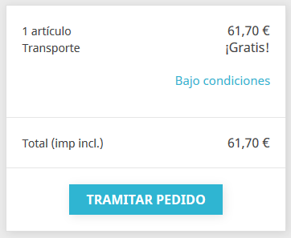 
* El opt-in para los Términos del Servicio también incluirá los Términos de Revocación \(si están disponibles\) durante la compra. 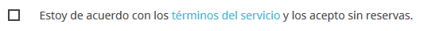  

#### Configuración

En este párrafo revisaremos todas las opciones disponibles dentro de la página de configuración del módulo de Cumplimiento normativo legal.

**ETIQUETAS**

**Etiqueta plazo de entrega \(productos disponibles\)**

Este es un parámetro global que se mostrará en la página de detalles de cada producto no virtual. Te recomendamos que utilices una indicación precisa como "plazo de entrega: 2 a 5 días" en lugar de indicaciones vagas como "entrega en 3 días en condiciones normales".  

En el back-office:

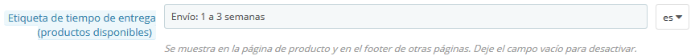

En el front-office:

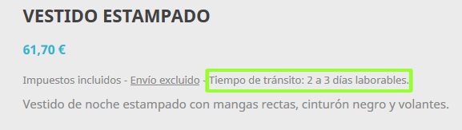

**Etiqueta plazo de entrega \(productos fuera de stock\)**  

Igual que lo indicado en el punto anterior, pero para los productos fuera de stock.

**Información adicional sobre el plazo de entrega**

Puedes utilizar este campo para mostrar información adicional sobre las condiciones aplicables de las etiquetas de tiempo de entrega antes mencionadas. Por ejemplo, el plazo de entrega sólo se aplica a Alemania.  
Un enlace a la página estática "Envío y pago" también se añade automáticamente para que el cliente pueda tener acceso a la información completa sobre las condiciones de envío.  

En el back-office:

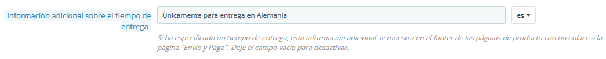

En las páginas de detalle del producto:

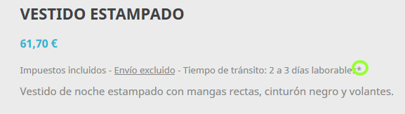

En el pie de página de las páginas de detalle del producto:

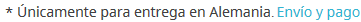

**Etiqueta 'Nuestro precio anterior'**  

Cuando un producto está a la venta, esta opción añade la etiqueta 'Nuestro precio anterior' antes del precio tachado \(rebajado\). Por lo tanto, te permite explicar que este precio tachado \(rebajado\), proviene de una promoción activa y que no es el precio recomendado por el fabricante ni el precio del competidor.  

En la página de detalles del producto:

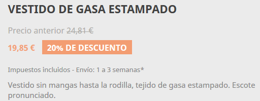

**Etiqueta Impuestos 'incl./excl.'**  

Esta opción muestra si el impuesto está incluido en la página del producto \(etiqueta "Impuestos incl. / excl."\) y agrega una mención breve en el pie de otras páginas \(listados de productos\).

En las páginas de detalle del producto:

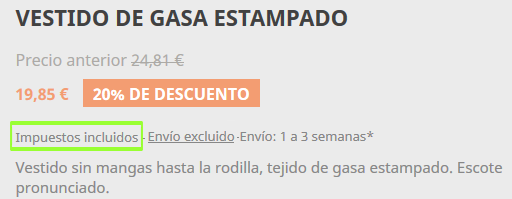

En el pie de página del listado de productos:

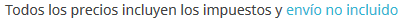

**Etiqueta Precio por unidad**  

Cuando esta opción está activada, el precio unitario \(precio por kg, L ...\), será visible junto al precio del producto si está disponible.

Revisa cómo establecer un precio unitario [aquí](cumplimiento-de-la-legislacion-europea.md#Cumplimientodelalegislacióneuropea-priceperunit).

En el front-office:

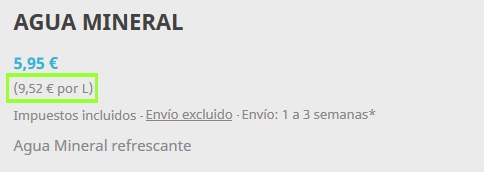

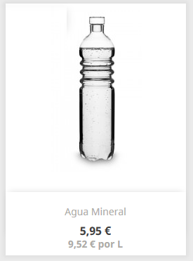

**Etiqueta 'Gastos de envío: impuestos excl.'**  

Cuando está activada, esta opción muestra una etiqueta "envío excluido" tanto en las páginas de detalles del producto como en el pie de los listados de productos. Esta etiqueta de "envío excluido" es un enlace a la página estática "Envío y pago", que es creada automáticamente por el módulo Cumplimiento normativo legal tras su instalación. Asegúrate de que las condiciones de envío y pago están asociadas a una [página estática](cumplimiento-de-la-legislacion-europea.md#Cumplimientodelalegislacióneuropea-Legalcontentmanagement).

En la página de detalles del producto:

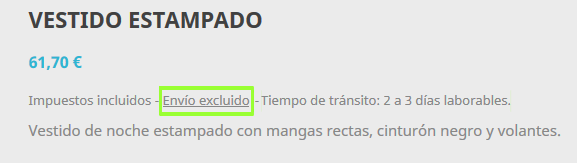

En el pie de página del listado de productos:

**Términos de revocación dentro de la página ToS - Términos de Servicio \(Terms of Service\)**  

Esta opción incluirá el contenido de los términos de revocación dentro de la página estática de Términos del Servicio \(Terms of Service\).

**Revocación para productos virtuales**

Esta opción añade una casilla de verificación obligatoria al final del proceso de pago cuando el carrito contiene un producto virtual \(ya sea un servicio o un bien digital\). Ésta asegura de que el cliente es consciente de que pierde su derecho a cancelar una vez que la descarga de bienes digitales ha comenzado o una vez que el servicio se ha completado.  

**Etiqueta de precio 'Desde' \(cuando hay combinaciones\)**

Si un producto tiene combinaciones con diferentes precios, esta opción añade una etiqueta "Desde", antes del precio del producto en los listados de productos. Ten en cuenta que el precio mostrado en los listados de productos no es el precio más bajo posible, sino el precio predeterminado de la combinación.

En los listados de productos:

**Texto personalizado en la página del carrito de la compra**

Esta opción te permite añadir un texto personalizado en el carrito de la compra, dándote la oportunidad de informar a los clientes sobre cómo se confirma el pedido legalmente, y cómo se utilizarán y/o almacenarán los datos del pedido.

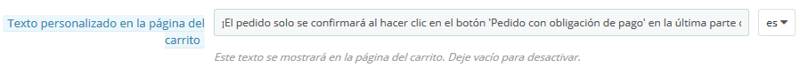

En la página del carrito de la compra:

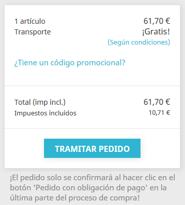

**CARACTERÍSTICAS**

**Activar característica 'Reordenar'**  

Esta opción permite a los clientes reordenar \(volver a comprar un producto\), realizando un simple clic desde su historial de pedidos. Desactiva esta opción si esta acción se considera como mercancías no solicitadas en tu legislación local.

**Impuesto proporcional para el envío y embalaje**

Cuando se activa esta opción, el impuesto para los gastos de envío y el embalaje se calcularán en proporción a los impuestos que se aplican a los productos incluidos en el carrito. Esto te permite definir un impuesto fijo, incluyendo los gastos de envío para cada transportista, mientras que la tasa de impuesto se calcula a partir de los impuestos del carrito promedio. Esta opción sustituye el comportamiento predeterminado en el que se define un gasto de envío excluido de impuestos, y lo sustituye por una regla de impuesto de envío fijo.  

Cuando esté activado, asegúrate de que los gastos de envío los has establecido con impuestos incluidos:

* Gastos de envío de los transportistas _\(en MEJORAS / Transporte / Transportistas / su transportista\)_
* Gastos de manipulación _\(en MEJORAS / Transporte /_ Preferencias\)
* Gastos de envío adicionales _\(en MEJORAS /_ Catálogo / Productos / su producto\)

**GESTIONAR EL CONTENIDO LEGAL** 

La legislación de tu país puede requerir que comunique alguna información legal específica a sus clientes, como tus términos de servicio o los términos de revocación. Para ello, puedes utilizar las páginas estáticas creadas automáticamente por el módulo Cumplimiento normativo legal. Es tu responsabilidad rellenar estas páginas con el contenido legal requerido. Para obtener asistencia legal acerca de este contenido, puedes obtener ayuda de los socios de PrestaShop:  

[https://www.prestashop.com/es/industry-partners/certifications/protectedshops](https://www.prestashop.com/es/industry-partners/certifications/protectedshops)

Para completar estas páginas, dirígete a MEJORAS / Diseño / Páginas y consulta cómo [Gestionar el contenido estático](http://doc.prestashop.com/display/PS16/CMS+-+Managing+Static+Content).

El cumplimiento legal tiene 7 asuntos predefinidos que sirven diferentes funciones en diferentes condiciones. Estos temas son:

* Términos del Servicio \(ToS - Terms of Service\)
* Aviso medioambiental
* Aviso Legal
* Privacidad
* Términos de revocación
* Formulario de revocación
* Envío y pago

Cada uno de estos asuntos se puede asignar con una página estática que corresponda al asunto concerniente.  

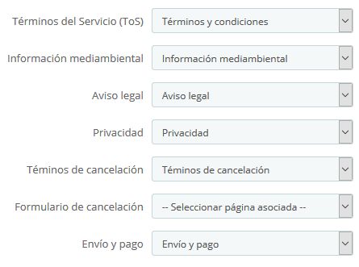

Para asegurarte de que otras opciones como los vínculos [etiqueta 'Gastos de envío excl.'](cumplimiento-de-la-legislacion-europea.md#Cumplimientodelalegislacióneuropea-shippingexcl) o [Información adicional sobre el plazo de entrega](cumplimiento-de-la-legislacion-europea.md#Cumplimientodelalegislacióneuropea-additionaldelivery) enlacen al contenido correspondiente, asegúrate de asignar una página estática a estos asuntos.  

También puedes dejarla vacía si no necesitas un asunto legal. Por ejemplo, es posible que no necesites una página sobre el aviso medioambiental si no vendes productos electrónicos.

Los enlaces a estas páginas estáticas formarán automáticamente parte del pie de página del front-office, por lo tanto, accesibles para tus clientes en cualquier momento. Visualizándose así en el pie de la página principal:

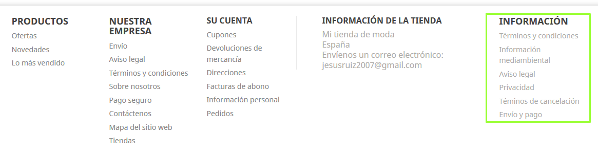

**INCLUSIÓN DEL CONTENIDO DEL CORREO ELECTRÓNICO**  

Esta sección te permite incluir información de la sección "Gestionar contenido legal" en la parte inferior de los correos electrónicos de tu tienda. Para cada tipo de correo electrónico, puedes definir qué contenido deseas incluir. De manera predeterminada, varios contenidos legales ya están pre-configurados para ser incluidos en algunas plantillas de correo electrónico. Ten en cuenta que el listado de plantillas de correo electrónico de esta sección no contiene plantillas de correo electrónico correspondientes a módulos externos de terceros.

### Configurar otros elementos de PrestaShop

#### Ajustes de Pedidos

**GENERAL**

**Habilitar resumen final**

Esta opción muestra una vista general del pedido \(direcciones de entrega y de facturación, método de envío y contenido del carrito\) en el paso de pago final antes de confirmar el pedido. Permite a sus clientes comprobar su pedido y modificarlo si es necesario. Este resumen es necesario en algunos países europeos.

En el proceso de pago:

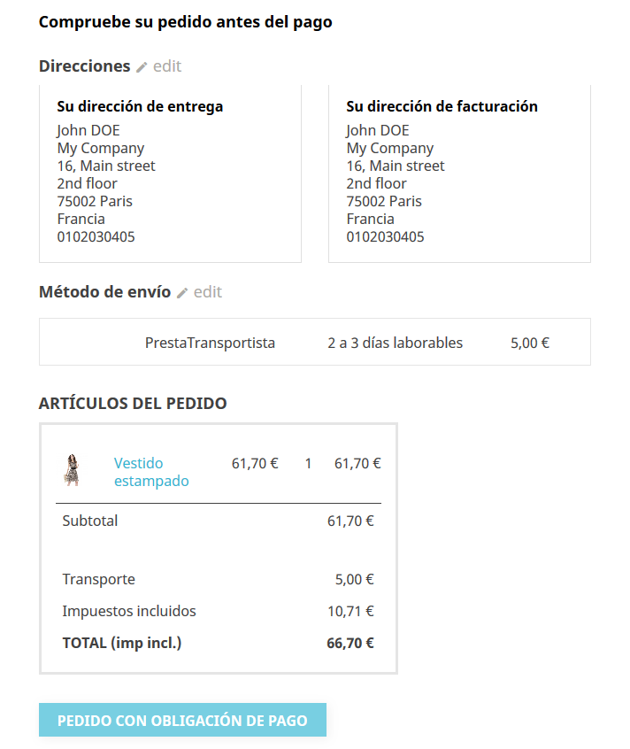

**Términos del servicio**

Activa esta opción para exigir a los clientes que acepten los términos de servicio durante la compra.

#### Configuración del producto

**Precio por unidad**

Dependiendo de la legislación local, puede ser necesario que tu tienda tenga que mostrar un precio unitario para los productos que pueden cuantificarse con volumen o masa \(€ / kg o € / L ...\). Puedes configurar este precio unitario en la página de configuración de tu producto:

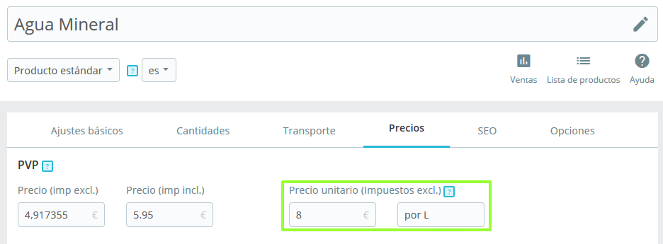

**Resumen de detalles del producto**

En el resumen del carrito de compras \(tanto en la página del carrito de la compra como en el [resumen final](cumplimiento-de-la-legislacion-europea.md#Cumplimientodelalegislacióneuropea-finalsummary)\), de manera predeterminada, solo los atributos de combinación de los productos se mostrarán en el resumen del carrito. Es posible que requieras mostrar otros detalles relevantes sobre el producto en este paso. Para añadir esta información, una solución es crear atributos para este propósito.

Por ejemplo, supongamos que estás vendiendo un televisor y necesitas mostrar su medida diagonal en el resumen del carrito de compras.

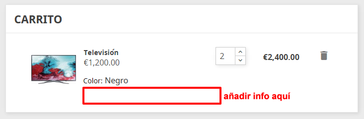

1. En VENTAS / Catálogo / Atributos y Características, dirígete a "Añadir nuevo atributo", establece su nombre a "Diagonal" con un nombre público de "Diag.", selecciona un tipo de atributo "Botones de radio" y guarda el atributo.
2. Regresa a VENTAS / Catálogo / Atributos y Características, haz clic en el atributo recién creado "Diagonal" de la tabla.
3. A continuación, dirígete a "Añadir nuevo valor", establece "138 cm \(55''\)" y guarda este valor.
4. En VENTAS / Catálogo / Productos / Televisión, marca el botón de radio 'Producto con combinaciones' en la primera pestaña 'Configuración básica'.
5. En la segunda pestaña 'Combinaciones', marca "138 cm \(55''\)" en Diag. \(o introdúcelo en la barra de texto\). A continuación, genera la combinación.
6. Ahora tienes un detalle adicional en el resumen del carrito de la compra:

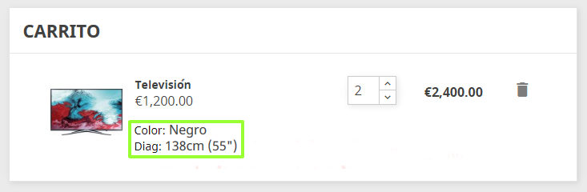

#### Configuración de envío

**Tiempo de tránsito personalizado del transportista**

Si has creado un transportista personalizado \(en MEJORAS / Transporte / Transportistas\), debes asegurarte de que el campo de **tiempo de tránsito**, no contradiga a la [etiqueta tiempo de entrega](cumplimiento-de-la-legislacion-europea.md#Cumplimientodelalegislacióneuropea-deliverytime) que has establecido con el módulo Cumplimiento normativo legal.

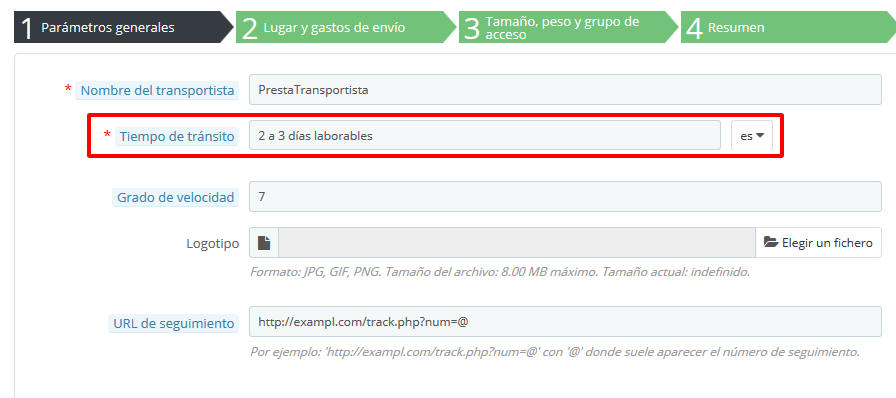

**Tasas especiales de aduanas**

En países como Suiza, se pueden añadir algunos honorarios adicionales cuando el producto cruza la frontera. Para advertir al cliente acerca de estas tasas, puedes editar el campo de tiempo de tránsito de tu transportista destinado para Suiza \(si lo has creado manualmente\).

#### Suscripción al Boletín de noticias

Es posible que debas añadir detalles sobre cómo se puede cancelar la suscripción al boletín de noticias. Para ello, puedes editar el texto incluido en la opción "Condiciones del boletín de noticias" desde la página de configuración del módulo "Suscripción a nuestro boletín de noticias":

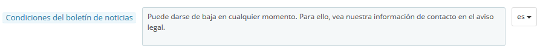

En el front-office:

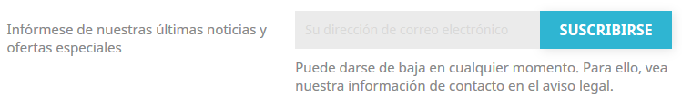

#### Módulo Información de Seguridad y Confianza para el cliente

Este módulo muestra más información para dar una mayor tranquilidad a tus clientes. Éste no tiene ningún contenido de muestra incluido por defecto, pero depende de ti \(y de tu equipo legal\), rellenarlo con el texto adecuado. Por ejemplo, puedes usarlo para mostrar información sobre la política de devolución, las tarifas de envío y la seguridad de los datos. Ten cuidado de no poner nada que pueda contradecir otras indicaciones.

#### Módulo Pago por Transferencia bancaria

En algunos países, al pagar por transferencia bancaria, el cliente no tiene que pagar hasta que reciba su confirmación de pedido. Asegúrate de desactivar la opción "Mostrar la invitación a pagar en la página de confirmación de pedidos" en la página de configuración del módulo, de modo que el cliente reciba la invitación a pagar únicamente por correo electrónico.

#### Ajustes de impuestos

**Mostrar impuesto en el carrito de la compra**

En algunos países es posible que debas mostrar el importe total del impuesto en el carrito de la compra. Para ello, asegúrate de que la opción 'Mostrar impuesto en el carrito de la compra' esté activada. Ésta muestra el importe total del impuesto en una línea distinta del resumen del carrito de compras.

#### Páginas estáticas

\[a ser completado\]

### Elementos Externos que se consideran pertinentes para tener en cuenta

#### Ley de Cookies

\[a ser completado\]

#### Seguridad de la contraseña

Es posible que también tengas que proteger a tus clientes contra la piratería de cuentas y el robo de contraseñas. Para ello puedes comprar un módulo en el Marketplace de PrestaShop:

[https://addons.prestashop.com/es/seguridad-y-accesos/23824-login-sheriff-pro.html?pab=1](https://addons.prestashop.com/es/seguridad-y-accesos/23824-login-sheriff-pro.html?pab=1)

#### Comisiones

\[a ser completado\]

#### Productos electrónicos

\[a ser completado\]

## ¿Cuál es tu responsabilidad?

Los módulos del núcleo y nativos de PrestaShop te permitirán cumplir con todos los requisitos funcionales de las autoridades de certificación.  
Sin embargo, hay algunos elementos de contenido o módulos externos que son específicos de tu tienda, y es tu responsabilidad asegurarte de que cumplen con la legislación europea. Estos elementos son:

* El contenido legal en páginas estáticas
* Módulos de pago
* Módulos Boletines de noticias
* Módulos de envío

