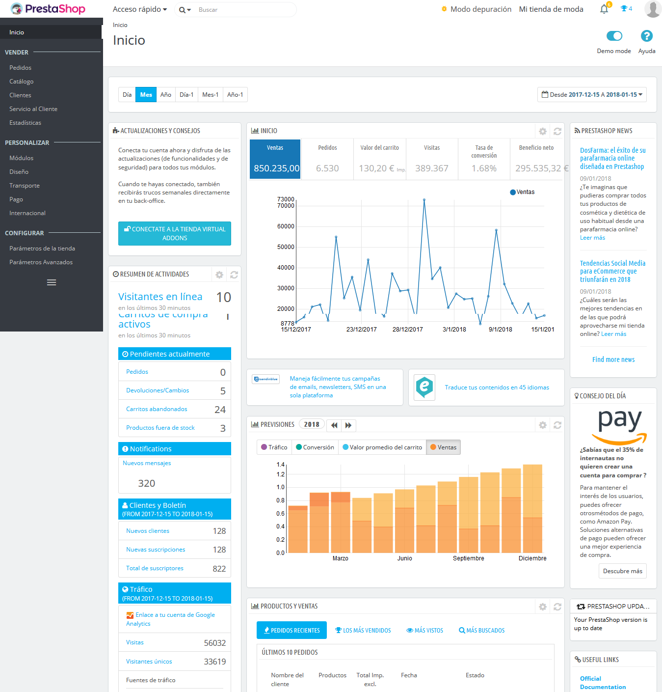
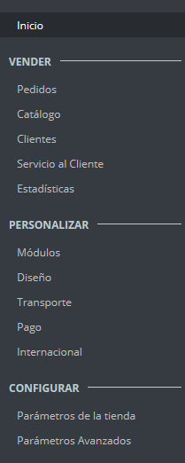
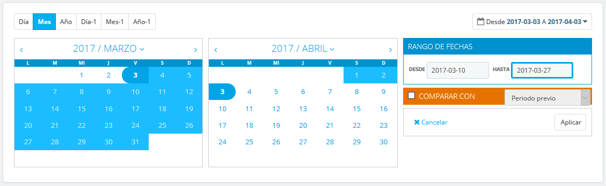
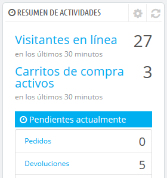
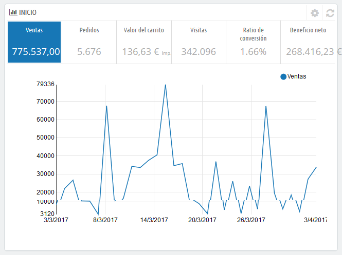
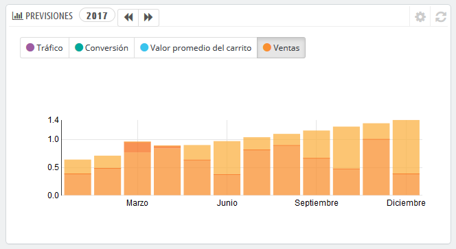
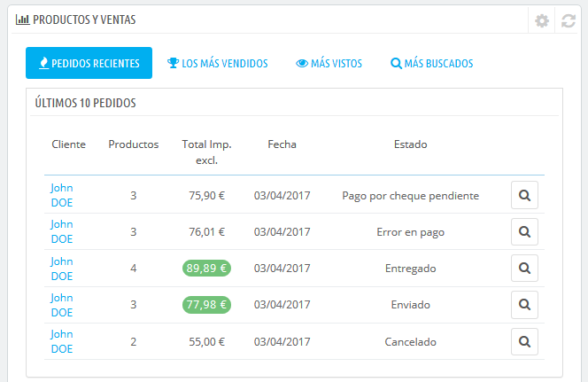

# Descubrir el Área de Administración

Ahora que ya tienes instalado PrestaShop 1.7 y que has iniciado sesión satisfactoriamente en el área de administración de tu tienda, debes asegurarte de aprender a navegar y a manejar con soltura esta interfaz de administración, comprendiendo sus notificaciones y sabiendo donde encontrar cada información específica.

El diseño del área de administración ha sido parcialmente renovado en la versión 1.7 de PrestaShop con el fin de presentar una interfaz más intuitiva y ergonómica (como podrás comprobar por ejemplo en la página de creación de productos y en la página del listado de módulos). La navegación y el menú principal también han sido renovados con respecto a la versión 1.6: aunque las distintas funcionalidades, se encuentran todavía en donde esperas encontrarlas, es posible que te lleve un tiempo acostumbrarte a esta nueva distribución.

El propósito de este rediseño es, por supuesto, hacer más sencillo a los comerciantes administrar sus tiendas.

Hemos creado este capítulo para ayudarte a descubrir y aprovechar al máximo, la interfaz de administración de PrestaShop. Aunque esta interfaz ha sido diseñada para ser muy ergonómica y fácil de utilizar, ¡deberías leer esta guía de principio a fin para comprender perfectamente todo el potencial de su nueva herramienta de negocios en línea!

## Visión general de la interfaz principal

Tómate el tiempo necesario que consideres oportuno para examinar el Panel de control. La primera página que verás al iniciar sesión en el back-office es la página de Inicio. Ésta no sólo te presenta un resumen de todo lo que necesitas saber sobre tu tienda en cualquier momento determinado, junto con enlaces rápidos a las páginas principales más utilizadas, sino que como principiante en PrestaShop, también te ofrece consejos sobre asuntos que deberías revisar.

### La barra superior

En la parte superior del back-office se encuentra una barra de color blanco que contiene un puñado de enlaces:

* **El logotipo de PrestaShop**.\
  ****
* **Acceso rápido**. Este es el menú de enlaces rápidos, el cual presenta los enlaces más utilizados. Puedes personalizarlo haciendo clic en "Administrar accesos rápidos".
* **Campo de búsqueda con lista desplegable**. Te permite realizar búsquedas dentro del contenido de tu tienda, tanto de datos de información como de funcionalidades.
* **Modo de depuración** (opcional). Si estableces tu tienda en el modo de depuración, te mostrará un icono para recordarte que este modo está activado.
* **Enlace "Nombre de la tienda"**. Abre en una nueva pestaña del navegador, el front-end de tu tienda.
* **Icono campana y número. **Indica el número de nuevas notificaciones, que por defecto mostrarán los últimos pedidos realizados en tu tienda.
  * **Pedidos**. Abre un panel presentando los nuevos pedidos recibidos desde la última vez que hiciste clic en este icono. Desde aquí, puedes visualizar los detalles de uno de estos nuevos pedidos, o ir a la página que muestra el listado completo de pedidos.
  * **Clientes**. Abre un panel que presenta los últimos clientes registrados. Desde aquí, puedes visualizar los detalles de uno de estos nuevos clientes, o ir a la página que muestra el listado completo de clientes.
  * **Mensajes**. Abre un panel que presenta el último mensaje recibido desde el Servicio al cliente. Desde aquí, puedes visualizar los detalles de uno de estos nuevos mensajes, o ir a la página que muestra el listado completo de mensajes recibidos.
* **Menú personal con tu foto de perfil**. Un panel desplegable que te sirve como recordatorio de la cuenta con la que estás conectado actualmente. Éste contiene los siguientes enlaces:\

  * **Enlace "Mis preferencias"**. Redirecciona al navegador a la página de preferencias de tu cuenta, donde puedes establecer algunas opciones personales (por ejemplo, el idioma del back-office o tu contraseña).
  * **Enlace "Cerrar sesión"**. Te desconecta de la cuenta de usuario actual.

### Los menús

A lo largo de tus actividades diarias administrando tu tienda, tendrás que navegar a través de muchas páginas y opciones del back-office.

En PrestaShop 1.7, el menú ha sido reorganizado en tres secciones principales, desde las páginas que utilizas con mayor frecuencia, a la que abres con menor frecuencia. Bajo estas secciones, cada menú se aplica a un conjunto específico de tareas y contextos:

* **Inicio**. La página principal del back-office, donde puedes ver las estadísticas principales, en tiempo real.

**Vender**

Aquí se presenta tu actividad cotidiana. Pedidos, catálogo, clientes, etc. Esta sección presenta la esencia de tu negocio, donde se muestra prácticamente todo el trabajo diario que tendrás que revisar y analizar.

* **Pedidos**. Una vez que los clientes empiezan a añadir productos en sus carritos, comenzarás a ver los pedidos en este menú, junto con las facturas resultantes. Aquí es también donde gestionarás las devoluciones de mercancía y las facturas por abono, entre otras cosas.
* **Catálogo**. Este es el corazón de tu tienda, donde podrás añadir productos, crear categorías, establecer transportistas y proveedores, definir descuentos, etc.
* **Clientes**. Desde aquí puedes acceder a toda la información acerca de tus clientes, y editar sus direcciones.
* **Servicio de atención al cliente**. En esta sección se gestiona el servicio de atención al cliente y el servicio postventa: devoluciones de mercancías, y atención al cliente por pedido, etc..
* **Estadísticas**. Este menú te da acceso a todas las numerosas estadísticas y gráficas recogidas y generadas por PrestaShop.

**Personalizar**

Aquí encontrarás todo lo que necesitas para personalizar tu tienda y llevar a tu negocio a lo más alto. Configura y establece el aspecto del front-office, adapta los métodos de pago a tus mercados objetivos, expande tu negocio internacionalmente o mejora tu tienda ¡con nuevos módulos y características!

* **Módulos**. Amplía el poder y la utilidad de tu tienda añadiendo y activando módulos: más de un centenar de ellos vienen incluidos por defecto junto con Prestashop, pero puedes adquirir muchos más en PrestaShop Addons, el marketplace oficial de PrestaShop ([http://addons.prestashop.com/](http://addons.prestashop.com)).&#x20;
* **Diseño**. Bajo la página de este título se manejan los temas, y puedes posicionar los bloques de contenido de los módulos que forman parte del tema de tu tienda. En general, aquí es donde puedes modificar la apariencia visual de tu tienda.
* **Transporte**. Todo lo relacionado con los transportistas y gastos de envío.
* **Pago**. Selecciona los métodos de pago disponibles en tu tienda y aplica ajustes globales a los módulos de pago.
* **Internacional**. Te ayuda a personalizar tu tienda con valores locales, como el idioma y la traducción, monedas, unidades, impuestos y reglas fiscales, y entidades geográficas (regiones, países, etc.).

**Configurar**

Se divide en dos submenús. En el primero se encuentran los parámetros de tu tienda. Aquí encontrarás todos los ajustes que necesitas configurar al iniciar tu actividad. Una vez realizadas tus elecciones iniciales, no volverás por aquí tan a menudo. El segundo menú está dirigido a la parte técnica de la tienda, en donde podrás realizar ajustes más avanzados, que al igual que en el caso anterior, tampoco se suelen utilizar frecuentemente.

* **Parámetros de la tienda**. PrestaShop es una solución de comercio electrónico muy configurable, por lo que puedes modificar casi cualquiera de sus comportamientos utilizando este menú que presenta las preferencias de todas las funcionalidades relacionadas con la tienda.
* **Parámetros avanzados**. Este menú contiene enlaces a herramientas y páginas de información que son demasiado específicas como para encajar y tener cabida en otros menús, tales como la configuración del servicio web (webservice), la herramienta de copia de seguridad de la base de datos, o el rendimiento de la página, entre otros. En esta área también se encuentran los ajustes que pertenecen al propio back office; por ejemplo, el listado de empleados de la tienda y los permisos.

Estos son los menús predeterminados. Ten en cuenta que los módulos pueden añadir nuevas opciones a las páginas existentes, nuevas páginas a los menús existentes, e incluso nuevos menús. Algunos de estos menús se dividen en páginas con pestañas para presentarte la multitud de características y funcionalidades disponibles en PrestaShop.

Además de lo indicado anteriormente, hay un menú que sólo se encuentra disponible cuando la opción adecuada está establecida:

* **Stock**. Este menú da acceso a la gestión de stock, donde puedes administrar y gestionar almacenes, movimientos de stock y pedidos de suministros.\
  Puede estar disponible a través del menú "Configuración de Productos": simplemente activa la opción "Activar la administración avanzada de stock" (en la sección "Inventario de productos"), y guarda el cambio realizado para visualizar el menú.

Todos los menús predeterminados, incluyendo el menú de "Existencias (stock)", se explican en profundidad en esta guía de usuario.

## Los botones

Muchas de las páginas del back-end tienen botones recurrentes, tanto en la parte superior como en la parte inferior de la pantalla. Por ejemplo, la página de edición de productos puede presentar hasta 8 botones disponibles al mismo tiempo.

Además de servir como simples accesos directos, ellos te dan acceso a las funcionalidades existentes que se utilizan con mayor frecuencia.

Los botones disponibles varían mucho dependiendo del contexto en el que te encuentres, y por lo tanto dos páginas diferentes podrían no contener el mismo conjunto de botones. Sin embargo, hay algunos botones que visualizarás frecuentemente:

* **Añadir nuevo**. Abre la página de creación en el contexto actual: nuevo producto, nueva categoría de producto, nuevo pedido, etc.
* **Módulos y servicios recomendados**. Abre una ventana emergente que contiene los módulos disponibles para el contexto actual.
* **Ayuda**. Abre la documentación en línea para la página actual – o la "ayuda contextual".

El botón "Módulos recomendados" presenta los módulos que se aplican al contexto actual. Por ejemplo, la página "Transporte > Transportistas", mostrará los módulos disponibles en la categoría de módulos "Envíos y Logística". Esto es muy útil cuando necesites encontrar rápidamente qué módulo instalar y configurar para obtener un resultado determinado.

Muchos de los formularios del back-office son validados con botones situados en la parte inferior de la pantalla:

* **Guardar**. Guarda el contenido de la página actual y retorna al listado de artículos existentes.
* **Guardar y permanecer**. Guarda el contenido de la página actual y mantiene la página abierta.
* **Cancelar**. Retorna al listado de artículos existentes.

Las tablas de datos (listados de productos, de categorías, de clientes, etc.) tienen su propio conjunto de botones para gestionar los elementos de la lista:

* **Añadir nuevo**. Crea un nuevo elemento en el contexto actual.
* **Exportar**. Descarga un archivo CSV de todos los productos existentes en el catálogo de productos de tu tienda.
* **Importar**. Redirecciona el navegador a la página de opciones de importación CSV, desde donde puedes importar los archivos CSV.
* **Actualizar lista**. Recarga la lista de elementos para mostrar los cambios producidos más recientes.
* **Mostrar consulta SQL**. Proporciona la consulta SQL para reproducir tu búsqueda o filtrar tu propia consulta SQL.
* **Exportar a SQL Manager**. Abre la herramienta PrestaShop SQL Manager (denominada Base de datos en el menú "Parámetros Avanzados"), desde donde puedes realizar consultas a la base de datos de PrestaShop utilizando sentencias SQL ("`SELECT ... FROM ... WHERE ...`").\
  Si tu lista de productos fue filtrada (por ejemplo, por nombre), la sentencia SQL por defecto tendrá esto en cuenta (por ejemplo, "``WHERE 1  AND b.`name` LIKE '%blouse%'``").

## Ayuda contextual

Desde la versión 1.6.0.7 de PrestaShop, la documentación del software está integrada directamente en la interfaz de administración: al hacer clic en el botón "Ayuda" en cualquiera de las páginas del back-office se reduce el ancho de la interfaz principal, mostrándose una nueva columna a la derecha que contiene la documentación para la sección actual del back-office.

Al realizar otro clic sobre el botón "Ayuda" se cierra la ayuda contextual. Si no cierras la columna de ayuda, PrestaShop entiende que quieres que ésta te sea mostrada en cada página del back-office, y por lo tanto mantendrá la columna abierta hasta que hagas clic en el botón correspondiente para cerrarla.

Si el ancho de la zona de visualización del navegador es inferior a 1220 pixeles, entonces PrestaShop optará por abrir la ayuda contextual de la documentación en una nueva ventana del navegador, en lugar de reducir el espacio de la pantalla dedicada a la interfaz principal.

En la parte inferior de la columna de ayuda, un pequeño formulario te permite comunicarle al equipo de PrestaShop si la sección de ayuda ha sido útil para ti o no. Valora la página de ayuda haciendo clic sobre uno de los 5 niveles de satisfacción. Si haces clic en uno de los dos niveles más bajos, PrestaShop abrirá un formulario permitiéndole detallar tu opinión sobre la ayuda recibida. Puedes rellenar éste y hacer clic en el botón "Enviar", o cerrar el formulario haciendo clic en la cruz, en cuyo caso solamente tu calificación será enviada a nuestro servidor.

## El cuadro de mandos

Ahora vamos a explorar el contenido del propio cuadro de mandos. Al utilizarlo por primera vez, puedes sentirte abrumado, pero pronto comprobarás que éste te muestra un excelente resumen de las actividades diarias de tu tienda que puedes ojear de un simple vistazo.

El cuadro de mandos está dividido en cuatro áreas principales: una barra horizontal, y tres columnas.

Modo Demo

De manera predeterminada, el cuadro de mandos utiliza datos de ejemplo inventados para que puedas visualizar de una manera más clara las distintas estadísticas disponibles.

Cuando vayas a utilizar PrestaShop para crear una tienda en línea con información real, debes desactivar estos datos de ejemplo para que tan sólo se utilicen los datos reales introducidos en tu tienda: para ello, haz clic en el botón "Desactivar" del bloque "Modo demo" situado en la parte inferior derecha de la pantalla.

### La cabecera y el modo demo

Además de la ayuda contextual, la cabecera también cuenta con la opción "Modo demo", desde la que puedes desactivar los datos falsos utilizados de forma predeterminada en el Cuadro de mandos, para utilizar tus propios datos reales (como los recolectados por el sistema de estadísticas de PrestaShop).

### La barra horizontal

La parte superior del Cuadro de mandos consta de una simple barra que te ayuda a seleccionar el periodo de tiempo que deseas utilizar para mostrar en las estadísticas del propio Cuadro de Mandos. Tres conjuntos de opciones están disponibles:

* Día, mes o año actual.
* Día, mes o año previo.
* Indicar una fecha o rango de fecha con precisión (el botón situado a la derecha, permite abrir un selector de fecha).

Al seleccionar una opción se actualiza todo el contenido de los bloques que están presentes en el cuadro de mandos, para que éstos solamente muestren los datos correspondientes al periodo de tiempo determinado. Los bloques que no están destinados a mostrar datos estadísticos, no presentarán ningún cambio.

Para seleccionar un periodo de tiempo, puedes hacer clic en la primera y la última fecha de ese período en el calendario (el orden en el que realices el clic no es determinante), o puedes escribir la fecha en las cajas de texto en el formato AAAA-MM-DD. Haz clic en "Aplicar" para ver como el Cuadro de mandos cambia los datos estadísticos de acuerdo a tus ajustes de configuración establecidos.

También puedes comparar dos períodos de tiempo a la vez, haciendo clic en la casilla "Comparar con". Selecciona el segundo periodo de la misma forma que lo hiciste con el primero (los dos pueden incluso solaparse), a continuación, haz clic en el botón "Aplicar".\
Cuando se comparan dos períodos, algunos de los bloques de contenido se actualizarán para indicar la evolución de los datos (véase por ejemplo el bloque principal "Inicio" del Cuadro de mandos, que presenta los datos del módulo Panel de tendencias).

### La columna izquierda

De manera predeterminada, esta columna te muestra datos del **módulo Panel de actividad**, el cual ofrece las principales cifras estadísticas de la base de datos de tu tienda, de manera que puedas revisarlas y valorarlas de un simple vistazo:&#x20;

* Visitantes en línea en los últimos 30 minutos.
* Carritos de compra activos en los últimos 30 minutos.
* Pedidos realizados pendientes, peticiones de devolución de mercancía y cambios, carritos abandonados y productos fuera de stock.
* Notificaciones de nuevos mensajes, consultas sobre pedidos y revisiones de comentarios de productos.
* Nuevos clientes y nuevas suscripciones al boletín de noticias.
* Estadísticas de tráfico: visitas, visitantes únicos, fuentes de tráfico y enlaces directos.

### La columna central

En la columna central es en donde el término "Cuadro de mandos" toma su significado: esta área muestra los números más importantes relacionados con las actividades diarias de tu tienda, junto con un gráfico de ventas y un listado de los últimos pedidos recibidos. Cada vez que inicies sesión en el área de administración de tu tienda, lo primero que verás será la evolución que han tenido estos números. Podríamos decir, que aquí es donde tomas consciencia de que tu tienda vive y respira.

De manera predeterminada, hay tres bloques de contenido en esta columna, que son gestionados por módulos:

* **Inicio** (Módulo Panel de tendencias). Este es el bloque principal de información del cuadro de mandos. Con sus diversas gráficas, te permite comprobar si tu tienda va por el buen camino o no. Haz clic sobre uno de los tipos de gráficas disponibles para mostrarla. Adicionalmente, cuando se comparan dos períodos de tiempo, este bloque muestra la evolución de cada cifra en porcentajes. Sitúa el cursor del ratón sobre los gráficos para visualizar los detalles.\
  \
  \
  Haz clic sobre su icono de configuración (situado en la parte superior derecha de este bloque) para abrir una nueva página en donde puedes establecer varios gastos que tu tienda probablemente tenga (comisión por transferencia bancaria, gastos de envío por cada método de envío, gastos de alojamiento del hosting, etc.), con el fin de mejorar lo que indican tus tendencias.\
  \

* **Tus previsiones** (Módulo Panel de objetivos). Este bloque te presenta los objetivos que tienes para los próximos meses, y los que tu tienda está consiguiendo alcanzar en comparación con ellos. Sitúa el cursor del ratón sobre los gráficos para visualizar los detalles.\
  Dependiendo de tus resultados mensuales, deberías actualizar tus objetivos más próximos. Puedes establecer tus objetivos en el formulario de configuración (situado en la parte superior derecha de este bloque), y rellenar tus expectativas por mes en términos de tráfico, tasa de conversión, y valor promedio del carrito. La columna "Ventas" se actualizará de acuerdo con los objetivos establecidos en las otras columnas (por ejemplo, por cada 1000 visitantes con un ratio de conversión de un 2% y un valor promedio de carrito de 10 €, probablemente obtendrías 1000\*(2/100)\*10 = 200 €). Puedes cambiar la moneda utilizada, en la página "Monedas" bajo el menú "Localización".
* **Productos y ventas** (Módulo Panel de Productos). Este bloque presenta una tabla con tus últimos pedidos y un ranking de tus productos: los más vendidos, los más vistos y los más buscados (recogidos desde el propio buscador de tu tienda, y no desde los motores de búsqueda).Puedes establecer el número de elementos a mostrar en cada una de ellas abriendo el formulario de configuración del bloque.

### La columna derecha

Esta última columna es tan sólo informativa: te muestra las últimas noticias desde [PrestaShop.com](http://prestashop.com), te notifica sobre la disponibilidad de nuevas versiones de PrestaShop, y te presenta enlaces de utilidad.
