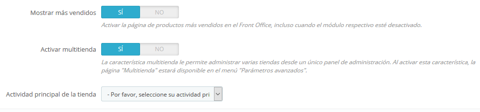

# Gestionar múltiples tiendas

Una de las principales funcionalidades de PrestaShop 1.5 es la llamada "multitienda", es decir, la capacidad de gestionar múltiples tiendas desde una misma interfaz back-office.

Gracias a esta funcionalidad, puedes gestionar varias tiendas que compartan elementos comunes. Para mejorar la eficiencia, puedes incluso crear grupos de tiendas.

## ¿Cómo saber si necesitas activar y utilizar la característica multitienda? 

En algunas ocasiones creemos necesaria la activación de la funcionalidad multitienda, cuando en realidad ésta no es necesaria. Por ejemplo, no es necesaria, si quieres una tienda multi-idioma, si necesitas utilizar más de una moneda, o si te gustaría tener una plantilla gráfica diferente para cada categoría.

Hay dos preguntas que deberías hacerte antes de decantarte por activar la característica multitienda:

1. ¿Quieres que tus tiendas tengan diferentes precios para un mismo producto? \(además de descuentos especiales para un cliente determinado o un grupo de clientes\). **Si la respuesta es 'sí', entonces necesitas utilizar la característica multitienda.**
2. Cuando un cliente compra en una tienda, ¿te gustaría que no pudiera tener acceso al historial de pedidos y facturas de la otra tienda? \(incluso si el cliente tiene el mismo identificador y contraseña de acceso en ambas tiendas\). **Si la respuesta es 'sí', entonces necesitas utilizar la característica multitienda**: las tiendas no compartirán sus carritos y pedidos, y los clientes que añadan artículos en su carrito de la tienda 1 no verán estos artículos en su carrito de la tienda 2.

Si la respuesta para ambas preguntas es 'no', entonces no necesitas activar la característica multitienda.

## Activar la característica multitienda 

Transformar tu tienda PrestaShop en una multitienda es muy sencillo:

1. Dirígete al menú "Parámetros de la tienda" y selecciona la página "Configuración".
2. Encuentra la opción "Activar Multitienda", y selecciona "Sí".
3. Guarda los cambios realizados.

Eso es todo: el modo multitienda está ahora en funcionamiento, comenzando con la adición de la página "Multitienda" bajo el menú "Parámetros avanzados". Esta es la página que permite gestionar las diferentes tiendas creadas en PrestaShop.

## Utilizar la característica multitienda 

* [La interfaz multitienda](la-interfaz-multitienda.md)
* [Crear un nuevo grupo de tiendas](crear-nuevo-grupo-de-tiendas.md)
* [Crear una nueva tienda](crear-nueva-tienda.md)
* [Configurar la URL de una tienda](configurar-url-tienda.md)
* [Ejemplo de usos y especificaciones del modo multitienda](ejemplo-de-usos-y-especificaciones.md)

