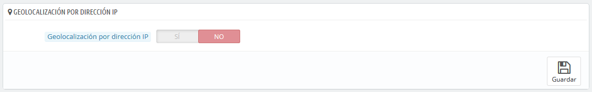
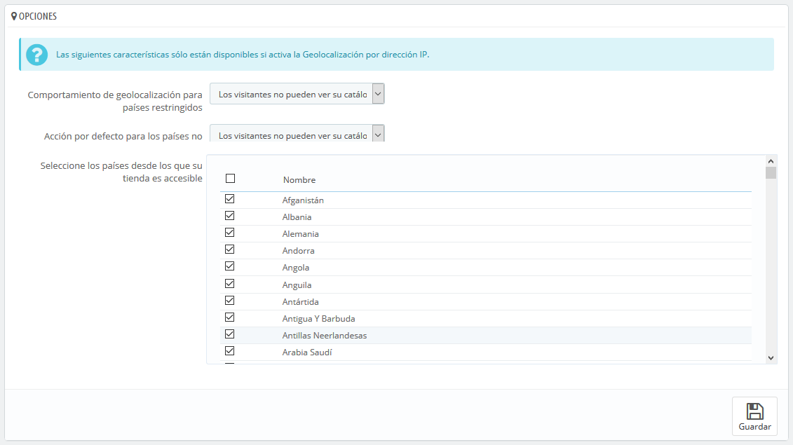
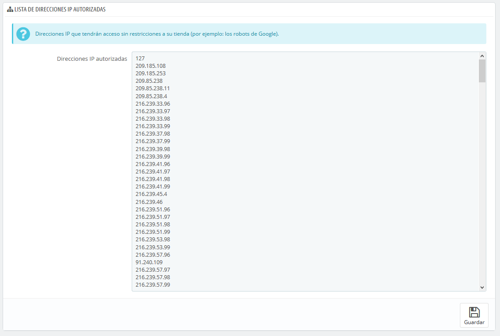

# Geolocalización

Geolocalización es "la identificación de la ubicación geográfica en el mundo real de un objeto, tales como un radar, un teléfono móvil o un ordenador conectado a Internet" \(puedes obtener más información en la siguiente página de la Wikipedia: [http://en.wikipedia.org/wiki/Geolocation](http://en.wikipedia.org/wiki/Geolocation)\). En nuestro caso, la geolocalización es utilizada para conocer la ubicación de un visitante, utilizando la dirección IP de su ordenador y otras herramientas. Uno de los usos que se realiza con la geolocalización es bloquear a visitantes de ciertas ciudades / países.

Como se indica en la página "Geolocalización", para utilizar la geolocalización por IP, necesitas descargar un archivo especial: [http://geolite.maxmind.com/download/geoip/database/GeoLiteCity.dat.gz](http://geolite.maxmind.com/download/geoip/database/GeoLiteCity.dat.gz). Este archivo es la base de datos GeoLite City de MaxMind, una base de datos bastante precisa de ciudades y otras localidades. Descarga este haciendo clic en el enlace, y descomprímelo en el directorio `/tools/geoip/` de tu instalación de PrestaShop.

Una vez que el archivo esté en su lugar, activa la opción "Localización geográfica por IP", y esta característica ya estará disponible para su uso.

## Opciones 

Puedes seleccionar los países que pueden acceder a tu tienda \(por defecto, todos ellos\), y configurar el comportamiento que tendrá PrestaShop para los países restringidos y no restringidos \(u "otros" países\). Puedes elegir entre estas tres opciones:

* Los visitantes no pueden ver tu catálogo.
* Los visitantes pueden ver tu catálogo, pero no pueden realizar pedidos. Por tanto, tu tienda estará para ellos en "Modo Catálogo".
* Todas las características están disponibles \(sólo para países sin restricciones\).  

Puedes seleccionar o anular la selección de todos los países que pueden acceder a tu tienda, marcando la casilla situada en la parte superior de la lista \(justo en la parte izquierda del primer campo que aparece denominado "Nombre"\). ¡Al seleccionar los países que pueden acceder a tu tienda, asegúrate de no bloquear un país por error, ya que perderías todas las posibles ventas de sus habitantes!

## Lista de direcciones IP autorizadas 

Esta sección te permite establecer direcciones IP que tendrán acceso sin restricciones a tu tienda. Como comprobarás la lista ya tiene añadidas IPs autorizadas que son utilizadas por ejemplo por los robots de Google. Añade todas las que necesites, una por cada línea, y haz clic en el botón "Guardar".

