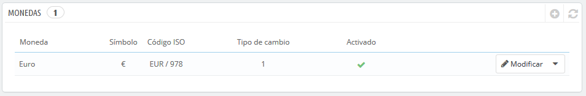
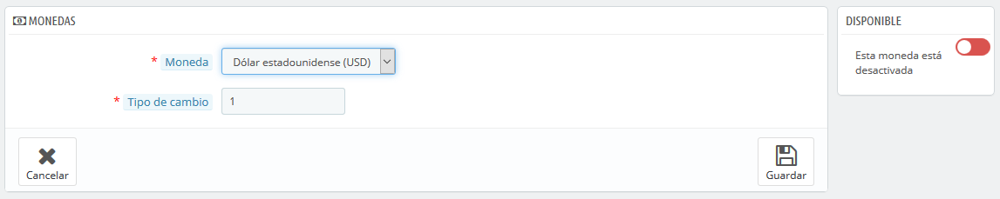

# Monedas

PrestaShop puede aceptar una gran cantidad de monedas. De manera predeterminada, sólo hay una moneda estándar: la oficial del país. Sin embargo, debes añadir y configurar nuevas monedas en función de las necesidades de tus clientes. De hecho, los clientes apreciarán la posibilidad de visualizar los precios de tu tienda en la moneda de su país.

  
Esta página es simple pero esencial, ya que están relacionadas con las tasas de cambio de las divisas \(o "tasas de conversión"\). Citando a Wikipedia, "En financias, el tipo o tasa de cambio entre dos divisas es la tasa o relación de proporción que existe entre el valor de una y la otra. Dicha tasa es un indicador que expresa cuántas unidades de una divisa se necesitan para obtener una unidad de la otra." Las tasas cambian diariamente, a veces drásticamente dependiendo de los acontecimientos actuales, y tu tienda siempre debe estar actualizada con los últimos valores.

Para cambiar la moneda predeterminada, debes ir a la página "Localización" en el menú "Internacional", y utilizar la opción "Moneda por defecto" de la sección "Configuración".  
Si la moneda que deseas utilizar no está disponible en esta opción, debes importar la moneda desde uno de los países que la utilicen, utilizando la sección "Importar un paquete de localización" de la página "Localización".

## Actualizar las tasas de cambio 

Puedes actualizar el tipo de cambio en la parte superior derecha de la página, haciendo clic en el botón "Actualizar tipos de cambio". Esto descargará el archivo de actualización de los servidores de [PrestaShop.com](http://PrestaShop.com) mediante el servicio web de PrestaShop.Ten en cuenta que las tasas se proporcionan tal cual: el equipo de PrestaShop pone mucha atención para tener las tasas correctas en estos archivos, pero pueden diferir ligeramente de los valores reales, ya que estas tasas pueden fluctuar considerablemente en un corto período de tiempo.

##  Añadir una nueva moneda 

La forma más sencilla de añadir la moneda de un país es mediante la importación de su paquete de localización. Esto se realiza en la página "Localización", bajo el menú "Internacional". Una vez importada, debes dirigirte a la pestaña "Monedas" para activarla.

Es posible que tengas que añadir una moneda que no aparezca en ninguno de los paquetes de localización. En ese caso, puedes utilizar el formulario de creación de monedas. Haz clic en "Añadir nueva moneda", y una nueva página aparecerá en pantalla:

* **Moneda**. El nombre de la moneda, preferentemente en inglés para que la mayor cantidad de clientes posibles puedan leerlo.
* **Tipo de cambio**. Esta tasa se define de acuerdo a la moneda por defecto de tu tienda. Por ejemplo, si la moneda predeterminada es el Euro y esta moneda es el dólar, teclee "1.31", ya que 1€ por lo general equivale a $1.31 \(en el momento de escribir este texto\). Utiliza el conversor que encontrarás en la siguiente página: [http://www.xe.com/ucc/](http://www.xe.com/ucc/). Si no conoces el tipo de cambio, déjalo en 1, y cuando termines de crear la moneda, actualiza los tipos de cambio haciendo clic en "Actualizar tipos de cambio".
* **Disponible**. Cualquier moneda puede ser desactivada cuando lo requieras, tanto de su propia página de edición, como de la tabla de monedas de la página "Monedas". Cuando creas una nueva moneda, está desactivada de manera predeterminada. Haz clic en el control deslizante disponible en la sección "Disponible" para activarla. El estado cambiará a "Esta moneda está activada".

