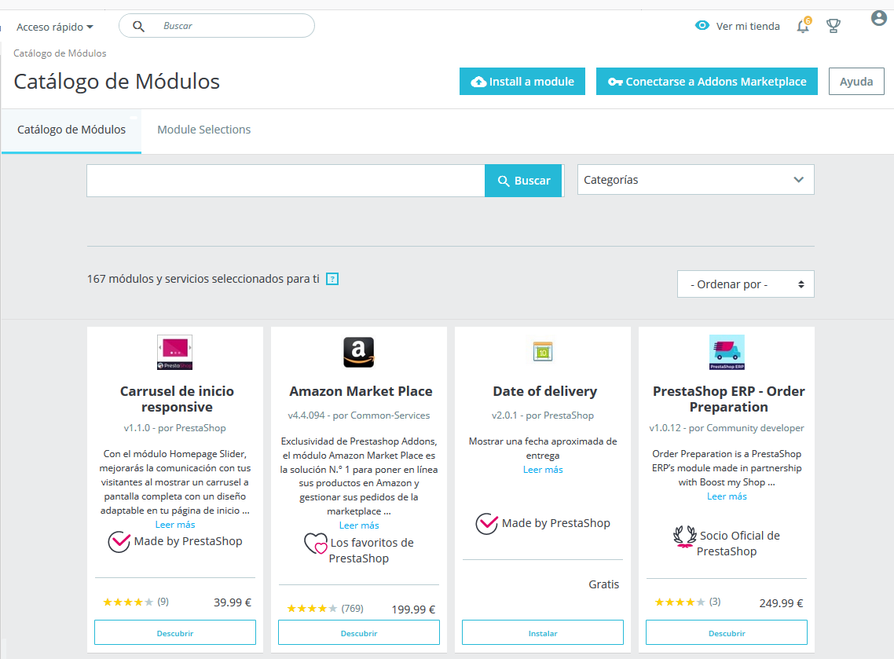

# Catálogo de módulos

PrestaShop viene acompañado con más de 100 módulos, Sin embargo, puedes añadir más módulos si encuentras alguna limitación que no puedes resolver con ninguno de los módulos incluidos, o si deseas explorar otras posibilidades.

Hay un gran número de módulos disponibles en el sitio web PrestaShop Addons \([http://addons.prestashop.com/](http://addons.prestashop.com/)\). Algunos son gratuitos, otro de pago, pero ¡seguro que encuentras alguno que se adapte a tus necesidades!. Si eres un expertos desarrollando módulos o diseñando temas, ¡puedes incluso publicar tus propias creaciones, y venderlas en el marketplace PrestaShop Addons!.

  
La página "Catálogo de Módulos" te ofrece un rápido y sencillo acceso a la base de datos de módulos y temas de PrestaShop Addons. Su interfaz incluye:

* Un campo de búsqueda, desde el que puedes buscar lo que necesites en todo el contenido de PrestaShop Addons.
* Una lista desplegable que te permite filtrar los módulos por categorías.
* Una selección de módulos que puedes comprar directamente, que te ayudarán a alcanzar ciertos objetivos de negocio: 
  * Ser más visible
  * Impulsar tus ventas
  * Incrementar el número de carritos promedio de tus clientes
  * Crear confianza con los módulos de pago
  * Incluir transportistas más rápidos en la entrega de pedidos
  * Módulos de compañías asociadas a PrestaShop gratuitos

Cualquier enlace en la página le enviará al sitio web Addons, donde hay más opciones disponibles.  
  
Al hacer clic en un elemento, se abrirá su página Addons en una nueva pestaña del navegador.  

**Addons es el marketplace oficial de Módulos y Temas de PrestaShop**. Aquí es donde los propietarios de tiendas pueden obtener todos los complementos necesarios para personalizar su tienda, y donde los autores pueden compartir sus creaciones con la comunidad.

Los módulos y temas pueden ser gratuitos o de pago: el precio es establecido por el autor. Tómate el tiempo necesario para estudiar con detalle los módulos y temas disponibles, ya que porque algo sea más caro, no significa que tenga que ser mejor.

Debes estar logueado para poder descargar o calificar un complemento. Crear una cuenta es gratis.

