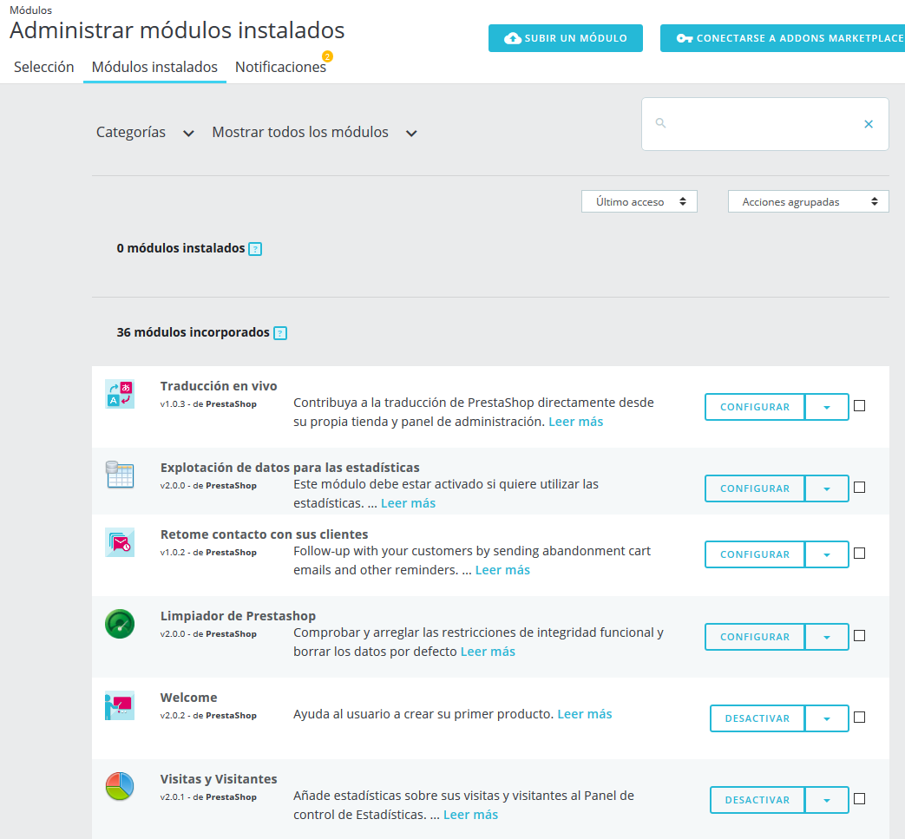
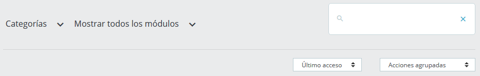

# Módulos instalados

En esta página, puedes instalar, desinstalar, configurar y actualizar cada uno de tus módulos. Este capítulo explica cómo puedes gestionar tus módulos desde la pestaña "Módulos instalados".\

## El listado de módulos 

Este listado te permite encontrar rápidamente el módulo que deseas configurar o desactivar.

Se divide en 3 secciones:

* **Módulos instalados**. Estos son todos los módulos que has añadido a su tienda, hayan sido comprados desde PrestaShop Addons o subiéndolos directamente.\

* **Módulos integrados**. Estos módulos de PrestaShop son preinstalados al instalar tu tienda. Cubren los aspectos básicos del comercio electrónico y vienen incluidos de forma gratuita.\

* **Módulos del tema**. Cada tema que instalas vendrá con su propio conjunto de módulos. Encontrarás aquí todos los módulos relacionados con el tema activo de tu tienda.

Si deseas encontrar rápidamente un módulo, puedes buscar un módulo específico o filtrar módulos hasta encontrar el que estás buscando.

* **Campo de búsqueda**. Buscar un módulo por su nombre, autor o utilizando palabras clave.
* **Selectores de orden**. La lista se recarga automáticamente al realizar una selección y muestra los módulos de acuerdo con todos los ajustes actuales.\

  * **Categorías**. A la izquierda se muestra un listado de todas las categorías de módulos, con el número de módulos para cada uno entre paréntesis. Haz clic en una categoría para visualizar los módulos de esta categoría.
  * **Mostrar todos los módulos.** Permite elegir entre módulos activados y desactivados. Los módulos activados son los únicos que se pueden configurar, de ahí la importancia de este selector.
  * **Instalados y no instalados**. La mayoría de las veces, tendrás que realizar una acción sobre un módulo instalado, o instalar uno nuevo. Este filtro es el más comúnmente utilizado.
  * **Último acceso.** Si frecuentemente utilizas los mismos módulos, esta opción facilitará la búsqueda de los módulos más recientes con los que has estado trabajando.
  * **Nombre**. Ordena los módulos por orden alfabético, de A a Z.\

Los módulos pueden tener 4 estados:

* No instalado.
* Instalado pero desactivado.
* Instalado y activado.
* Instalado y activado, pero con advertencias.\
  \

Diferencia entre desactivar y desinstalar

Si no deseas utilizar un módulo, puedes optar por desactivarlo o desinstalarlo. El resultado de ambas acciones es aparentemente el mismo: el módulo deja de estar disponible, sus opciones ya no aparecen en el back-office y cualquier elemento que éste hubiera añadido al front-end ya no se muestra.

La diferencia es que al desactivar un módulo mantiene tu configuración de seguridad para una posterior re-activación, mientras que la desinstalación elimina todos tus datos de configuración. Todos los archivos del módulo serán eliminados.

Por lo tanto, sólo debes desinstalar un módulo si no te preocupe tus datos, o si está seguro de que no lo necesitarás nunca más.

## Acciones que podemos realizar sobre los módulos 

Estas son las acciones disponibles, dependiendo del estado del módulo:

* Módulos desinstalados:\

  * **Instalar**. Esta acción desencadenará la instalación del módulo en tu tienda PrestaShop. El módulo será activado automáticamente.\
    \

* Módulos instalados:\

  * **Actualizar**. Tu instalación de PrestaShop comprueba regularmente a través del servidor Addons, si hay alguna actualización para tus módulos. Si es así, el botón de acción se convierte en "Actualizar" para los módulos afectados. Simplemente haz clic en éste y PrestaShop se encargará de descargar y actualizar el módulo.
  * **Activar**. En los módulos que se han desactivado anteriormente. Una vez activado de nuevo, puedes añadir nuevas opciones al back office de tu tienda.\

    * **Activar en móviles**. Esto activará la vista front-office del módulo solamente en dispositivos móviles (smartphones, etc.).
  * **Configurar**. Algunos módulos tienen una página de configuración. En ese caso, ofrecen un enlace "Configurar" para acceder a una nueva interfaz donde el usuario puede ajustar su configuración.
  * **Desactivar**. Cuando un módulo está instalado, se encuentra activado de manera predeterminada. Puedes desactivarlo, lo que eliminará sus opciones en el back office, pero conservará su configuración por si decides volver a activarlo.\

    * **Desactivar en móviles**. Esto desactivará la vista front-office del módulo solamente en dispositivos móviles (smartphones, etc.).
  * **Reiniciar**. Esta acción restaurará la configuración del módulo a sus valores predeterminados.
  * **Desinstalar**. Esta acción desactivará el módulo. Para eliminar también todos sus archivos y datos, debes seleccionar la opción "Eliminar la carpeta de módulo después de desinstalar".

Estas acciones se pueden realizar individualmente sobre cada módulo, o en masa gracias al menú "Acciones masivas" de la derecha.

### Desinstalar un módulo 

**¡Nunca elimines un módulo borrando su carpeta directamente desde un cliente FTP!**. Deja a PrestaShop hacerse cargo de esto.

Si quieres dejar de utilizar un módulo, pero deseas conservar su configuración, puedes simplemente desactivarlo: haciendo clic en el enlace: "Desactivar". Tras realizar esto, las acciones disponibles para el módulo se convertirán en "Activar" y "Eliminar", además el botón "Desinstalar" continuará estando disponible.

Si no te preocupa perder la configuración del módulo, haz clic en el botón "Desinstalar": la carpeta del módulo continuará existiendo en la carpeta `/modules` de PrestaShop, pero el módulo no tendrá ningún impacto sobre tu tienda.\
&#x20;Si deseas eliminar por completo el módulo de tu servidor, haz clic en el enlace "Eliminar": PrestaShop eliminará la carpeta y todos los archivos que lo componen.

Asegúrate que tras desactivar o eliminar el módulo, el tema de tu tienda continúa mostrándose correctamente.
