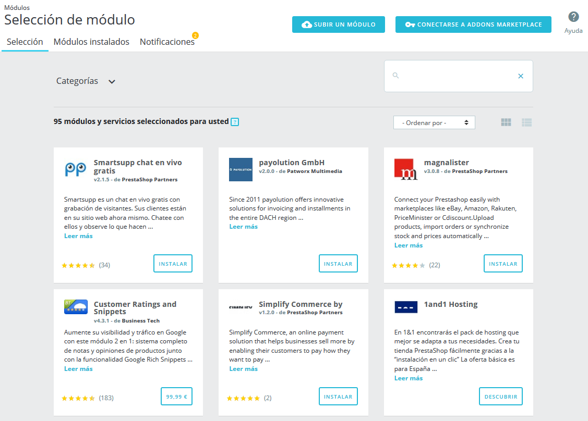
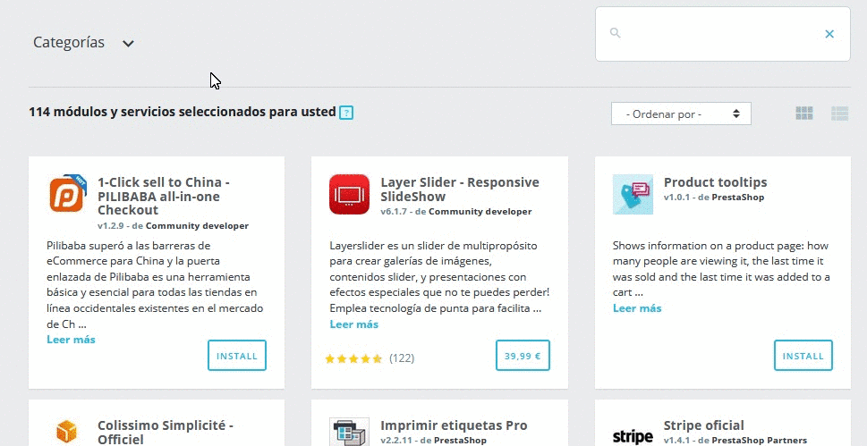
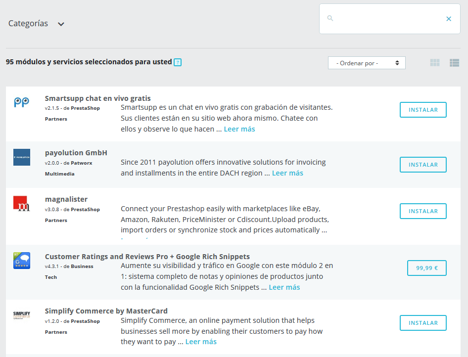
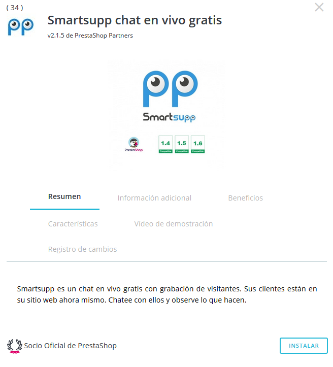
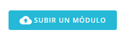
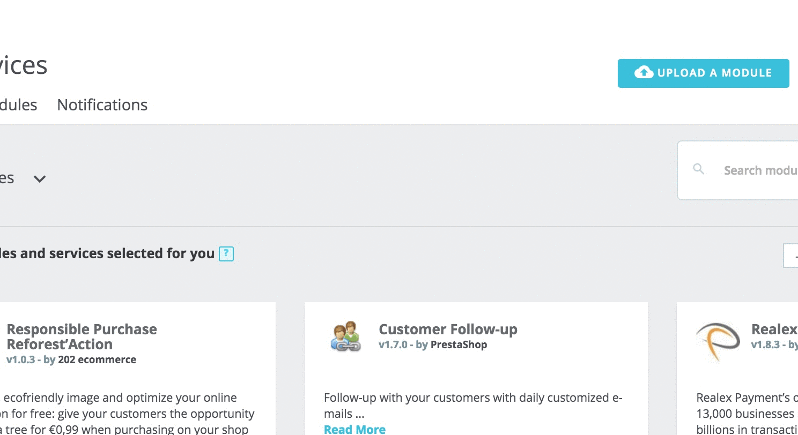
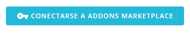
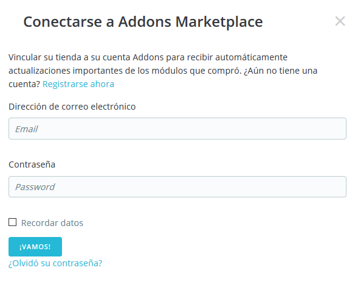

# Selección de Módulos

La pestaña "Selección" te permite descubrir nuevos módulos y servicios para mejorar tu tienda. Aquí encontrarás un listado de todos los módulos que puedes instalar (no aparecerán lo que ya hayas instalado).

Esta selección de módulos recomendados se basa en tu país, idioma y versión de PrestaShop. Esta sección incluye los módulos más populares de nuestro marketplace PrestaShop Addons y los módulos gratuitos de empresas asociadas.

* [Búsqueda de un módulo o servicio](seleccion-modulos.md#busqueda-de-un-modulo-o-servicio)
  * [Filtrar módulos](seleccion-modulos.md#filtrar-modulos)
  * [Opciones de Visualización de los resultados](seleccion-modulos.md#opciones-de-visualizacion-de-los-resultados)
  * [Información de Módulos y Servicios](seleccion-modulos.md#informacion-de-modulos-y-servicios)
    * [Leer más](seleccion-modulos.md#leer-mas)
* [Instalación o compra de un módulo](seleccion-modulos.md#instalacion-o-compra-de-un-modulo)
* [Subir un módulo manualmente](seleccion-modulos.md#subir-un-modulo-manualmente)
  * [Instalación mediante el formulario de subida](seleccion-modulos.md#instalacion-mediante-el-formulario-de-subida)
  * [Instalación mediante un cliente FTP](seleccion-modulos.md#instalacion-mediante-un-cliente-ftp)
* [Conectar al marketplace PrestaShop Addons](seleccion-modulos.md#conectar-al-marketplace-prestashop-addons)
  * [¿No tienes una cuenta Addons?](seleccion-modulos.md#no-tienes-una-cuenta-addons)
  * [¿Ya tienes una cuenta?](seleccion-modulos.md#ya-tienes-una-cuenta)

¿Cuál es la diferencia entre un módulo y un servicio?

**Un módulo** te permite añadir funcionalidades a tu tienda como nuevas modalidades de pago, sincronizar el inventario y pedidos con tu sistema de logística, exportar tu catálogo a guías inteligentes de compras, y otras muchas otras opciones de interés para ti y tus clientes. Los módulos son básicamente un archivo que debe instalarse dentro de tu tienda PrestaShop.\

Por otro lado, **un servicio** es intangible: no tienes que instalar nada en tu tienda para que el servicio funcione. En su lugar, puede que tengas que firmar un contrato con el proveedor de servicios. Los servicios se indentifican con el botón "Descubrir".\

## Búsqueda de un módulo o servicio

Si tienes una necesidad específica y estás buscando un módulo que te ayude, hay dos formas de buscar un módulo:

* **Examinar las categorías**. Al hacer clic en "Categorías" encontrarás una lista de categorías: los módulos son organizados en categorías funcionales, dependiendo las mejoras que quieras realizar en tu tienda. ¿Deseas mejorar la navegación en tu tienda o estás interesado en implementar algunas nuevas acciones de marketing? Una vez que hayas terminado de examinar las categorías, selecciona "Todas las categorías" para restablecer la selección predeterminada.\

* **Utilizar la barra de búsqueda**. Si tienes una necesidad específica en mente, también puedes escribir palabras clave en la barra de búsqueda, en el lado superior derecho de la página. Por ejemplo, si tecleas "Newsletter", encontrarás todos los módulos y servicios relacionados con los boletines. También puedes buscar módulos por su nombre o por autor. Para eliminar una palabra clave, haz clic en su icono de la cruz. Para restablecer la búsqueda, haz clic en la cruz azul en el extremo derecho de la barra.

Puedes utilizar la barra de búsqueda y las categorías simultáneamente, para limitar aún más los resultados.

Si tu búsqueda no ofrece ningún resultado, un enlace te invita a ir al marketplace PrestaShop Addons donde encontrarás más módulos disponibles.

### Filtrar módulos

Además de la búsqueda, también puedes ordenar módulos para encontrar mejor lo que necesitas, con estos filtros:

* **Nombre**. Ordenar los módulos por su nombre, de A a Z.
* **Precio creciente**. Mostrar primero los módulos con el precio más bajo. Los módulos gratuitos se mostrarán en la parte superior de la lista, ordenados de A a Z.
* **Precio decreciente**. Mostrar primero los módulos con el precio más alto.
* **Popularidad**. Ordenar los módulos y servicios de acuerdo con su calificación en Addons. Los módulos integrados se mostrarán primero, ya que no tienen ninguna calificación disponible en Addons.\
  \

¿Qué es un módulo integrado?

Los módulos integrados (o nativos) están disponibles en tu tienda desde su puesta en marcha. Algunos ya están preinstalados para ayudarte a que tu tienda funcione (los encontrarás en la pestaña "Módulos instalados"), mientras que otros están disponibles en la pestaña "Selección". Puedes elegir instalarlos o no, dependiendo de tus necesidades. Éstos cubren las funcionalidades básicas del comercio electrónico y son incluidos de forma gratuita.\

### Opciones de Visualización de los resultados

Hay dos opciones disponibles para mostrar el listado de módulos.

* **Vista de tarjeta**. Cada módulo se muestra en una tarjeta, proporcionando más espacio para la visualización de la información.
* **Vista de lista**. Cada módulo se muestra en una fila, lo que permite mostrar más módulos al mismo tiempo. Encontrarás la misma información que la vista de tarjeta, a excepción de la popularidad.

Al hacer clic en "Leer más" encontrarás más detalles sobre cada módulo o servicio.

### Información de Módulos y Servicios

Cada módulo viene con un conjunto de información para guiarte en su elección.

* **Nombre del módulo.** El nombre del módulo.
* **Autor del módulo**. El autor del módulo.&#x20;
  * "De PrestaShop" Se utiliza tanto para módulos integrados como para módulos desarrollados por PrestaShop y vendidos en el marketplace PrestaShop Addons.
  * "De PrestaShop partners" Identifica a los módulos desarrollados por los socios institucionales de PrestaShop. Estos módulos suelen ser gratuitos.
  * "De Community developer" Incluye contribuidores o agencias independientes de la comunidad de PrestaShop cuyos módulos están disponibles en Addons.
* **Versión del módulo**. La versión del módulo que estarías instalando.
* **Descripción corta**. Una frase que resuma y describa el propósito del módulo o servicio y en qué puede ayudarte.
* **Popularidad**. La calificación del módulo disponible en Addons (hasta cinco estrellas) y el número de calificaciones.

#### **Leer más** 

Si la información básica ofrecida no es suficiente para que tomes una decisión, puedes hacer clic en "Leer más" para obtener más detalles. Se abrirá una ventana emergente, que incluye una imagen del módulo (su icono o, a veces, una captura de pantalla) y varias pestañas. Esta información es proporcionada por el autor del módulo, por lo tanto, pueden variar de un módulo a otro en términos de cantidad y calidad.

* **Resumen**. Una breve descripción del módulo.
* **Información adicional**. Información más detallada.
* **Beneficios**. Lo que el módulo ofrecerá e incorporará a tu tienda.
* **Características**. Qué características se pueden esperar del módulo.
* **Video de demostración** (opcional). Un video de corta duración que presenta el módulo.
* **Registro de cambios** (opcional). Una lista de las novedades de la última versión del módulo. Lo que se ha añadido o mejorado.

En la parte inferior de la ventana emergente, puede aparecer un distintivo:

* **Made by PrestaShop**. Este módulo ha sido desarrollado por el equipo de PrestaShop.
* **Official Partner**. Este módulo ha sido desarrollado por un socio o agencia certificada por PrestaShop.
* **PrestaShop's Favorite**. ¡Estos módulos han sido recompensados por el equipo de PrestaShop como módulos particularmente simples y útiles!

## Instalación o compra de un módulo

Cuando hayas elegido el módulo que necesitas, dependiendo del tipo de módulo que sea, puedes realizar tres tipos diferentes de acciones.

* **Instalarlo**. Los módulos gratuitos disponen de un botón "Instalar". Al hacer clic en éste, el módulo se instalará en tu tienda. Una vez instalado, aparecerá un nuevo menú para gestionar el módulo: puedes configurarlo, desinstalarlo, deshabilitarlo, desactivarlo para dispositivos móvil o reiniciar el módulo. Lee más sobre estas opciones en la sección "Módulos instalados".\

* **Comprarlo**. En los módulos de pago, en lugar de "Instalar", el botón mostrará el precio del módulo. Al hacer clic en éste, el navegador te redirigirá a la página del módulo en Addons, donde puedes completar el proceso de compra. ¡No olvides vincular tu tienda a tu cuenta Addons para obtener y recuperar automáticamente el módulo para tu tienda!
* **Descubrirlo**. Los servicios muestran un botón "Descubrir". Al hacer clic en éste, el navegador te redirigirá a la página del servicio en Addons, donde puedes suscribirte al servicio.

Cuando hayas instalado un módulo, lo encontrarás en el listado de módulos de la pestaña "Módulos instalados", que es el siguiente capítulo que vamos a ver en esta guía.

## Subir un módulo manualmente

Una vez que hayas descargado un módulo desde Addons a tu ordenador, éste tiene que ser instalado en tu sitio PrestaShop.

Si no has vinculado tu tienda a tu cuenta Addons, hay dos maneras de instalar un módulo: ya sea utilizando el formulario destinado para ello o utilizando un cliente FTP.

#### Instalación mediante el formulario de subida

Para instalar automáticamente un nuevo módulo de PrestaShop, haz clic en el botón "Subir un módulo" en la parte superior de la página. Se abrirá una ventana emergente.

&#x20;El formulario de esta sección permite subir el archivo del módulo, descargado desde Addons. Puedes subir un archivo `zip`, o `tar.gz` (tarball) mediante este formulario, para ello simplemente busca el archivo del módulo que has descargado, y haz clic en el botón "Subir este módulo". ¡No selecciones como ubicación la carpeta donde tengas descomprimido el módulo o alguno de tus archivos!.

Una vez que hayas hecho clic en el botón, PrestaShop subirá el módulo desde tu ordenador a tu servidor, lo descomprimirá, colocará los archivos en la ubicación correcta, y actualizará la página, todo esto en pocos segundos. PrestaShop mostrará entonces el mensaje "Módulo instalado".

Los módulos no se instalan por defecto: así que tendrás que hacer clic en el botón "Instalar" del módulo, y posiblemente configurar algunos de sus ajustes desde la pestaña "Módulos instalados".

Una vez finalizada la configuración, asegúrate de probar el módulo inmediatamente para confirmar que funciona según lo previsto.

#### Instalación mediante un cliente FTP

También puedes optar por instalar un módulo realizando tu mismo las acciones necesarias, utilizando un cliente FTP.

Para instalar un nuevo módulo de PrestaShop manualmente:

1. Descomprime el archivo del módulo (`.zip` o `tar.gz`). Tras este proceso deberás obtener una nueva carpeta.
2. Utilizando un cliente FTP, transfiere la carpeta del módulo descomprimido, dentro de la carpeta `/modules` de PrestaShop.\
   &#x20;Presta atención de NO subir esa carpeta, en la carpeta de otro módulo (que puede ocurrir si arrastras y sueltas archivos utilizando el ratón). Sube tanto la carpeta como los archivos que ésta contiene, no solamente los archivos.
3. Dirígete en el back-office, al menú "Módulos".
4. Busca el nuevo módulo en el listado de módulos. Es posible que tengas que desplazar la página hacía abajo; aunque también puedes utilizar el buscador, que te dará una lista actualizada dinámicamente de los módulos cuyos nombres coincidan con lo que vayas escribiendo en el campo de búsqueda.
5. En la fila correspondiente al nuevo módulo, haz clic en el botón "Instalar".
6. El módulo estará ahora instalado, pero deberás activarlo si así lo deseas. Si es necesario, haz clic en el enlace "Configurar" del módulo. También, presta atención a cualquier mensaje de advertencia que pueda presentarte PrestaShop en pantalla.

Una vez finalizada la configuración, asegúrate de probar el módulo inmediatamente para confirmar que funciona según lo previsto.

&#x20;Los módulos pueden provenir de muchas fuentes, y no todos ellos son confiables. Esta es la razón por PrestaShop 1.6.0.7 introdujo una ventana de advertencia para los módulos "no verificados" – estos son módulos que no han sido verificadas por PrestaShop a través de su marketplace PrestaShop Addons. Esta ventana te permite elegir si deseas continuar con la instalación sin recibir más notificaciones, o detener el proceso de instalación.

La instalación de un módulo nativo o un módulo obtenido a través de Addons, no producirá la aparición de esta ventana de advertencia.

Conectar al marketplace PrestaShop Addons\

PrestaShop Addons es el marketplace oficial de PrestaShop, donde puedes obtener nuevos módulos y temas para tu tienda. ¡Los usuarios de Addons son ciudadanos de primera clase a la hora de gestionar módulos!.\
De hecho, una vez que tu instalación de PrestaShop está vinculada a tu cuenta Addons, los módulos que obtengas desde Addons ¡serán importados y actualizados automáticamente!. Esta es la razón por la cual se recomienda encarecidamente que vincule tu tienda a tu cuenta de PrestaShop Addons.

### ¿No tienes una cuenta Addons?

Crear una cuenta es gratis y fácil. Haz clic en el botón "Conectarme a Addons marketplace", a continuación haga clic en el enlace "Registrarme ahora", que le redirigirá al siguiente enlace: [https://addons.prestashop.com/es/login](https://addons.prestashop.com/es/login)

En la página que se abre, puedes crear una nueva cuenta y navegar a través del listado de módulos y temas disponibles en Addons.

### ¿Ya tienes una cuenta?

Si ya tienes una cuenta Addons, haz clic en el botón "Conectarme a Addons marketplace" para abrir la ventana de inicio de sesión.

Introduce tus credenciales, haz clic en "Vamos": tu instalación de PrestaShop ahora está vinculada a tu cuenta Addons, y comenzará a buscar diferencias entre los módulos en local con los que obtuvo desde Addons, asegurándose de mantener cada uno disponible y actualizado!
