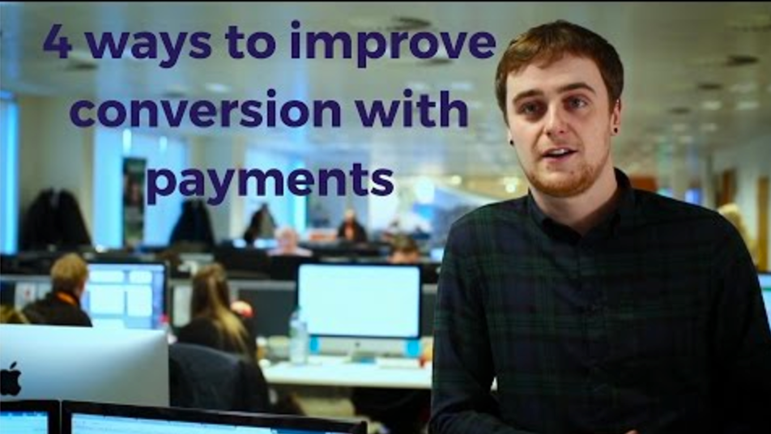

# Métodos de pago

La página "Métodos de pago" es bastante sencilla, e incluye dos secciones.

**Medios de pago activos**. Los métodos de pago actualmente habilitados en tu tienda. Un botón de acción te permite administrar los módulos, con las mismas opciones que las disponibles en la página de Módulos.

**Pasarelas de pago recomendadas**. Dependiendo de tu ubicación geográfica y configuración de la tienda, PrestaShop te mostrará los métodos de pago disponibles para tu país o los mercados a los que te diriges. A continuación, puedes elegir añadir métodos de pago que sean relevantes para las expectativas de tus clientes. Algunos módulos se pueden instalar de forma gratuita, mientras que otros son de pago. En ese caso, se te redirigirá a Addons, para comprar el módulo, antes de instalarlo.

## Instalar un módulo de pago 

La instalación de un módulo de pago no presenta diferencias con la de instalación de cualquier otro módulo: simplemente haz clic en el botón "Instalar", y todo lo que quedará por hacer es configurar el módulo.  
Debes prestar mucha atención a la configuración de estos módulos de pago, y comprobar que tu dirección o tu cuenta bancaria están establecidas correctamente en estos módulos. Para la configuración de algunos de los módulos de pago deberás establecer los datos proporcionados por el proveedor del servicio de pago, es decir, tener una cuenta en su servicio.

Video - 4 maneras de mejorar la conversión con pagos

