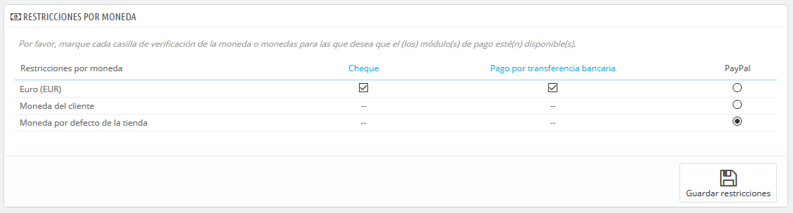
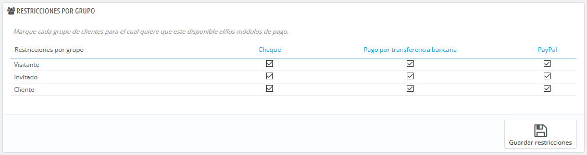
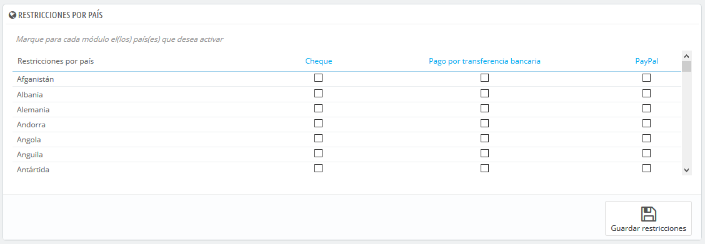

# Preferencias de pago

Las preferencias de pago están destinadas a ayudarte a decidir qué método de pago debe estar disponible para tus clientes en función de la moneda, el país, el grupo o el transportista. ¡Presa atención a esta página si no quieres tener sorpresas!

Restricciones por Moneda de los Módulos de Pago\
 
--------------------------------------------------------------------------------------------------------------------------------------------

Dependiendo de la forma de pago elegida por el cliente, las opciones permitidas para realizar el pago pueden variar.\
Puedes limitar la elección de los métodos de pago en función de las divisas disponibles: es posible que desees que los clientes puedan pagar con cualquier moneda, cuando utilicen PayPal, pero que los clientes que utilicen Moneybookers sólo puedan pagar en dólares, por ejemplo.

De manera predeterminada, solamente la moneda utilizada por tu tienda está disponible para realizar los pagos. Si necesitas alguna más, sigue este proceso:

1. En la página "Localización" bajo el menú "Internacional", importa el paquete de localización del país que tiene la moneda en la que estás interesado. Por ejemplo, USA para Dólares Américanos, Reino Unido para Libras Esterlinas, etc.
2. En la página "Monedas" bajo el menú "Localización", activa la moneda que acabas de importar.

Si necesitas restringir el uso de un módulo de pago de acuerdo a la moneda del usuario, simplemente selecciona las casillas correspondientes y haga clic en "Guardar restricciones".

Tenga en cuenta que las restricciones monetarias funcionan de diferentes formas dependiendo del módulo de pago:

* Para algunos, como Contra reembolso, no puedes cambiar la configuración que tienen por defecto.
* &#x20;Para otros, como Transferencia bancaria, Pago por cheque, Skrill, Ogone, etc., puedes cambiar la configuración establecida, a excepción de las opciones "Moneda del cliente" y "Moneda por defecto de la tienda", que permanecerán en su estado predeterminado.
* &#x20;Y para otros módulos como Hipay o PayPal, puedes cambiar la configuración establecida, pero tan sólo puedes elegir una opción entre "Moneda del cliente" y "Moneda por defecto de la tienda", no ambas.

El cliente puede establecer la moneda con la que quieres que trabaje la tienda, utilizando el menú desplegable situado en la parte superior de cada página del front-office.

Puedes establecer la moneda por defecto de tu tienda desde la página "Localización", bajo el menú "Internacional".

Si cambias la moneda predeterminada _después_ de haber configurado los primeros productos, tendrás que restablecer el precio de todos estos productos. Debes establecer la moneda por defecto antes de añadir los productos.

## Restricciones por Grupo de los Módulos de Pago 

Puedes limitar la elección de los módulos de pago disponibles en función de los grupos de clientes: puedes tener un número determinado de grupos de clientes que tengan acceso a un mayor número de métodos de pago.

Por ejemplo, podrías establecer que los clientes que no pertenecen a un grupo especial paguen a través de PayPal, Skrill y Hipay, mientras que otros clientes que pertenecen a otro grupo podrían realizar sus pagos por transferencia bancaria. En función del tipo de cliente y sus opciones, los clientes sólo pueden pagar con los métodos de pago que hayas establecido para ellos.

## Restricciones por Países de los Módulos de Pago 

Puedes limitar la elección de los módulos de pago disponibles de acuerdo al país de origen de tus clientes. Por ejemplo, puedes optar por aceptar todos los métodos de pago para los clientes procedentes de Francia, España y Alemania, mientras que los clientes de Italia, Reino Unido y Suiza, sólo puedan pagar por transferencia bancaria.

La tabla lista todos los países conocidos. Si falta alguno, puedes añadirlo utilizando la pestaña "Zonas", de la página "Ubicaciones geográficas", bajo el menú "Internacional".

Al igual que ocurre con las limitaciones de monedas, las opciones disponibles varían en función del módulo de pago:

* Para algunos, la única opción es su propio país.
* Para otros, las únicas opciones son los países soportados por el servicio: Austria, Bélgica, Francia, etc.
* Todos los demás módulos de pago nativos deberían funcionar con todos los países.

Encuentra el país que desea configurar en el listado de países (ordenado alfabéticamente), y marca las casillas para establecer los métodos de pago que desees que estén disponibles para los clientes de ese país. Una vez configurados los métodos de pago de dicho país, haz clic en el botón "Guardar restricciones", que encontrarás al final de la tabla.\
De manera predeterminada, todos los métodos de pago instalados están habilitados para el país de la tienda.
