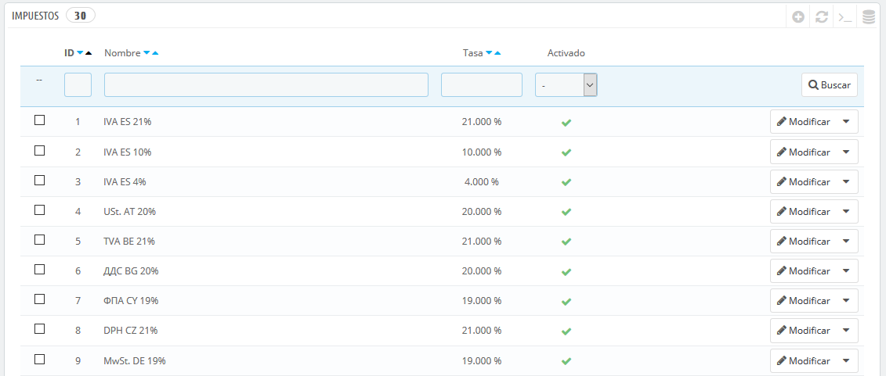
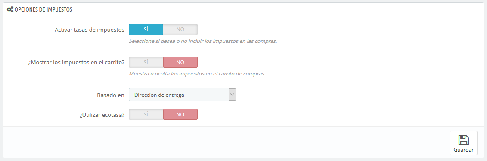

# Impuestos

Esta página enumera en una lista, todos los impuestos ya creados en tu tienda. También te permite crear nuevos impuestos, si fuese necesario.

Para cada impuesto, verás su nombre, la tasa y si está o no activado. Puedes activar o desactivar un impuesto directamente desde este listado, o puedes editar o eliminar un impuesto utilizando el botón de acción situado en el extremo derecho.

## Opciones de impuestos 

En la parte inferior de la página se encuentra la sección "Opciones de impuestos". Estas opciones se aplican a toda la tienda, y a todos los pedidos.

* **Activar tasas de impuestos**. Indica si los impuestos deben ser incluidos en cada pedido o no.
* **¿Mostrar los impuestos en el carrito?**. Es posible que prefieras que el cliente no sepa los impuestos que se aplican al pedido. En ese caso, desactiva esta opción.
* **Basado en**. El cliente puede optar porque no se entreguen tus productos en la dirección de facturación. Esto puede tener un gran impacto en los impuestos. Por defecto, PrestaShop basa tus tasas de impuestos sobre la dirección de entrega, pero puedes elegir que se basen en la dirección de facturación.
* **Utilizar ecotasa**. La ecotasa se refiere a "impuestos destinados a promover las actividades ecológicamente sostenibles a través de incentivos económicos". Este es un impuesto que los propietarios de las tiendas pagan con el fin de "sentir la carga social de sus acciones". Aprende más sobre la ecotasa en esta página de la Wikipedia: [http://es.wikipedia.org/wiki/Ecotasas](http://en.wikipedia.org/wiki/Ecotax).\
  &#x20;Una vez que hayas habilitado el uso de la ecotasa, todas las páginas back-office de tus productos mostrarán el campo "Ecotasa (ya incluida en el precio)" en su pestaña "Precios". Deberías rellenar este campo con el valor exacto de los impuestos, el cual depende de las leyes fiscales de tu país (que probablemente se base en el precio del producto).

Si decides habilitar la ecotasa después de haber añadido los productos, tendrás que editar todos ellos con el fin de establecer correctamente el impuesto para cada producto.\
Ten en cuenta que, si ya has establecido las ecotasas para tus productos, y posteriormente decides desactivarla, todos tus productos perderán sus impuestos ecológicos. La reactivación de la ecotasa significará tener que establecer las ecotasas de todos tus productos de nuevo.\
La ecotasa también será mostrada al cliente, en la página del producto.

## Añadir un nuevo impuesto 

Añadir un nuevo impuesto es muy fácil, porque son las reglas de impuestos las que llevan a cabo todo el trabajo de especificar los países en los que se aplica el impuesto. El formulario de creación de impuestos es muy corto:

* **Nombre**. Se muy específico, ya que esto te ayudará a construir reglas de impuestos más rápidamente.\
  Se recomienda añadir recordatorios en el nombre, tales como el país/grupo/zona a la que se aplica el impuesto, y su tasa. Esto te será de gran ayuda para reconocer el impuesto que debes utilizar en una regla de impuesto.
* **Tasa**. La tasa exacta, en el formato XX.XX.
* **Activar**. Puedes activar o desactivar un impuesto en cualquier momento.
