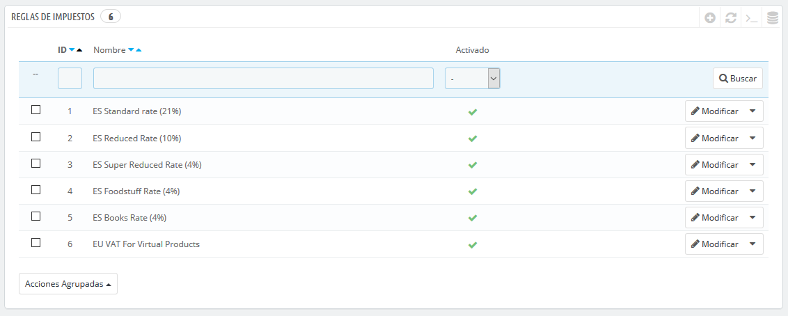
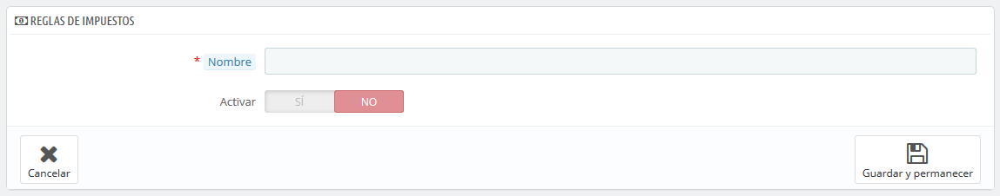
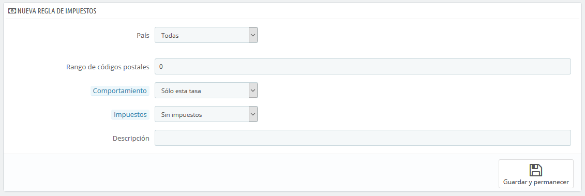

# Reglas de Impuestos

Las reglas de impuestos permiten aplicar un impuesto a un conjunto de países.

De manera predeterminada en PrestaShop, un impuesto se aplica a todos los países/estados/zonas. Para aplicar un tipo de gravamen específico para un país o un conjunto de países \(y no para algunos otros\), debes crear una regla de impuesto. La regla de impuesto se aplica a continuación sobre la base de cada producto, durante la creación del producto \(pestaña "Precios"\).

No puedes aplicar directamente un impuesto a un producto; sólo puedes aplicarle reglas de impuesto. Por lo tanto, deben registrarse primero todos los impuestos pertinentes, y a continuación crear una regla de impuesto para dicho impuesto, con el fin de especificar los países a los que se les aplica el impuesto, y finalmente establecer el impuesto al producto.

Algunos ejemplos de reglas de impuestos ya están registrados en esta página, dependiendo del país que seleccionaste durante la instalación de PrestaShop. Las reglas de impuestos son establecidas para cada tasa: las reglas en realidad sirven como una especie de filtro por países, limitando el uso de dichos impuestos a un conjunto específico de países.

Debes editar algunas de las reglas ya existentes para entender mejor cómo se crean las reglas de impuestos.

## Añadir una nueva regla de impuesto 

Puedes añadir tantas reglas de impuestos, como sea necesario. Debes asegurarte de que todas las reglas de impuestos necesarias están registradas en tu tienda.

La creación de una nueva regla de impuesto se realiza en dos pasos:

1. Crear la regla de impuesto: 
   * Haz clic en el botón "Añadir nuevo grupo de reglas de impuestos".
   * En el formulario que aparece, establece un nombre para la regla. Utiliza un nombre identificativo: usa por ejemplo el código del país de la regla de impuesto, su nombre, incluso el valor del impuesto, de esta forma será más fácil de identificar y encontrar. Si PrestaShop ya tiene establecida una regla de impuesto para este país, utiliza este nombre identificativo como fuente de inspiración. 
   * Selecciona si la regla pasará a estar activa tras su creación o no. Puedes habilitarla más tarde si es necesario.
   * Haz clic en el botón "Guardar y permanecer". Al realizar esta acción, la página se recargará, mostrando un nuevo bloque que te permite definir los atributos de esta regla de impuestos.  
2. Especifica el país y su comportamiento.  

   * Rellena los campos de la sección "Nueva regla de impuestos":

   

* * * **País**. El país a la que está destinada la regla de impuestos que estás creando. 
      * **Estado**. Algunos países tienen estados federales registrados en PrestaShop \(consulta la página "Estados", bajo el menú "Localización"\). En ese caso, puedes hacer que el impuesto sea aún más específico, o permitir que este se aplique a todo el país. Puedes seleccionar más de un estado manteniendo pulsada la tecla Ctrl mientras haces clic en los nombres de estado.
    * **Rango de códigos postales/Zip**. Ya tenga o no el país provincias o estados registrados, puedes especificar aún más la aplicación de este impuesto utilizando los códigos postales de los clientes. Este campo te permite definir códigos postales en los que se debe aplicar el impuesto: puedes introducir un sólo código postal, o definir un rango utilizando para ello un guion. Por ejemplo, puedes especificar "75000-75012" para crear un rango de todos los códigos postales que estén incluidos entre estos dos números.
    * **Comportamiento**. Algunos clientes pueden tener una dirección que coincida con más de una de las reglas de impuestos. En ese caso, puedes elegir cómo esta regla de impuesto debe comportarse: 
      * **Sólo este impuesto**. Se aplicará sólo este impuesto, ninguno otro de los impuestos existentes.
      * **Combinar**. Combinar impuestos. Por ejemplo: 100€ + \(10% + 5% =&gt; 15%\) =&gt; 115€.
      * **Uno después otro**. Aplicar los impuestos, uno después de otro. Por ejemplo: 100€ + 10% =&gt; 110€ + 5% =&gt; 115.5€.
    * **Impuestos**. La tasa que se utilizará para esta regla de impuestos. Dicha tasa debe estar ya registrada en PrestaShop. Si no fuera así: elige "Sin impuestos", para desactivar la tasa del impuesto, guarda esta página, y dirígete a la página "Impuestos" para crear una nueva tasa, a continuación, vuelve a esta página para editar esta regla de impuestos.
    * **Descripción**. Debes añadir un breve texto como recordatorio de por qué existe esta regla de impuestos para este país.
  * Haz clic en "Guardar y permanecer". El país será añadido a la tabla de abajo, y puedes comenzar a añadir otro país a este grupo de reglas de impuestos, haciendo clic en "Añadir nuevo grupo de reglas de impuestos".

Por favor, ten en cuenta que la regla por defecto que se aplica a los productos de tu tienda estará basada en la tasa del país predeterminado de tu tienda.

