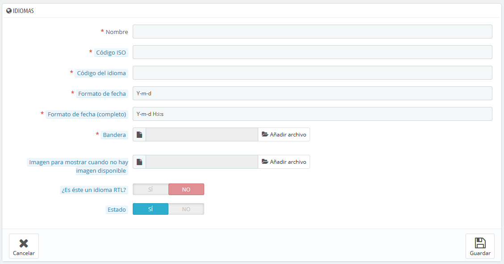

# Idiomas

PrestaShop fue diseñado para ser multilingüe: en la instalación española hay tres idiomas instalados por defecto (aunque esto depende del idioma que utilizaste para instalarlo), y muchos más idiomas están disponibles para descargar.

Participa en las traducciones de PrestaShop

Si PrestaShop no está completamente traducido en tu idioma, puedes ayudar a traducirlo, ¡uniéndote a nuestra comunidad abierta de traductores y contribuyendo en tu idioma! [https://crowdin.com/project/prestashop-official](https://crowdin.com/project/prestashop-official)

La página "Idiomas" gestiona los idiomas que verás en tu panel de administración y en tu tienda.

La página muestra los idiomas ya instalados en tu tienda, junto con alguna otra información: código ISO, código del idioma, formato de fecha (corto y completo). Puedes activar o desactivar un idioma haciendo clic en el icono de la columna "Activado".

Para añadir un idioma, basta con importar la ubicación del paquete de un país que utilice ese idioma (en la página "Localización"). Si esto no funciona, o si necesitas algo que se adapte mejor a tus necesidades, puedes añadir un nuevo idioma manualmente, utilizando el formulario que se encuentra tras el botón "Añadir nuevo idioma".

También puedes añadir un nuevo idioma desde la página "Traducciones", sección "Añadir / Actualizar un idioma". Contrariamente a un paquete de localización, esta acción sólo importará el idioma, y no los ajustes de localización (unidades, moneda, etc.).

.png>)

## Crear un nuevo idioma 

Antes de crear un nuevo idioma, debes comprobar si este idioma ya está disponible en la sección "Añadir / actualizar un idioma" de la página "Traducciones". De esta forma, incluso aunque la traducción no esté completa, está acción importará las traducciones oficiales de PrestaShop y te proporcionará una base para tu trabajo de traducción.\

Crear un nuevo idioma significa que tendrás que traducir todos los textos del front-end de PrestaShop, así como el back-end, los módulos, etc., o arriesgarte a que tus clientes no entiendan el idioma y utilizar las cadenas en inglés que vienen por defecto. La traducción se realiza con la herramienta de la página "Traducciones", bajo el menú "Internacional".

Para crear un nuevo idioma manualmente, haz clic en el botón "Añadir nuevo idioma", disponible en la pestaña "Idiomas" del menú "Internacional". Debes rellenar tantos campos del formulario como sea posible:

* **Nombre**. El nombre es público. Si vas a crear este idioma para un uso regional, puedes indicar esto en el nombre: por ejemplo, "francés (Quebec)".
* **Código ISO**. Introduce el código ISO 639-1 de 2 letras. Para obtener mayor información, consulta: [http://en.wikipedia.org/wiki/List\_of\_ISO\_639-1\_codes](http://en.wikipedia.org/wiki/List\_of\_ISO\_639-1\_codes).\
  Si estás importando un paquete de idioma, este código debe coincidir exactamente con el del paquete.
* **Código del idioma**. Introduce las 4 letras pertenecientes al código del idioma, en el formato `xx-yy`, siendo `xx` el código ISO del idioma (igual que el anterior), e `yy` el código ISO del país, utilizando ISO 3166-1 alpha-2 ([http://en.wikipedia.org/wiki/ISO\_3166-1\_alpha-2](http://en.wikipedia.org/wiki/ISO\_3166-1\_alpha-2)). Para obtener mayor información, consulta: [http://es.wikipedia.org/wiki/C%C3%B3digo\_de\_idioma\_IETF](http://es.wikipedia.org/wiki/C%C3%B3digo\_de\_idioma\_IETF).
* **Formato de fecha**. Los países no siempre comparten la misma representación en el formato de la fecha (Consulta [http://en.wikipedia.org/wiki/Date\_format\_by\_country](http://en.wikipedia.org/wiki/Date\_format\_by\_country)). Por lo tanto, cuando tu tienda muestre 02/08/12, un cliente de Francia entenderá "August 2nd, 2012" mientras que otro en EE.UU. lo interpretará como "February 8th, 2012" – y un cliente japonés podría leer ésta como "August 12th, 2002". Por esta razón, es importante indicar el formato de fecha que está ligado a tu idioma. Las letras utilizadas deben ser las de la función PHP's `date()`: [http://www.php.net/manual/es/function.date.php](http://www.php.net/manual/es/function.date.php).
* **Formato de fecha (completo)**. Igual que el formato de fecha anterior, pero incluyendo el formato horas-minutos.
* **Bandera**. Sube una imagen de la bandera que mejor se adapte al idioma que quieras añadir. Ésta debe ser de 16\*11 píxeles. Te recomendamos que utilices las imágenes de banderas gratuitas FamFamFam Flags: [http://www.famfamfam.com/lab/icons/flags/](http://www.famfamfam.com/lab/icons/flags/).
* **Imagen para mostrar cuando no hay imagen disponible**. Sube una imagen que será mostrada cuando un producto no cuente todavía con una foto/imagen. Esta imagen es simplemente una imagen en blanco, con el texto "Sin imagen" o "Imagen no disponible" en el idioma que te encuentres creando. La imagen debería ser de 250\*250 píxeles. Puedes encontrar ejemplos de imágenes "Sin imagen" en el directorio `/img/l` de la instalación de PrestaShop.
* **¿Es éste un idioma RTL?**. Algunos idiomas se escriben de derecha a izquierda, sobre todo los que utilizan la escritura árabe o el alfabeto hebreo ([http://es.wikipedia.org/wiki/Escritura\_de\_derecha\_a\_izquierda](http://es.wikipedia.org/wiki/Escritura\_de\_derecha\_a\_izquierda)). Cuando un tema de PrestaShop está bien codificado, éste permite gestionar idiomas RTL - siempre y cuando se establezca como tal.
* **Estado**. Puedes desactivar un nuevo idioma hasta que no se encuentre traducido completamente.
* **Selección de tienda**. Puedes hacer que el idioma sólo esté disponible para una selección de tus tiendas, por ejemplo, tiendas cuyo objetivo sea cubrir una determinada zona local.

Una vez que hayas guardado y activado este idioma, puedes importar su paquete de idiomas. Esto se realiza en la página "Traducciones", bajo el menú "Internacional". Utiliza la opción "Importar un paquete de localización manualmente".

Por último, asegúrate de que todo funciona correctamente: dirígete al front-office de tu tienda y haz clic en las banderas situadas en la parte superior. Del mismo modo, los clientes pueden seleccionar un idioma adicional mediante el uso de estos iconos.

Comparte tus traducciones con la comunidad

Es posible que hayas traducido completamente un nuevo idioma directamente a través de la interfaz de PrestaShop. Puedes compartirlo con la comunidad de PrestaShop enviando una exportación del mismo a [translation@prestashop.com.](mailto:translation@prestashop.com.) ¡Subiremos tu contribución a nuestro [proyecto de traducción](https://crowdin.com/project/prestashop-official) para que otros comerciantes de tu país también puedan beneficiarse de ésta!.

Para ver cómo puedes exportar tus traducciones, dirígete a la sección "Exportar un idioma", de la página "Traducciones" bajo el menú "Internacional".
